## 14-15. Tomasulo's Algorithm - Review

Now that we have seen all of the steps in Tomasulo's algorithm, consider a review of it in its entirety.

<center>
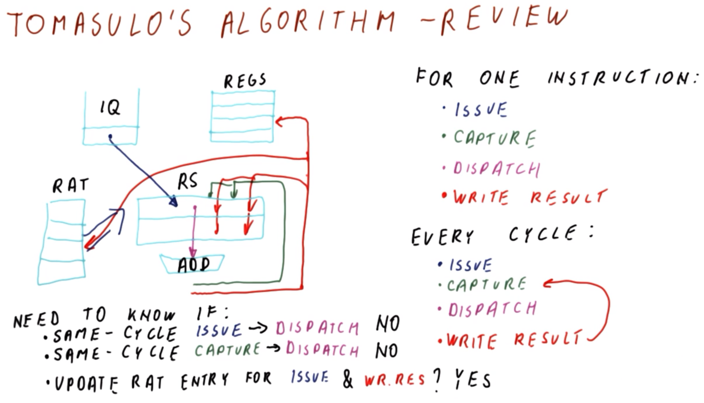
</center>

The pertinent hardware components in Tomasulo's algorithm are as follows (as in the figure shown above):
  * **Instruction Queue (IQ)**
  * **Register Allocation Table (RAT)**
  * **Register File (REGS)**
  * **Reservation Station (RS)**
  * **Execution Unit** (e.g., `ADD`)

Examining the **operations** for *one* instruction, these are as follows:
  1. `Issue` (denoted by blue in the figure shown above)
      * The instruction is issued from the IQ to an available RS, with a corresponding lookup performed in the RAT to determine the location of the value(s) for its operand(s).
      * Once the instruction is issued, its waits for the operands to become ready (i.e., obtain actual values)
  2. `Capture` (denoted by green in the figure shown above)
      * While instructions wait in their respective RSes, the instructions are attempting to capture the results broadcasted by other instructions (i.e., from their respective execution units)
  3. `Dispatch` (denoted by purple in the figure shown above)
      * Once the last-pending operand has been captured, the instruction is dispatched, i.e., sent to the execution unit for execution.
  4. `Write Result` (aka `Broadcast`) (denoted by red in the figure shown above)
      * Once the instruction completes execution, it writes its result, i.e., this result is broadcasted and fed back to other instructions in their respective RSes which are pending capture of this result, as well as making corresponding updates to the REGS and RAT. Writing to the RAT allows (i.e., clearing the entry there) allows future instructions to get the current value from the REGS directly, rather than waiting for the blocking instruction to execute.

It is ***important*** to note while all of these operations occur sequentially for any given *instruction*, in any given *cycle*, some instruction will be in any one of these operations at any given time (i.e., the processor is generally performing *all* of these operations simultaneously at any given time). In this manner, the broadcasted result is the one that feeds back to the capture for use by subsequent instructions which are pending the result.

Therefore, because all of these operations *can* (and do) occur in every cycle, there are some additional **considerations** to be aware of.
  * Is it possible to perform an `Issue` of an instruction followed immediately by a `Dispatch` of that instruction in the *same* cycle, if it does not need to `Capture` any other results? → Typically, ***no***.
    * While issuing the instruction, the RS is being populated for the instruction. In order to dispatch, it is necessary to test the contents of the RS prior to dispatching. Since the data is being written to the RS *during* the issue, and since the RS is not ready yet at that point in the cycle, it is not yet recognized as an instruction that can be dispatched by that point. Effectively, the RS is treated as "empty" in this cycle, and only starting in the *next* cycle is the RS containing the instruction eligible for dispatch.
    * However, note that it *is* possible to design the processor in such a manner that the instruction is ready for dispatch in the *same* cycle as in which it is issued.
  * Is it possible to perform a `Capture` (i.e., of the last-pending operand value) in the *same* cycle as the `Dispatch`? → Typically, ***no***.
    * The RS updates its status from "operands missing" to "operands available" in during the cycle in which the capture is occurring; only in the next cycle does the RS subsequently appear as containing an instruction which can be dispatched.
    * However, it *is* still possible to capture operands in the *same* cycle as dispatch, however, this requires specialized hardware to accomplish this.
  * Is it possible to update the RAT entry for *both* `Issue` and `Write Result` (aka `Broadcast`) in the *same* cycle? → ***yes***.
    * An instruction that is issued may need to update the RAT, in order to change the entry belonging to its destination operand. Meanwhile, the instruction that is broadcasting also needs to update the RAT entry corresponding to its destination operand. Therefore, if the instruction being issued and the instruction writing its result *both* have the *same* destination-register entry in the RAT, then the RAT entry must be effectively "updated twice"; this *can* indeed be done. Rather than writing the entry once and then writing it again, it must be ensured that the instruction that issuing ends up being the one whose value is ultimately retained in the RAT; this is because the broadcast instruction is pointing other RSes to the read the corresponding register in the REGS, but since the issuing instruction is later-occurring in the program-order, the latter instructs the RSes to examine *its* own RS for the result. Because the (downstream) instructions that read the RAT are the ones that issue even later, then they need to see the *latest* value of the register upon their issuing, i.e., that which is produced by the currently issuing instruction (rather than the broadcasting instruction). Therefore, there is no ambiguity, and the issuing instruction can simply be used to update the RAT entry accordingly.

    ## 21-26. Tomasulo's Algorithm - Long Example
    
    ### 21. Introduction
    
    Now that we have seen how Tomasulo's algorithm works and the corresponding structures, we will now consider a longer example spanning multiple cycles (which is more representative of long-form problems, exam questions, etc.).
    
    <center>
    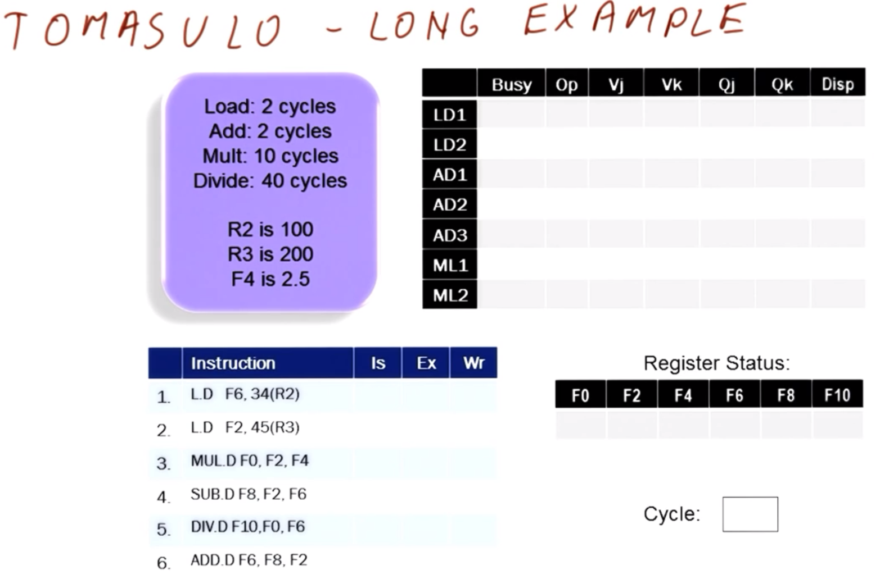
    </center>
    
    For convenience, the tables in the figure shown above are provided to streamline the analysis.
    
    The processor is characterized as follows:
      * The unit `L` (load) requires `2` cycles to execute
      * The unit `ADD` (add) requires `2` cycles to execute
      * The unit `MUL` (multiply) requires `10` cycles to execute
      * The unit `DIV` (divide) requires `40` cycles to execute
    
    Furthermore, the initial content of the register file (REGS) is as follows:
      * Register `R2` contains `100`
      * Register `R3` contains `200`
      * Register `F4` contains `2.5`
    
    The instructions in the instruction queue (IQ) are as follows (ordered in program-order starting with instruction `I1`):
    
    | Instruction Label | Instruction | Cycle of `Issue` | Cycle of `Execute` | Cycle of `Write Result` |
    |:--:|:--:|:--:|:--:|:--:|
    | `I1` | `L.D F6, 34(R2)` | | | |
    | `I2` | `L.D F2, 45(R3)` | | | |
    | `I3` | `MUL.D F0, F2, F4` | | | |
    | `I4` | `SUB.D F8, F2, F6` | | | |
    | `I5` | `DIV.D F10, F0, F6` | | | |
    | `I6` | `ADD.D F6, F8, F2` | | | |
    
    The register allocation table (RAT) contains the register statuses as follows (where empty entry implies pointing to the corresponding entry in REGS):
    
    | Register | Value |
    |:--:|:--:|
    | `F0` | |
    | `F2` | |
    | `F4` | |
    | `F6` | |
    | `F8` | |
    | `F10` | |
    
    Lastly, the reservation stations (RSes) are as follows:
    
    | Reservation Station Label | RS is busy/occupied? | Operation | Operand `Vj` | Operand `Vk` | Waited-for value `Qj` | Waited-for value `Qk` | Instruction is dispatched? |
    |:--:|:--:|:--:|:--:|:--:|:--:|:--:|:--:|
    | `LD1` | | | | | | | |
    | `LD2` | | | | | | | |
    | `AD1` | | | | | | | |
    | `AD2` | | | | | | | |
    | `AD3` | | | | | | | |
    | `ML1` | | | | | | | |
    | `ML2` | | | | | | | |
    
    ### 22. Cycles 1-2
    
    <center>
    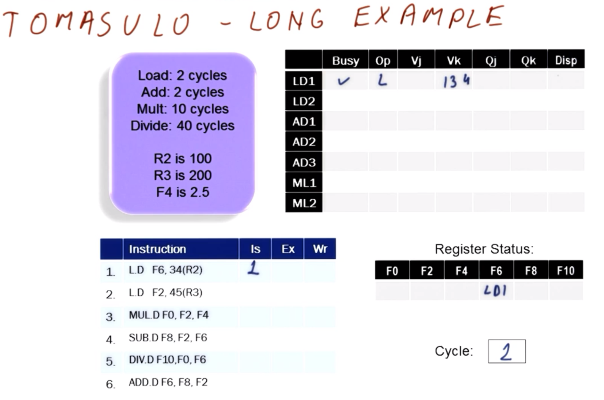
    </center>
    
    | Instruction Label | Instruction | Cycle of `Issue` | Cycle of `Execute` | Cycle of `Write Result` |
    |:--:|:--:|:--:|:--:|:--:|
    | `I1` | `L.D F6, 34(R2)` | `C1` | | |
    | `I2` | `L.D F2, 45(R3)` | | | |
    | `I3` | `MUL.D F0, F2, F4` | | | |
    | `I4` | `SUB.D F8, F2, F6` | | | |
    | `I5` | `DIV.D F10, F0, F6` | | | |
    | `I6` | `ADD.D F6, F8, F2` | | | |
    
    In cycle `C1`, there is nothing to dispatch and nothing to write, so only issuing is of concern. This is noted accordingly in the table shown above.
    
    | Reservation Station Label | RS is busy/occupied? | Operation | Operand `Vj` | Operand `Vk` | Waited-for value `Qj` | Waited-for value `Qk` | Instruction is dispatched? |
    |:--:|:--:|:--:|:--:|:--:|:--:|:--:|:--:|
    | `LD1` | `C1` | `L.D` | `(N/A)` | `134` (`100 + 34`) | `(N/A)`|`(N/A)` | `No` |
    | `LD2` | | | | | | | |
    | `AD1` | | | | | | | |
    | `AD2` | | | | | | | |
    | `AD3` | | | | | | | |
    | `ML1` | | | | | | | |
    | `ML2` | | | | | | | |
    
    Since there is a correspondingly empty reservation station, instruction `I1` can be placed accordingly into `LD1`, as in the table shown above. Furthermore, instruction `I1` gets its operand `R2` directly via REGS.
    
    | Register | Value |
    |:--:|:--:|
    | `F0` | |
    | `F2` | |
    | `F4` | |
    | `F6` | `LD1` |
    | `F8` | |
    | `F10` | |
    
    The other operand `F6` is placed into the RAT (via corresponding RS `LD1`), as in the table shown above.
    
    <center>
    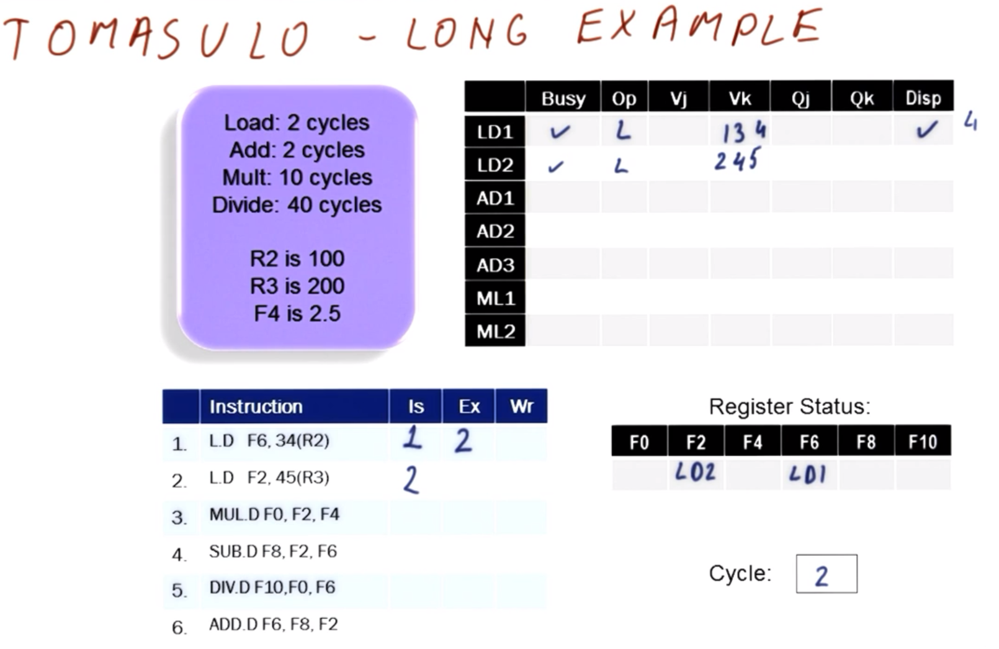
    </center>
    
    | Instruction Label | Instruction | Cycle of `Issue` | Cycle of `Execute` | Cycle of `Write Result` |
    |:--:|:--:|:--:|:--:|:--:|
    | `I1` | `L.D F6, 34(R2)` | `C1` | `C2` | |
    | `I2` | `L.D F2, 45(R3)` | `C2` | | |
    | `I3` | `MUL.D F0, F2, F4` | | | |
    | `I4` | `SUB.D F8, F2, F6` | | | |
    | `I5` | `DIV.D F10, F0, F6` | | | |
    | `I6` | `ADD.D F6, F8, F2` | | | |
    
    In cycle `C2`, there is nothing to dispatch and nothing to write, so only issuing is of concern. This is noted accordingly in the table shown above.
    
    | Reservation Station Label | RS is busy/occupied? | Operation | Operand `Vj` | Operand `Vk` | Waited-for value `Qj` | Waited-for value `Qk` | Instruction is dispatched? |
    |:--:|:--:|:--:|:--:|:--:|:--:|:--:|:--:|
    | `LD1` | `C2` | `L.D` | `(N/A)` | `134` | `(N/A)`|`(N/A)` | `Yes (C2-C4)` |
    | `LD2` | `C2` | `L.D` | `(N/A)` | `245` (`200 + 45`) | `(N/A)`|`(N/A)` | `No` |
    | `AD1` | | | | | | | |
    | `AD2` | | | | | | | |
    | `AD3` | | | | | | | |
    | `ML1` | | | | | | | |
    | `ML2` | | | | | | | |
    
    Since there is a correspondingly empty reservation station, instruction `I2` can be placed accordingly into `LD2`, as in the table shown above. Furthermore, instruction `I2` gets its operand `R3` directly via REGS.
    
    | Register | Value |
    |:--:|:--:|
    | `F0` | |
    | `F2` | `LD2` |
    | `F4` | |
    | `F6` | `LD1` |
    | `F8` | |
    | `F10` | |
    
    The other operand `F2` is placed into the RAT (via corresponding RS `LD2`), as in the table shown above.
    
    Furthermore, note that instruction `I1` is dispatched in cycle `C2`, noted above in the corresponding tables for `C2`. Furthermore, recall (cf. Section 21) that a load instruction requires `2` cycles; here, we shall assume that the write back occurs *after* execution of the second cycle (from initiation) is completed (i.e., two cycles after `C2`, or `C4`).
    
    ### 23. Cycles 3-4
    
    <center>
    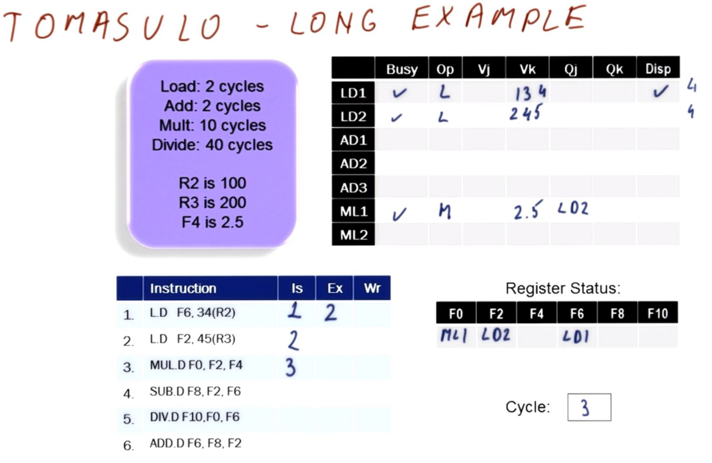
    </center>
    
    | Instruction Label | Instruction | Cycle of `Issue` | Cycle of `Execute` | Cycle of `Write Result` |
    |:--:|:--:|:--:|:--:|:--:|
    | `I1` | `L.D F6, 34(R2)` | `C1` | `C2` | |
    | `I2` | `L.D F2, 45(R3)` | `C2` | | |
    | `I3` | `MUL.D F0, F2, F4` | `C3` | | |
    | `I4` | `SUB.D F8, F2, F6` | | | |
    | `I5` | `DIV.D F10, F0, F6` | | | |
    | `I6` | `ADD.D F6, F8, F2` | | | |
    
    In cycle `C3`, instruction `I3` is issued. This is noted accordingly in the table shown above.
    
    | Reservation Station Label | RS is busy/occupied? | Operation | Operand `Vj` | Operand `Vk` | Waited-for value `Qj` | Waited-for value `Qk` | Instruction is dispatched? |
    |:--:|:--:|:--:|:--:|:--:|:--:|:--:|:--:|
    | `LD1` | `C3` | `L.D` | `(N/A)` | `134` | `(N/A)`|`(N/A)` | `Yes (C2-C4)` |
    | `LD2` | `C3` | `L.D` | `(N/A)` | `245` | `(N/A)`|`(N/A)` | `No` |
    | `AD1` | | | | | | | |
    | `AD2` | | | | | | | |
    | `AD3` | | | | | | | |
    | `ML1` | `C3` | `MUL.D` | `(waiting)` | `2.5` | `LD2` |`(N/A)` | `No` |
    | `ML2` | | | | | | | |
    
    Since there is a correspondingly empty reservation station, instruction `I3` can be placed accordingly into `ML1`, as in the table shown above. Furthermore, the operand `F4` is read directly from REGS. However, the other operand (`F2`) is waiting on `LD2`.
    
    | Register | Value |
    |:--:|:--:|
    | `F0` | `ML1` |
    | `F2` | `LD2` |
    | `F4` | |
    | `F6` | `LD1` |
    | `F8` | |
    | `F10` | |
    
    Furthermore, the remaining operand `F0` is placed into the RAT (via corresponding RS `ML1`), as in the table shown above.
    
    In cycle `C3`, instruction `I1` (via corresponding RS `LD1`) is still executing; in this case, can instruction `I2` (via corresponding RS `LD2`) begin execution?
      * If the load/store unit were pipelined, then this *would* be possible.
      * Conversely, without such a pipelined load/store unit, then this is *not* possible. With this assumption holding (as is intended for this particular example), `LD2` will have to wait until cycle `C4` to begin executing the instruction, once the previous instruction `I1` (via `LD1`) has completed execution.
    
    Furthermore, note that nothing is broadcasting yet in cycle `C3`.
    
    <center>
    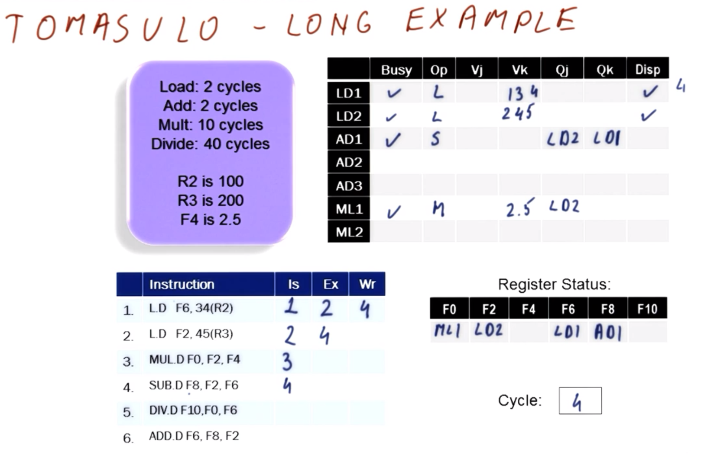
    </center>
    
    | Instruction Label | Instruction | Cycle of `Issue` | Cycle of `Execute` | Cycle of `Write Result` |
    |:--:|:--:|:--:|:--:|:--:|
    | `I1` | `L.D F6, 34(R2)` | `C1` | `C2` | |
    | `I2` | `L.D F2, 45(R3)` | `C2` | | |
    | `I3` | `MUL.D F0, F2, F4` | `C3` | | |
    | `I4` | `SUB.D F8, F2, F6` | `C4` | | |
    | `I5` | `DIV.D F10, F0, F6` | | | |
    | `I6` | `ADD.D F6, F8, F2` | | | |
    
    In cycle `C4`, instruction `I4` is issued. This is noted accordingly in the table shown above.
    
    | Reservation Station Label | RS is busy/occupied? | Operation | Operand `Vj` | Operand `Vk` | Waited-for value `Qj` | Waited-for value `Qk` | Instruction is dispatched? |
    |:--:|:--:|:--:|:--:|:--:|:--:|:--:|:--:|
    | `LD1` | `C4` | `L.D` | `(N/A)` | `134` | `(N/A)`|`(N/A)` | `Yes (C2-C4)` |
    | `LD2` | `C4` | `L.D` | `(N/A)` | `245` | `(N/A)`|`(N/A)` | `No` |
    | `AD1` | `C4` | `SUB.D` | `(waiting)` | `(waiting)` | `LD2` | `LD1` | `No` |
    | `AD2` | | | | | | | |
    | `AD3` | | | | | | | |
    | `ML1` | `C4` | `MUL.D` | `(waiting)` | `2.5` | `LD2` |`(N/A)` | `No` |
    | `ML2` | | | | | | | |
    
    Since there is a correspondingly empty reservation station, instruction `I4` can be placed accordingly into `AD1`, as in the table shown above. Furthermore, both operands are waiting on RSes (i.e., `LD2` and `LD1`).
    
    | Register | Value |
    |:--:|:--:|
    | `F0` | `ML1` |
    | `F2` | `LD2` |
    | `F4` | |
    | `F6` | `LD1` |
    | `F8` | `AD1` |
    | `F10` | |
    
    Furthermore, the remaining operand `F8` is placed into the RAT (via corresponding RS `AD1`), as in the table shown above.
    
    This now covers analysis of issuing in cycle `C4`. Now, consider analysis of dispatching in cycle `C4`, as follows.
    
    <center>
    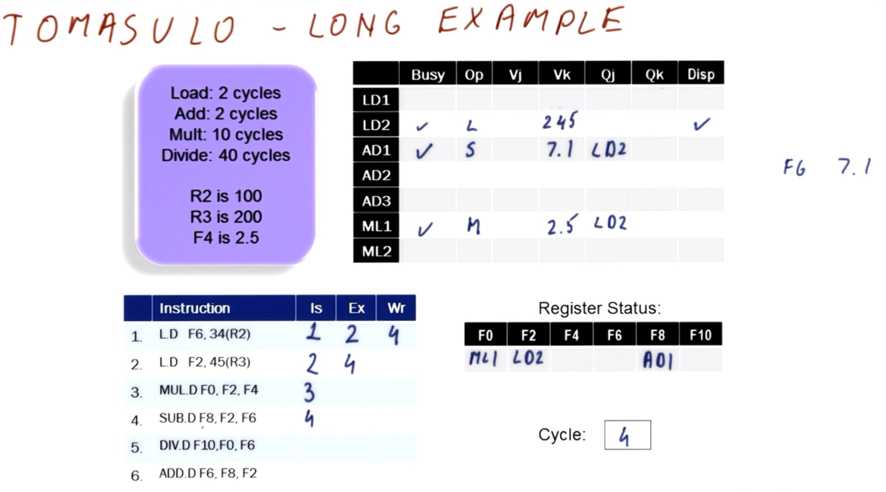
    </center>
    
    | Instruction Label | Instruction | Cycle of `Issue` | Cycle of `Execute` | Cycle of `Write Result` |
    |:--:|:--:|:--:|:--:|:--:|
    | `I1` | `L.D F6, 34(R2)` | `C1` | `C2` | `C4` |
    | `I2` | `L.D F2, 45(R3)` | `C2` | `C4` | |
    | `I3` | `MUL.D F0, F2, F4` | `C3` | | |
    | `I4` | `SUB.D F8, F2, F6` | `C4` | | |
    | `I5` | `DIV.D F10, F0, F6` | | | |
    | `I6` | `ADD.D F6, F8, F2` | | | |
    
    | Reservation Station Label | RS is busy/occupied? | Operation | Operand `Vj` | Operand `Vk` | Waited-for value `Qj` | Waited-for value `Qk` | Instruction is dispatched? |
    |:--:|:--:|:--:|:--:|:--:|:--:|:--:|:--:|
    | `LD1` | `C4` | `L.D` | `(N/A)` | `134` | `(N/A)`|`(N/A)` | `Yes (C2-C4)` |
    | `LD2` | `C4` | `L.D` | `(N/A)` | `245` | `(N/A)`|`(N/A)` | `Yes (C4-C6)` |
    | `AD1` | `C4` | `SUB.D` | `(waiting)` | `(waiting)` | `LD2` | `LD1` | `No` |
    | `AD2` | | | | | | | |
    | `AD3` | | | | | | | |
    | `ML1` | `C4` | `MUL.D` | `(waiting)` | `2.5` | `LD2` |`(N/A)` | `No` |
    | `ML2` | | | | | | | |
    
    In cycles `C2` and `C3`, instruction `I1` (via RS `LD1`) has been executing, and is now ready to write result in cycle `C4` (and correspondingly instruction `I2` via RS `LD2` is ready to dispatch and begin executing), as indicated in the tables shown above.
    
    | Reservation Station Label | RS is busy/occupied? | Operation | Operand `Vj` | Operand `Vk` | Waited-for value `Qj` | Waited-for value `Qk` | Instruction is dispatched? |
    |:--:|:--:|:--:|:--:|:--:|:--:|:--:|:--:|
    | `LD1` | | | | | | | |
    | `LD2` | `C4` | `L.D` | `(N/A)` | `245` | `(N/A)`|`(N/A)` | `Yes (C4-C6)` |
    | `AD1` | `C4` | `SUB.D` | `(waiting)` | `7.1` | `LD2` | `(N/A)` | `No` |
    | `AD2` | | | | | | | |
    | `AD3` | | | | | | | |
    | `ML1` | `C4` | `MUL.D` | `(waiting)` | `2.5` | `LD2` |`(N/A)` | `No` |
    | `ML2` | | | | | | | |
    
    On write of the result of instruction `I1`, the result (`7.1`) is broadcasted and captured/latched (i.e., via waited-on RS `LD1`), as in the table shown above. Furthermore, RS `LD1` is now available.
      * ***N.B.*** For demonstration purposes, an "available" RS here corresponds to a blank row/entry, however, in practice, this would be recorded in hardware via a single "valid" bit entry.
    
    | Register | Value |
    |:--:|:--:|
    | `F0` | `ML1` |
    | `F2` | `LD2` |
    | `F4` | |
    | `F6` | |
    | `F8` | `AD1` |
    | `F10` | |
    
    Additionally, the RAT is updated as shown above. Consequently, value `F6` is now read directly from REGS.
    
    To recap, in cycle `C4`:
      * Instruction `I4` is issued
      * Instruction `I1` is dispatched and written back
    
    ### 24. Cycles 5-6
    
    <center>
    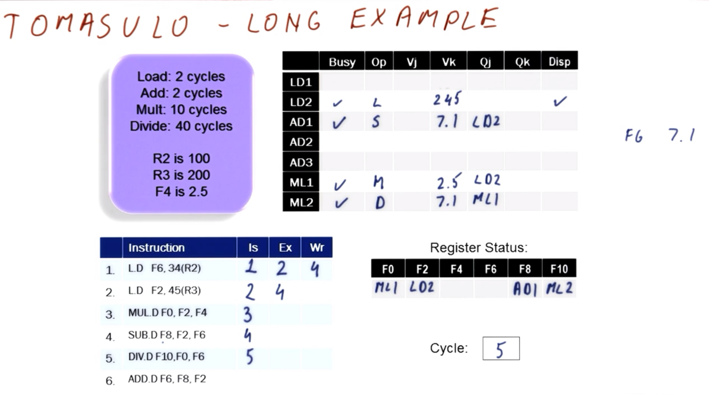
    </center>
    
    | Instruction Label | Instruction | Cycle of `Issue` | Cycle of `Execute` | Cycle of `Write Result` |
    |:--:|:--:|:--:|:--:|:--:|
    | `I1` | `L.D F6, 34(R2)` | `C1` | `C2` | `C4` |
    | `I2` | `L.D F2, 45(R3)` | `C2` | `C4` | |
    | `I3` | `MUL.D F0, F2, F4` | `C3` | | |
    | `I4` | `SUB.D F8, F2, F6` | `C4` | | |
    | `I5` | `DIV.D F10, F0, F6` | `C5` | | |
    | `I6` | `ADD.D F6, F8, F2` | | | |
    
    In cycle `C5`, instruction `I5` is issued. This is noted accordingly in the table shown above.
    
    | Reservation Station Label | RS is busy/occupied? | Operation | Operand `Vj` | Operand `Vk` | Waited-for value `Qj` | Waited-for value `Qk` | Instruction is dispatched? |
    |:--:|:--:|:--:|:--:|:--:|:--:|:--:|:--:|
    | `LD1` | | | | | | | |
    | `LD2` | `C5` | `L.D` | `(N/A)` | `245` | `(N/A)`|`(N/A)` | `Yes (C4-C6)` |
    | `AD1` | `C5` | `SUB.D` | `(waiting)` | `7.1` | `LD2` | `(N/A)` | `No` |
    | `AD2` | | | | | | | |
    | `AD3` | | | | | | | |
    | `ML1` | `C5` | `MUL.D` | `(waiting)` | `2.5` | `LD2` |`(N/A)` | `No` |
    | `ML2` | `C5` | `DIV.D` | `(waiting)` | `7.1` | `ML1` | `(N/A)` | `No` |
    
    Since there is a correspondingly empty reservation station, instruction `I5` can be placed accordingly into `ML2`, as in the table shown above. Furthermore, operand `F0` is waiting on RS `ML1`, while operand `F6` can be read directly from REGS.
    
    | Register | Value |
    |:--:|:--:|
    | `F0` | `ML1` |
    | `F2` | `LD2` |
    | `F4` | |
    | `F6` | |
    | `F8` | `AD1` |
    | `F10` | `ML2` |
    
    Furthermore, the remaining operand `F10` is placed into the RAT (via corresponding RS `ML2`), as in the table shown above.
    
    This now covers analysis of issuing in cycle `C5`. Furthermore, instruction `I2` (via RS `LD2`) is still executing in cycle `C5`, so it cannot be dispatched yet, nor is any other instruction able to dispatch at this point yet, either.
    
    <center>
    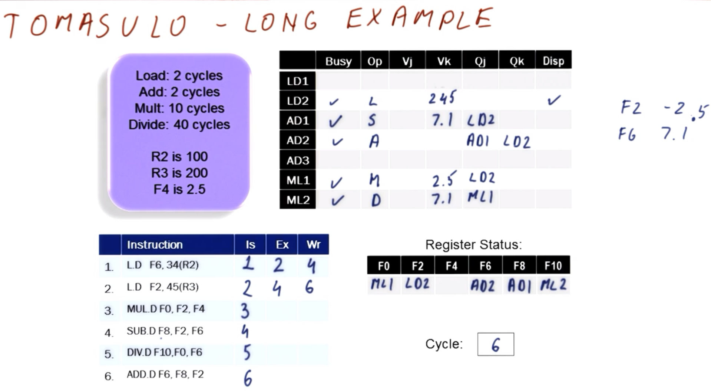
    </center>
    
    | Instruction Label | Instruction | Cycle of `Issue` | Cycle of `Execute` | Cycle of `Write Result` |
    |:--:|:--:|:--:|:--:|:--:|
    | `I1` | `L.D F6, 34(R2)` | `C1` | `C2` | `C4` |
    | `I2` | `L.D F2, 45(R3)` | `C2` | `C4` | |
    | `I3` | `MUL.D F0, F2, F4` | `C3` | | |
    | `I4` | `SUB.D F8, F2, F6` | `C4` | | |
    | `I5` | `DIV.D F10, F0, F6` | `C5` | | |
    | `I6` | `ADD.D F6, F8, F2` | `C6` | | |
    
    In cycle `C6`, instruction `I6` is issued. This is noted accordingly in the table shown above.
    
    | Reservation Station Label | RS is busy/occupied? | Operation | Operand `Vj` | Operand `Vk` | Waited-for value `Qj` | Waited-for value `Qk` | Instruction is dispatched? |
    |:--:|:--:|:--:|:--:|:--:|:--:|:--:|:--:|
    | `LD1` | | | | | | | |
    | `LD2` | `C6` | `L.D` | `(N/A)` | `245` | `(N/A)`|`(N/A)` | `Yes (C4-C6)` |
    | `AD1` | `C6` | `SUB.D` | `(waiting)` | `7.1` | `LD2` | `(N/A)` | `No` |
    | `AD2` | `C6` | `ADD.D` | `(waiting)` | `(waiting)` | `AD1` | `LD2` | `No` |
    | `AD3` | | | | | | | |
    | `ML1` | `C6` | `MUL.D` | `(waiting)` | `2.5` | `LD2` |`(N/A)` | `No` |
    | `ML2` | `C6` | `DIV.D` | `(waiting)` | `7.1` | `ML1` | `(N/A)` | `No` |
    
    Since there is a correspondingly empty reservation station, instruction `I6` can be placed accordingly into `AD2`, as in the table shown above. Furthermore, both operands are waiting on RSes (i.e., `AD1` and `LD2`).
    
    | Register | Value |
    |:--:|:--:|
    | `F0` | `ML1` |
    | `F2` | `LD2` |
    | `F4` | |
    | `F6` | `AD2` |
    | `F8` | `AD1` |
    | `F10` | `ML2` |
    
    Furthermore, the remaining operand `F6` is placed into the RAT (via corresponding RS `AD2`), as in the table shown above.
    
    This now covers analysis of issuing in cycle `C6`. Now, consider analysis of dispatching in cycle `C6`, as follows.
    
    <center>
    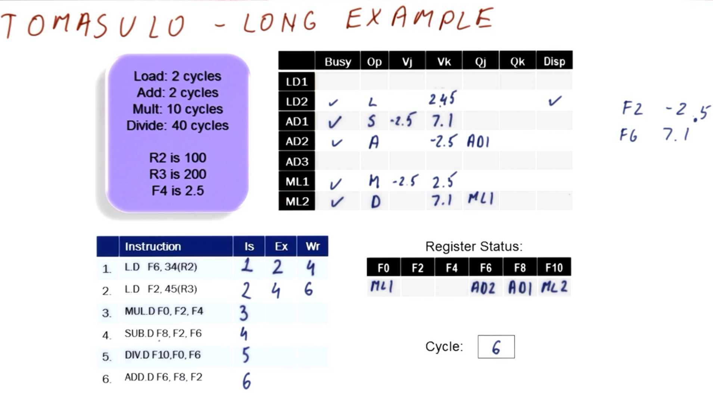
    </center>
    
    | Instruction Label | Instruction | Cycle of `Issue` | Cycle of `Execute` | Cycle of `Write Result` |
    |:--:|:--:|:--:|:--:|:--:|
    | `I1` | `L.D F6, 34(R2)` | `C1` | `C2` | `C4` |
    | `I2` | `L.D F2, 45(R3)` | `C2` | `C4` | `C6` |
    | `I3` | `MUL.D F0, F2, F4` | `C3` | | |
    | `I4` | `SUB.D F8, F2, F6` | `C4` | | |
    | `I5` | `DIV.D F10, F0, F6` | `C5` | | |
    | `I6` | `ADD.D F6, F8, F2` | `C6` | | |
    
    | Reservation Station Label | RS is busy/occupied? | Operation | Operand `Vj` | Operand `Vk` | Waited-for value `Qj` | Waited-for value `Qk` | Instruction is dispatched? |
    |:--:|:--:|:--:|:--:|:--:|:--:|:--:|:--:|
    | `LD1` | | | | | | | |
    | `LD2` | `C6` | `L.D` | `(N/A)` | `245` | `(N/A)`|`(N/A)` | `Yes (C4-C6)` |
    | `AD1` | `C6` | `SUB.D` | `-2.5` | `7.1` | `(N/A)`| `(N/A)` | `No` |
    | `AD2` | `C6` | `ADD.D` | `(waiting)` | `-2.5` | `AD1` | `(N/A)` | `No` |
    | `AD3` | | | | | | | |
    | `ML1` | `C6` | `MUL.D` | `-2.5` | `2.5` |`(N/A)` |`(N/A)` | `No` |
    | `ML2` | `C6` | `DIV.D` | `(waiting)` | `7.1` | `ML1` | `(N/A)` | `No` |
    
    In cycles `C4` and `C5`, instruction `I2` (via RS `LD2`) has been executing, and is now ready to write result (`-2.5`) in cycle `C6` (however, nothing else is ready to execute until this result is written, and thus no dispatch occurs), as indicated in the tables shown above. This result is correspondingly captured (via `LD2`/`F2`).
      * ***N.B.*** While RSes `AD1` and `ML1` now have defined operands and are capable of executing, based on the constraints of the hardware (i.e., inability to perform simultaneous broadcast/capture and dispatch in the *same* cycle), dispatch cannot occur yet in this cycle.
    
    | Register | Value |
    |:--:|:--:|
    | `F0` | `ML1` |
    | `F2` | |
    | `F4` | |
    | `F6` | `AD2` |
    | `F8` | `AD1` |
    | `F10` | `ML2` |
    
    Additionally, the RAT is updated as shown above. Consequently, value `F2` is now read directly from REGS.
    
    In summary, in cycle `C6`:
      * Instruction `I6` is issued
      * Result of instruction `I2` is broadcasted
      * No dispatch occurs yet
    
    ### 25. Cycles 7-9
    
    <center>
    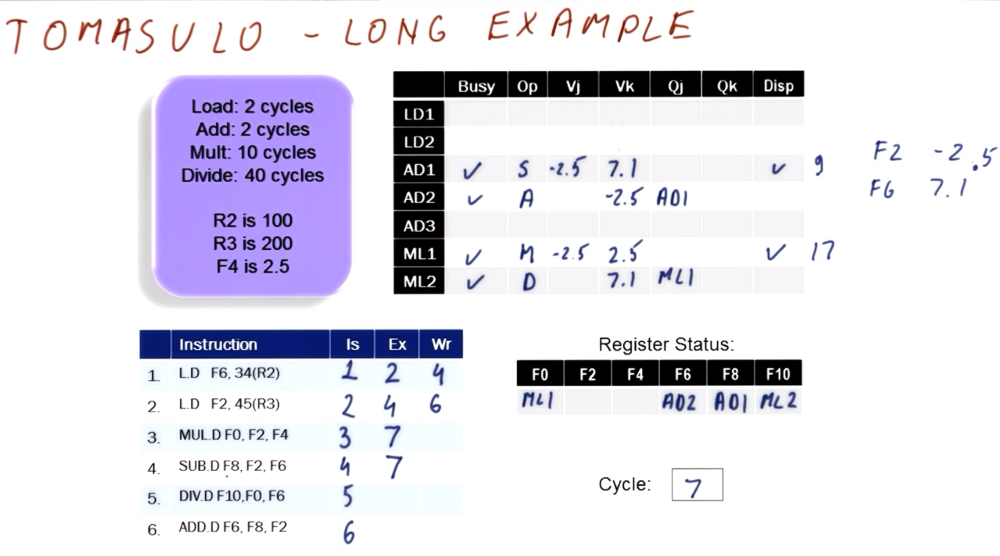
    </center>
    
    | Instruction Label | Instruction | Cycle of `Issue` | Cycle of `Execute` | Cycle of `Write Result` |
    |:--:|:--:|:--:|:--:|:--:|
    | `I1` | `L.D F6, 34(R2)` | `C1` | `C2` | `C4` |
    | `I2` | `L.D F2, 45(R3)` | `C2` | `C4` | `C6` |
    | `I3` | `MUL.D F0, F2, F4` | `C3` | `C7` | |
    | `I4` | `SUB.D F8, F2, F6` | `C4` | `C7` | |
    | `I5` | `DIV.D F10, F0, F6` | `C5` | | |
    | `I6` | `ADD.D F6, F8, F2` | `C6` | | |
    
    In cycle `C7`, there is no instruction to issue. This is noted accordingly in the table shown above. (This will also be true for subsequent cycles, since there are only six total instructions in this program.)
    
    | Reservation Station Label | RS is busy/occupied? | Operation | Operand `Vj` | Operand `Vk` | Waited-for value `Qj` | Waited-for value `Qk` | Instruction is dispatched? |
    |:--:|:--:|:--:|:--:|:--:|:--:|:--:|:--:|
    | `LD1` | | | | | | | |
    | `LD2` | | | | | | | | |
    | `AD1` | `C7` | `SUB.D` | `-2.5` | `7.1` | `(N/A)`| `(N/A)` | `Yes (C7-C9)` |
    | `AD2` | `C7` | `ADD.D` | `(waiting)` | `-2.5` | `AD1` | `(N/A)` | `No` |
    | `AD3` | | | | | | | |
    | `ML1` | `C7` | `MUL.D` | `-2.5` | `2.5` |`(N/A)` |`(N/A)` | `Yes (C7-C17)` |
    | `ML2` | `C7` | `DIV.D` | `(waiting)` | `7.1` | `ML1` | `(N/A)` | `No` |
    
    With respect to dispatch, both RSes `AD1` and `ML1` are ready to be dispatched in cycle `C7`, as in the table shown above. Both are correspondingly dispatched; however, since nothing is currently executing (i.e., both dispatched instructions require multiple cycles to execute), the results are not yet broadcasted at this point.
    
    In cycle `C8`, there is no issue, dispatch, or broadcast, since the instructions are still currently executing at that point.
    
    <center>
    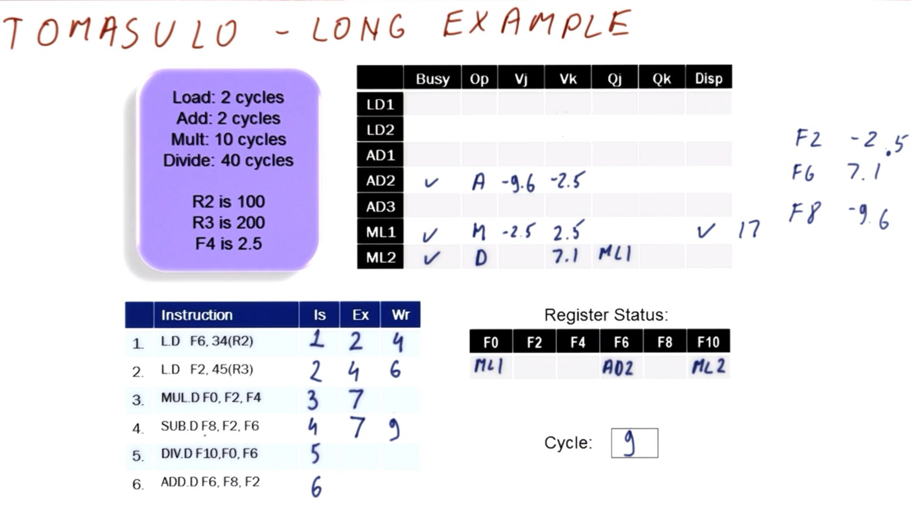
    </center>
    
    | Instruction Label | Instruction | Cycle of `Issue` | Cycle of `Execute` | Cycle of `Write Result` |
    |:--:|:--:|:--:|:--:|:--:|
    | `I1` | `L.D F6, 34(R2)` | `C1` | `C2` | `C4` |
    | `I2` | `L.D F2, 45(R3)` | `C2` | `C4` | `C6` |
    | `I3` | `MUL.D F0, F2, F4` | `C3` | `C7` | |
    | `I4` | `SUB.D F8, F2, F6` | `C4` | `C7` | `C9` |
    | `I5` | `DIV.D F10, F0, F6` | `C5` | | |
    | `I6` | `ADD.D F6, F8, F2` | `C6` | | |
    
    In cycle `C9`, instruction `I4` completes execution is able to broadcast its result (`-9.6`), as indicated in the table shown above. Furthermore, this broadcast *can* occur unambiguously here, because no other instruction is attempting to broadcast at this point.
    
    | Register | Value |
    |:--:|:--:|
    | `F0` | `ML1` |
    | `F2` | |
    | `F4` | |
    | `F6` | `AD2` |
    | `F8` | |
    | `F10` | `ML2` |
    
    With respect to broadcast and corresponding capture/latch, the RAT is updated as shown above (i.e., with `F8` now read directly from REGS).
    
    | Reservation Station Label | RS is busy/occupied? | Operation | Operand `Vj` | Operand `Vk` | Waited-for value `Qj` | Waited-for value `Qk` | Instruction is dispatched? |
    |:--:|:--:|:--:|:--:|:--:|:--:|:--:|:--:|
    | `LD1` | | | | | | | |
    | `LD2` | | | | | | | | |
    | `AD1` | | | | | | | | |
    | `AD2` | `C9` | `ADD.D` | `-9.6` | `-2.5` | `(N/A)` | `(N/A)` | `No` |
    | `AD3` | | | | | | | |
    | `ML1` | `C9` | `MUL.D` | `-2.5` | `2.5` |`(N/A)` |`(N/A)` | `Yes (C7-C17)` |
    | `ML2` | `C9` | `DIV.D` | `(waiting)` | `7.1` | `ML1` | `(N/A)` | `No` |
    
    Furthermore, with respect to broadcast and corresponding capture/latch, `AD1` entry in RS `AD2` is updated accordingly (i.e., with result `-9.6`).
    
    ### 26. Cycles 10-end
    
    <center>
    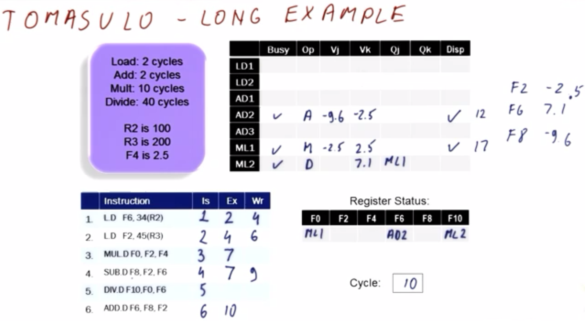
    </center>
    
    | Instruction Label | Instruction | Cycle of `Issue` | Cycle of `Execute` | Cycle of `Write Result` |
    |:--:|:--:|:--:|:--:|:--:|
    | `I1` | `L.D F6, 34(R2)` | `C1` | `C2` | `C4` |
    | `I2` | `L.D F2, 45(R3)` | `C2` | `C4` | `C6` |
    | `I3` | `MUL.D F0, F2, F4` | `C3` | `C7` | |
    | `I4` | `SUB.D F8, F2, F6` | `C4` | `C7` | `C9` |
    | `I5` | `DIV.D F10, F0, F6` | `C5` | | |
    | `I6` | `ADD.D F6, F8, F2` | `C6` | `C10` | |
    
    | Reservation Station Label | RS is busy/occupied? | Operation | Operand `Vj` | Operand `Vk` | Waited-for value `Qj` | Waited-for value `Qk` | Instruction is dispatched? |
    |:--:|:--:|:--:|:--:|:--:|:--:|:--:|:--:|
    | `LD1` | | | | | | | |
    | `LD2` | | | | | | | | |
    | `AD1` | | | | | | | | |
    | `AD2` | `C10` | `ADD.D` | `-9.6` | `-2.5` | `(N/A)` | `(N/A)` | `Yes (C10-C12)` |
    | `AD3` | | | | | | | |
    | `ML1` | `C10` | `MUL.D` | `-2.5` | `2.5` |`(N/A)` |`(N/A)` | `Yes (C7-C17)` |
    | `ML2` | `C10` | `DIV.D` | `(waiting)` | `7.1` | `ML1` | `(N/A)` | `No` |
    
    In cycle `C10`, instruction `I6` is able to dispatch, as indicated in the tables shown above.
    
    In cycle `C11`, the RSes `AD2` and `ML1` are executing their respective instructions, however, no other operations occur in this time.
    
    <center>
    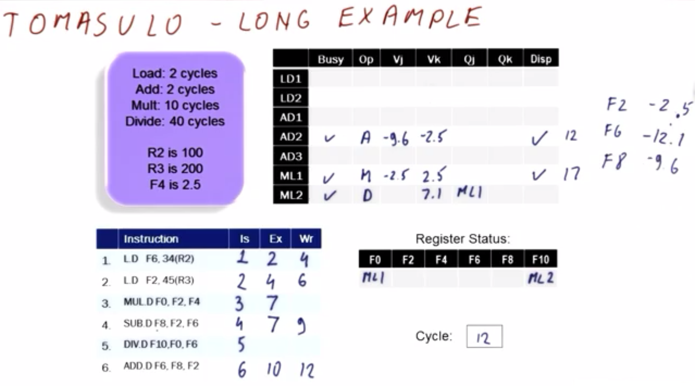
    </center>
    
    | Instruction Label | Instruction | Cycle of `Issue` | Cycle of `Execute` | Cycle of `Write Result` |
    |:--:|:--:|:--:|:--:|:--:|
    | `I1` | `L.D F6, 34(R2)` | `C1` | `C2` | `C4` |
    | `I2` | `L.D F2, 45(R3)` | `C2` | `C4` | `C6` |
    | `I3` | `MUL.D F0, F2, F4` | `C3` | `C7` | |
    | `I4` | `SUB.D F8, F2, F6` | `C4` | `C7` | `C9` |
    | `I5` | `DIV.D F10, F0, F6` | `C5` | | |
    | `I6` | `ADD.D F6, F8, F2` | `C6` | `C10` | `C12` |
    
    | Reservation Station Label | RS is busy/occupied? | Operation | Operand `Vj` | Operand `Vk` | Waited-for value `Qj` | Waited-for value `Qk` | Instruction is dispatched? |
    |:--:|:--:|:--:|:--:|:--:|:--:|:--:|:--:|
    | `LD1` | | | | | | | |
    | `LD2` | | | | | | | | |
    | `AD1` | | | | | | | | |
    | `AD2` | | | | | | | | |
    | `AD3` | | | | | | | |
    | `ML1` | `C12` | `MUL.D` | `-2.5` | `2.5` |`(N/A)` |`(N/A)` | `Yes (C7-C17)` |
    | `ML2` | `C12` | `DIV.D` | `(waiting)` | `7.1` | `ML1` | `(N/A)` | `No` |
    
    In cycle `C12`, instruction `I6` is able to broadcast its result (`-12.1`) via RS `AD2`, as indicated in the tables shown above. (In this case, there is no capture/latch, since there is no RS waiting on this particular result.)
    
    | Register | Value |
    |:--:|:--:|
    | `F0` | `ML1` |
    | `F2` | |
    | `F4` | |
    | `F6` | |
    | `F8` | |
    | `F10` | `ML2` |
    
    Furthermore, with respect to broadcast, the RAT is updated as shown above (i.e., with `F6` now read directly from REGS). Additionally, note that the old value (`7.1`) for `F6` in REGS is overwritten by the new value (`-12.1`).
    
    The subsequent cycles `C13` through `C16` simply execute pending instruction via RS `ML1`.
    
    <center>
    
    </center>
    
    | Instruction Label | Instruction | Cycle of `Issue` | Cycle of `Execute` | Cycle of `Write Result` |
    |:--:|:--:|:--:|:--:|:--:|
    | `I1` | `L.D F6, 34(R2)` | `C1` | `C2` | `C4` |
    | `I2` | `L.D F2, 45(R3)` | `C2` | `C4` | `C6` |
    | `I3` | `MUL.D F0, F2, F4` | `C3` | `C7` | `C17` |
    | `I4` | `SUB.D F8, F2, F6` | `C4` | `C7` | `C9` |
    | `I5` | `DIV.D F10, F0, F6` | `C5` | | |
    | `I6` | `ADD.D F6, F8, F2` | `C6` | `C10` | `C12` |
    
    | Reservation Station Label | RS is busy/occupied? | Operation | Operand `Vj` | Operand `Vk` | Waited-for value `Qj` | Waited-for value `Qk` | Instruction is dispatched? |
    |:--:|:--:|:--:|:--:|:--:|:--:|:--:|:--:|
    | `LD1` | | | | | | | |
    | `LD2` | | | | | | | | |
    | `AD1` | | | | | | | | |
    | `AD2` | | | | | | | | |
    | `AD3` | | | | | | | |
    | `ML1` | | | | | | | |
    | `ML2` | `C17` | `DIV.D` | `-6.25` | `7.1` |`(N/A)` | `(N/A)` | `No` |
    
    In cycle `C17`, instruction `I3` is able to broadcast its result (`-6.25`) via RS `ML1`, which is correspondingly broadcasted and captured/latched, as indicated in the tables shown above.
    
    | Register | Value |
    |:--:|:--:|
    | `F0` | |
    | `F2` | |
    | `F4` | |
    | `F6` | |
    | `F8` | |
    | `F10` | `ML2` |
    
    Furthermore, with respect to broadcast, the RAT is updated as shown above (i.e., with `F0` now read directly from REGS).
    
    <center>
    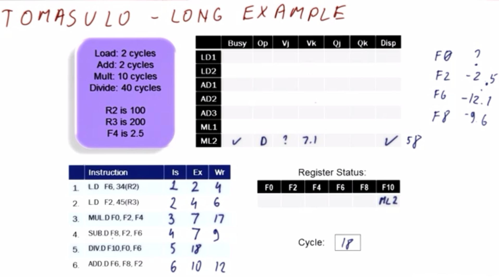
    </center>
    
    | Instruction Label | Instruction | Cycle of `Issue` | Cycle of `Execute` | Cycle of `Write Result` |
    |:--:|:--:|:--:|:--:|:--:|
    | `I1` | `L.D F6, 34(R2)` | `C1` | `C2` | `C4` |
    | `I2` | `L.D F2, 45(R3)` | `C2` | `C4` | `C6` |
    | `I3` | `MUL.D F0, F2, F4` | `C3` | `C7` | `C17` |
    | `I4` | `SUB.D F8, F2, F6` | `C4` | `C7` | `C9` |
    | `I5` | `DIV.D F10, F0, F6` | `C5` | `C18` | |
    | `I6` | `ADD.D F6, F8, F2` | `C6` | `C10` | `C12` |
    
    | Reservation Station Label | RS is busy/occupied? | Operation | Operand `Vj` | Operand `Vk` | Waited-for value `Qj` | Waited-for value `Qk` | Instruction is dispatched? |
    |:--:|:--:|:--:|:--:|:--:|:--:|:--:|:--:|
    | `LD1` | | | | | | | |
    | `LD2` | | | | | | | | |
    | `AD1` | | | | | | | | |
    | `AD2` | | | | | | | | |
    | `AD3` | | | | | | | |
    | `ML1` | | | | | | | |
    | `ML2` | `C18` | `DIV.D` | `-6.25` | `7.1` |`(N/A)` | `(N/A)` | `Yes (C18-C58)` |
    
    In cycle `C18`, the last-remaining instruction `I5` is able to dispatch, as indicated in the tables shown above.
    
    The subsequent cycles `C19` through `C57` simply execute pending instruction via RS `ML2`.
    
    <center>
    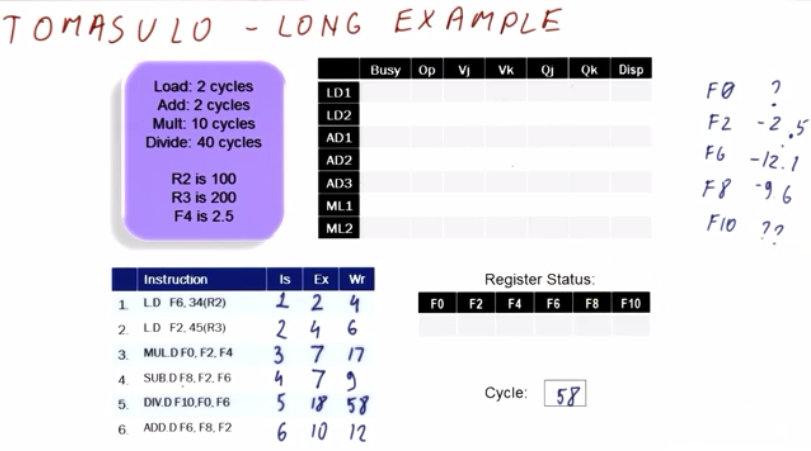
    </center>
    
    | Instruction Label | Instruction | Cycle of `Issue` | Cycle of `Execute` | Cycle of `Write Result` |
    |:--:|:--:|:--:|:--:|:--:|
    | `I1` | `L.D F6, 34(R2)` | `C1` | `C2` | `C4` |
    | `I2` | `L.D F2, 45(R3)` | `C2` | `C4` | `C6` |
    | `I3` | `MUL.D F0, F2, F4` | `C3` | `C7` | `C17` |
    | `I4` | `SUB.D F8, F2, F6` | `C4` | `C7` | `C9` |
    | `I5` | `DIV.D F10, F0, F6` | `C5` | `C18` | `C58` |
    | `I6` | `ADD.D F6, F8, F2` | `C6` | `C10` | `C12` |
    
    | Reservation Station Label | RS is busy/occupied? | Operation | Operand `Vj` | Operand `Vk` | Waited-for value `Qj` | Waited-for value `Qk` | Instruction is dispatched? |
    |:--:|:--:|:--:|:--:|:--:|:--:|:--:|:--:|
    | `LD1` | | | | | | | |
    | `LD2` | | | | | | | | |
    | `AD1` | | | | | | | | |
    | `AD2` | | | | | | | | |
    | `AD3` | | | | | | | |
    | `ML1` | | | | | | | |
    | `ML2` | | | | | | | |
    
    In cycle `C58`, the last-remaining instruction `I5` is able to broadcast its result (`0.5165`), as indicated in the tables shown above.
    
    | Register | Value |
    |:--:|:--:|
    | `F0` | |
    | `F2` | |
    | `F4` | |
    | `F6` | |
    | `F8` | |
    | `F10` | |
    
    Furthermore, with respect to broadcast, the RAT is updated as shown above (i.e., with `F10` now read directly from REGS).
    
    This concludes execution of the program via Tomasulo's algorithm.
    
    ## 27. Tomasulo's Algorithm - Timing Example
    
    As a practical matter (e.g., exam questions), it is typically most noteworthy to focus on **timing** of particular events (i.e., cycles in which dispatches, executions, broadcasts, etc. occur).
    
    <center>
    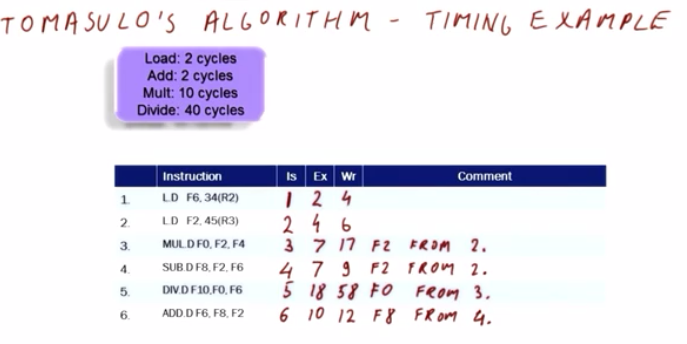
    </center>
    
    Consider such an example, as in the figure shown above.
    
    The processor given is the same as from before (cf. Section 21), as well as the same program in question.
    
    | Instruction Label | Instruction | Cycle of `Issue` | Cycle of `Execute` | Cycle of `Write Result` | Comment |
    |:--:|:--:|:--:|:--:|:--:|:--:|
    | `I1` | `L.D F6, 34(R2)` | | | | |
    | `I2` | `L.D F2, 45(R3)` | | | | |
    | `I3` | `MUL.D F0, F2, F4` | | | | |
    | `I4` | `SUB.D F8, F2, F6` | | | | |
    | `I5` | `DIV.D F10, F0, F6` | | | | |
    | `I6` | `ADD.D F6, F8, F2` | | | | |
    
    As a consolidated version of the same example, consider the table shown above.
    
    | Instruction Label | Instruction | Cycle of `Issue` | Cycle of `Execute` | Cycle of `Write Result` | Comment |
    |:--:|:--:|:--:|:--:|:--:|:--:|
    | `I1` | `L.D F6, 34(R2)` | `C1` | `C2` | `C4` | |
    
    With respect to instruction `I1` (as in the table shown above), by inspection, an issue can occur in cycle `C1`, followed by an execution in cycle `C2`. The result can be written as early as cycle `C4` (i.e., based on the hardware constraints), so this is noted tentatively as such accordingly.
    
    | Instruction Label | Instruction | Cycle of `Issue` | Cycle of `Execute` | Cycle of `Write Result` | Comment |
    |:--:|:--:|:--:|:--:|:--:|:--:|
    | `I1` | `L.D F6, 34(R2)` | `C1` | `C2` | `C4` | |
    | `I2` | `L.D F2, 45(R3)` | `C2` | `C4` | `C6` | |
    
    With respect to instruction `I2` (as in the table shown above), by inspection, an issue can occur in cycle `C2`. Furthermore, since the load instructions cannot overlap, the earliest possible execution would be in cycle `C4`, followed by a tentative write result in cycle `C6`.
    
    | Instruction Label | Instruction | Cycle of `Issue` | Cycle of `Execute` | Cycle of `Write Result` | Comment |
    |:--:|:--:|:--:|:--:|:--:|:--:|
    | `I1` | `L.D F6, 34(R2)` | `C1` | `C2` | `C4` | |
    | `I2` | `L.D F2, 45(R3)` | `C2` | `C4` | `C6` | |
    | `I3` | `MUL.D F0, F2, F4` | `C3` | `C7` | `C17` | operand `F2` dependent on instruction `I2` |
    
    With respect to instruction `I3` (as in the table shown above), by inspection, an issue can occur in cycle `C3`, and there is a corresponding reservation station available for this purpose (i.e., `ML1`). Examining the operands of instruction `I3`, there is a dependency with respect to `F2` (via instruction `I2`), so the earliest possible execution for instruction `I3` would be cycle `C7`. Furthermore, a tentative write result can occur in cycle `C17` for this operation (which requires `10` cycles to execute).
    
    | Instruction Label | Instruction | Cycle of `Issue` | Cycle of `Execute` | Cycle of `Write Result` | Comment |
    |:--:|:--:|:--:|:--:|:--:|:--:|
    | `I1` | `L.D F6, 34(R2)` | `C1` | `C2` | `C4` | |
    | `I2` | `L.D F2, 45(R3)` | `C2` | `C4` | `C6` | |
    | `I3` | `MUL.D F0, F2, F4` | `C3` | `C7` | `C17` | operand `F2` dependent on instruction `I2` |
    | `I4` | `SUB.D F8, F2, F6` | `C4` | `C7` | `C9` | operand `F2` dependent on instruction `I2` |
    
    With respect to instruction `I4` (as in the table shown above), by inspection, an issue can occur in cycle `C4`, and there is a corresponding reservation station available for this purpose (i.e., `AD1`). Examining the operands of instruction `I4`, there is a dependency with respect to both `F2` (via instruction `I2`) and `F6` (via instruction `I1`), so the earliest possible execution for instruction `I4` would be cycle `C7`. Furthermore, a tentative write result can occur in cycle `C9` for this operation (which requires `2` cycles to execute).
    
    | Instruction Label | Instruction | Cycle of `Issue` | Cycle of `Execute` | Cycle of `Write Result` | Comment |
    |:--:|:--:|:--:|:--:|:--:|:--:|
    | `I1` | `L.D F6, 34(R2)` | `C1` | `C2` | `C4` | |
    | `I2` | `L.D F2, 45(R3)` | `C2` | `C4` | `C6` | |
    | `I3` | `MUL.D F0, F2, F4` | `C3` | `C7` | `C17` | operand `F2` dependent on instruction `I2` |
    | `I4` | `SUB.D F8, F2, F6` | `C4` | `C7` | `C9` | operand `F2` dependent on instruction `I2` |
    | `I5` | `DIV.D F10, F0, F6` | `C5` | `C18` | `C58` | operand `F0` dependent on instruction `I3` |
    
    With respect to instruction `I5` (as in the table shown above), by inspection, an issue can occur in cycle `C5`, and there is a corresponding reservation station available for this purpose (i.e., `ML2`). Examining the operands of instruction `I5`, there is a dependency with respect to both `F0` (via instruction `I3`) and `F6` (via instruction `I1`), so the earliest possible execution for instruction `I5` would be cycle `C18`. Furthermore, a tentative write result can occur in cycle `C58` for this operation (which requires `40` cycles to execute).
    
    | Instruction Label | Instruction | Cycle of `Issue` | Cycle of `Execute` | Cycle of `Write Result` | Comment |
    |:--:|:--:|:--:|:--:|:--:|:--:|
    | `I1` | `L.D F6, 34(R2)` | `C1` | `C2` | `C4` | |
    | `I2` | `L.D F2, 45(R3)` | `C2` | `C4` | `C6` | |
    | `I3` | `MUL.D F0, F2, F4` | `C3` | `C7` | `C17` | operand `F2` dependent on instruction `I2` |
    | `I4` | `SUB.D F8, F2, F6` | `C4` | `C7` | `C9` | operand `F2` dependent on instruction `I2` |
    | `I5` | `DIV.D F10, F0, F6` | `C5` | `C18` | `C58` | operand `F0` dependent on instruction `I3` |
    | `I6` | `ADD.D F6, F8, F2` | `C6` | `C10` | `C12` | operand `F8` dependent on instruction `I4` |
    
    Lastly, with respect to instruction `I6` (as in the table shown above), by inspection, an issue can occur in cycle `C6`, and there is a corresponding reservation station available for this purpose (i.e., `AD2`). Examining the operands of instruction `I6`, there is a dependency with respect to both `F8` (via instruction `I4`) and `F2` (via instruction `I2`), so the earliest possible execution for instruction `I6` would be cycle `C10`. Furthermore, a tentative write result can occur in cycle `C12` for this operation (which requires `2` cycles to execute).
    
    As a final "sanity check," to ensure proper ordering of instructions, examine the "Cycle of `Write Result`" to ensure there are no inconsistencies and/or nonsensical entries (e.g., two instructions attempting to write simultaneously in the *same* cycle). Here, no such inconsistencies result, so the proposed tentative values can be finalized. (Conversely, if such collisions had occurred, it would be necessary to reevaluate the cycles, e.g., postponing certain cycles to allow proper write results ordering.)

    ## 31. ReOrder Buffer (ROB) Timing Example
    
    Following a similar approach to previously with respect to Tomasulo's algorithm (cf. Lesson 7), consider now a "timing analysis" of a ROB-based system.
    
    <center>
    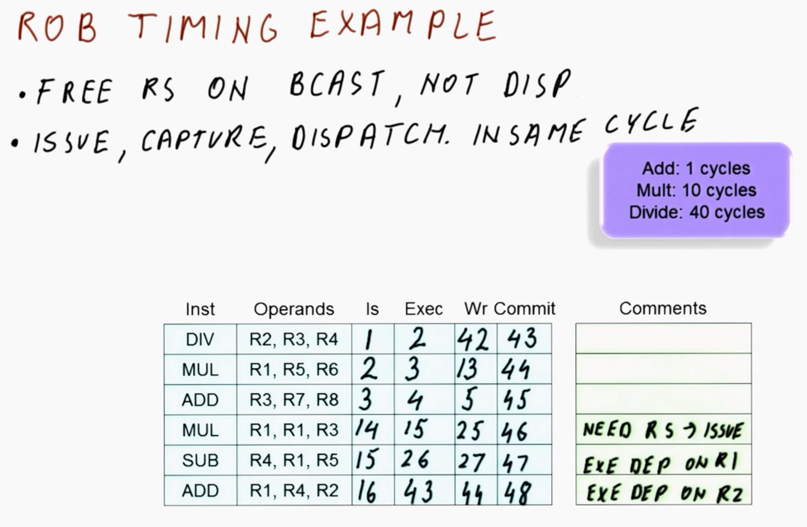
    </center>
    
    Consider the system as in the figure shown above.
    
    ```mips
    DIV R2, R3, R4 # I1
    MUL R1, R5, R6 # I2
    ADD R3, R7, R8 # I3
    MUL R1, R1, R3 # I4
    SUB R4, R1, R5 # I5
    ADD R1, R4, R2 # I6
    ```
    
    The instructions in the system are as shown above.
    
    The execution units are characterized as follows:
      * Instructions `ADD` and `SUB` require `1` cycle to execute
      * Instruction `MUL` requires `10` cycles to execute
      * Instruction `DIV` requires `40` cycles to execute
    
    Furthermore, the processor operations are characterized as follows:
      * Reservation stations (RSes) are freed on broadcast, *not* on dispatch
        * ***N.B.*** In practice, this can occur in a speculative processor, wherein the instruction is retained until there is sufficient "certainty" that instruction execution is appropriate by that point
      * Issue, capture, and dispatch operations can all occur in the *same* cycle, with consequent execution occurring in the *following* cycle
        * ***N.B.*** This is similar to the processors of the previous examples
    
    Assume that there are arbitrarily many ROB entries available (i.e., at least `6` such entries), and that there are `2` RSes for operations `MUL`/`DIV` and `3` RSes for operations `ADD`/`SUB`.
    
    | Instruction | Operands | Issue | Execute | Write Result | Commit | Comments |
    |:-:|:-:|:-:|:-:|:-:|:-:|:-:|
    | `DIV` | `R2, R3, R4` | `C1` | `C2` | `C42` | `C43` | |
    
    In cycle `C1`, instruction `I1` is issued into one of the `MUL`/`DIV` RSes, as per the table shown above.
    
    Being the first instruction, `I1` has no dependencies "by inspection," therefore, it commences execution in the subsequent cycle `C2`. Furthermore, instruction `DIV` requires `40` cycles, therefore, the earliest possible write result would be in cycle `C42`, which is noted tentatively at this point.
    
    Furthermore, the commit will occur in the subsequent cycle (i.e., `C43`).
    
    | Instruction | Operands | Issue | Execute | Write Result | Commit | Comments |
    |:-:|:-:|:-:|:-:|:-:|:-:|:-:|
    | `DIV` | `R2, R3, R4` | `C1` | `C2` | `C42` | `C43` | |
    | `MUL` | `R1, R5, R6` | `C2` | `C3` | `C13` | `C44` | |
    
    In cycle `C2`, instruction `I2` is issued into the other `MUL`/`DIV` RS, as per the table shown above.
    
    Instruction `I2` has no dependencies "by inspection," therefore, it commences execution in the subsequent cycle `C3`. Furthermore, instruction `MUL` requires `10` cycles, therefore, the earliest possible write result would be in cycle `C13`, which is noted tentatively at this point.
    
    Furthermore, the commit will be unable to occur until at least cycle `C44`, pending commit of the upstream instruction `I1`.
    
    | Instruction | Operands | Issue | Execute | Write Result | Commit | Comments |
    |:-:|:-:|:-:|:-:|:-:|:-:|:-:|
    | `DIV` | `R2, R3, R4` | `C1` | `C2` | `C42` | `C43` | |
    | `MUL` | `R1, R5, R6` | `C2` | `C3` | `C13` | `C44` | |
    | `ADD` | `R3, R7, R8` | `C3` | `C4` | `C5` | `C45` | |
    
    In cycle `C3`, instruction `I3` is issued into one of the `ADD`/`SUB` RSes, as per the table shown above.
    
    Instruction `I3` has no dependencies "by inspection," therefore, it commences execution in the subsequent cycle `C4`. Furthermore, instruction `ADD` requires `1` cycle, therefore, the earliest possible write result would be in cycle `C5`, which is noted tentatively at this point.
    
    Furthermore, the commit will be unable to occur until at least cycle `C45`, pending commit of the upstream instruction `I2`.
    
    | Instruction | Operands | Issue | Execute | Write Result | Commit | Comments |
    |:-:|:-:|:-:|:-:|:-:|:-:|:-:|
    | `DIV` | `R2, R3, R4` | `C1` | `C2` | `C42` | `C43` | |
    | `MUL` | `R1, R5, R6` | `C2` | `C3` | `C13` | `C44` | |
    | `ADD` | `R3, R7, R8` | `C3` | `C4` | `C5` | `C45` | |
    | `MUL` | `R1, R1, R3` | `C14` | `C15` | `C25` | `C46` | Requires a free RS in order to issue, must wait until `C14` |
    
    In cycle `C4`, instruction `I4` cannot be issued into one of the `MUL`/`DIV` RSes (which are both currently occupied pending execution of their respective instructions), therefore, the earliest possible issue of instruction `I4` is in cycle `C14`, as per the table shown above. 
    
    Furthermore, instruction `I4` has dependencies for both of its operands, however, both will have executed by the end of cycle `C14`, and therefore instruction `I4` can commence execution in cycle `C15`. Instruction `MUL` requires `10` cycles, therefore, the earliest possible write result would be in cycle `C25`, which is noted tentatively at this point.
    
    Furthermore, the commit will be unable to occur until at least cycle `C46`, pending commit of the upstream instruction `I3`.
    
    | Instruction | Operands | Issue | Execute | Write Result | Commit | Comments |
    |:-:|:-:|:-:|:-:|:-:|:-:|:-:|
    | `DIV` | `R2, R3, R4` | `C1` | `C2` | `C42` | `C43` | |
    | `MUL` | `R1, R5, R6` | `C2` | `C3` | `C13` | `C44` | |
    | `ADD` | `R3, R7, R8` | `C3` | `C4` | `C5` | `C45` | |
    | `MUL` | `R1, R1, R3` | `C14` | `C15` | `C25` | `C46` | Requires a free RS in order to issue, must wait until `C14` |
    | `SUB` | `R4, R1, R5` | `C15` | `C26` | `C27` | `C47` | Execution depends on `R1` |
    
    In cycles `C4` and `C5`, instruction `I5` cannot be issued yet (i.e., to ensure issuing of instructions in program-order), therefore, the earliest possible issue of instruction `I5` is in cycle `C15`, as per the table shown above.
    
    Furthermore, instruction `I5` has a dependency via operand `R1`, whose value is not broadcasted until cycle `C25` (via instruction `I4`), and therefore instruction `I5` can commence execution in cycle `C26`. Instruction `SUB` requires `1` cycle, therefore, the earliest possible write result would be in cycle `C27`, which is noted tentatively at this point.
    
    Furthermore, the commit will be unable to occur until at least cycle `C47`, pending commit of the upstream instruction `I4`.
    
    | Instruction | Operands | Issue | Execute | Write Result | Commit | Comments |
    |:-:|:-:|:-:|:-:|:-:|:-:|:-:|
    | `DIV` | `R2, R3, R4` | `C1` | `C2` | `C42` | `C43` | |
    | `MUL` | `R1, R5, R6` | `C2` | `C3` | `C13` | `C44` | |
    | `ADD` | `R3, R7, R8` | `C3` | `C4` | `C5` | `C45` | |
    | `MUL` | `R1, R1, R3` | `C14` | `C15` | `C25` | `C46` | Requires a free RS in order to issue, must wait until `C14` |
    | `SUB` | `R4, R1, R5` | `C15` | `C26` | `C27` | `C47` | Execution depends on `R1` |
    | `ADD` | `R1, R4, R2` | `C16` | `C43` | `C44` | `C48` | Execution depends on `R2`|
    
    In cycles `C5` and `C6`, instruction `I6` cannot be issued yet (i.e., to ensure issuing of instructions in program-order), therefore, the earliest possible issue of instruction `I6` is in cycle `C16`, as per the table shown above.
    
    Furthermore, instruction `I6` has dependencies for both of its operands, however, both will have executed by the end of cycle `C42`, and therefore instruction `I6` can commence execution in cycle `C43`. Instruction `ADD` requires `1` cycle, therefore, the earliest possible write result would be in cycle `C44`, which is noted tentatively at this point.
    
    Furthermore, the commit will be unable to occur until at least cycle `C48`, pending commit of the upstream instruction `I5`.
    
    This concludes the timing analysis of the system.