# Introduction

## 4. Computer Architecture Quiz and Answers

Computer architecture is about: (Select all that apply.)
* How to build faster transistors
  * `DOES NOT APPLY` - Computer architecture may involve the use of such faster transistors for building better/faster computers, but it does not pertain to the design of these transistors themselves.
* How to build faster computers
  * `APPLIES` - Since a "faster" computer may fit the criterion of a "better" computer, computer architecture is a key method by which such a faster/better computer can be achieved.
* How to build larger buildings
  * `DOES NOT APPLY`
* How to design energy-efficient computers
  * `APPLIES` - Energy efficiency is another criterion by which a computer can be deemed "better."
* How to build buildings that fit more computers
  * `DOES NOT APPLY`
* How to build computers that fit better into buildings
  * `APPLIES` - Optimizing the size of a computer is another criterion related to computer architecture.

## 7. Speed Doubling Quiz and Answers

<center>
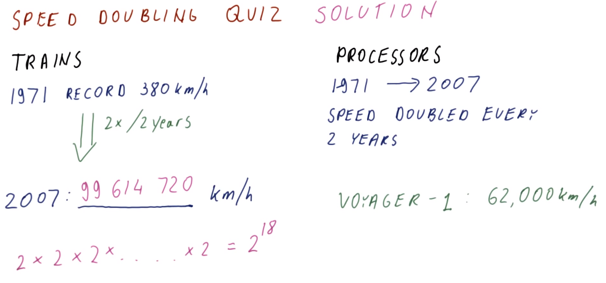
</center>

Consider the implications of speed doubling, by comparing the speed of trains and processors, as in the figure shown above.

Therefore, if maximum train speed had doubled at a comparable rate to processors between 1971 and 2007 (i.e., twice every two years, for 18 years), the resulting speed would be an astronomical `2`<sup>`18`</sup> km/h (or `99,614,720` km/h); for comparison/reference, the Voyager-1 probe (the fastest entity built by humans to date) achieved a maximum speed of `62,000` km/h. Furthermore, over that time period (18 years), the maximum train speed has not even doubled (i.e., not even `2`<sup>`1`</sup>)!

## 10. Speed vs. Power vs. Weight vs. Cost Quiz and Answers

<center>
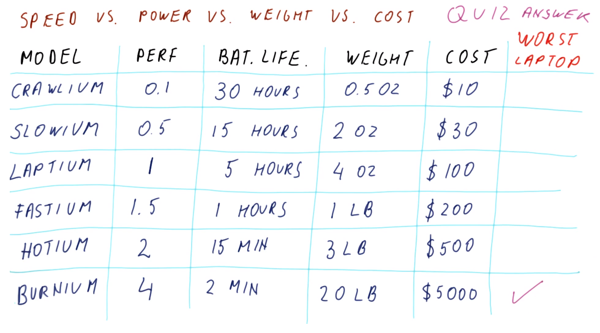
</center>

Consider the laptop processor models as in the figure shown above, which compares their relative speed performance, expected battery life, overall weight, and cost. Of these models, which is the ***worst***?
* The general trend moving down the table rows is an improvement in speed performance with corresponding diminution of the remaining characteristics.
* `Laptium` is a reasonable processor model, giving reasonable performance balanced with acceptable battery life, weight, and cost. Similarly, `Slowium` is somewhat reasonable, sacrificing speed for a comparable improvement in the other characteristics.
* Beginning with `Fastium` (moving towards the bottom), however, the improvement in speed is rapidly outpaced by diminution in the other characteristics.
* In general, the design in the "middle" of the table (e.g., `Laptium` and `Fastium`) are better than either extremes (`Crawlium` and `Burnium`).
* Therefore, in comparing the extremes, the ***worst*** model is `Burnium`. `Crawlium` may still have some use cases (e.g., embedded devices, simple handheld devices, etc.), while `Burnium` has extremely suboptimally improved performance at the expense of the other desirable performance characteristics. Thus, paradoxically, in this example, the "highest performance" processor is also the worst!

## 14. Active Power Quiz and Answers

<center>
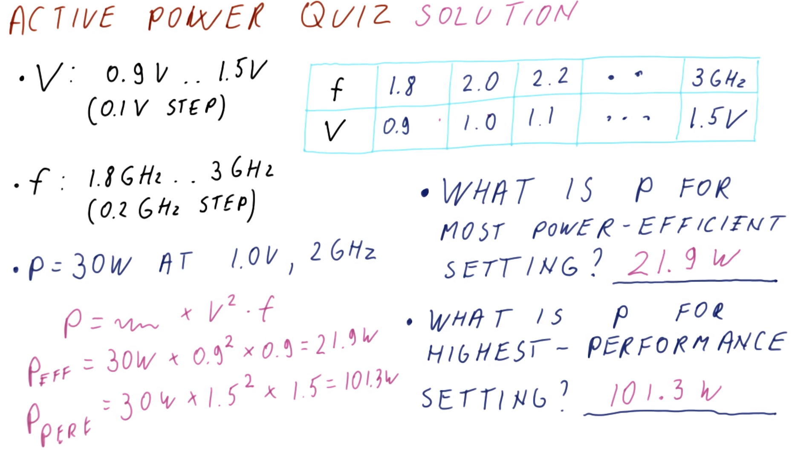
</center>

Consider a processor with the parameters as shown in the figure above, having the given relationships/requirements between frequency `f` and voltage `V` per the table (where `V` is the minimum possible value for given `f`). Furthermore, assume that a power measurement of `30 W` is observed at `1.0 V` and `2 GHz`.

What is the power for the most power-efficient setting?
* `30 W × (0.9 V / 1.0 V)`<sup>`2`</sup>` × (1.8 GHz / 2 GHz) = 21.9 W`
  * This is the setting with the lowest frequency and lowest voltage, due to the relationships `P ~ f` and `P ~ V`<sup>`2`</sup> (respectively)

What is the power for the highest-performance (i.e., speed) setting?
* `30 W × (1.5 V / 1.0 V)`<sup>`2`</sup>` × (3 GHz / 2 GHz) = 101.3 W`
  * This is the setting with the highest frequency

Therefore, there is a large difference in power consumption between the most power-efficient vs. highest-performance settings, however, the corresponding difference between these two settings is not even a `2×` improvement in performance (i.e., `f`), due to the relatively larger effect of the voltage on performance.

## 18. Manufacturing Cost Quiz and Answers

Consider the following processors:
* `WP` (watch processor) - `1 mm`<sup>`2`</sup> processor for watches
* `LP` (laptop processor) - `100 mm`<sup>`2`</sup> processor for laptops

Which of the following is true regarding these processors cost? (Select the correct choice.)
* cost(LP) = 100 * cost(WP)
* cost(LP) > 100 * cost(WP)
  * `CORRECT` - Larger processors generally result in lower yield.
    * ***N.B.*** cost(LP) = 100 * cost(WP) would only be true if yield were disregarded; however, this is not a practical assumption. Recall the effect of chip size on working chips quantity (cf. Section 17).
* cost(LP) < 100 * cost(WP)

# Metrics and Evaluation

## 3. Latency and Throughput Quiz and Answers

<center>
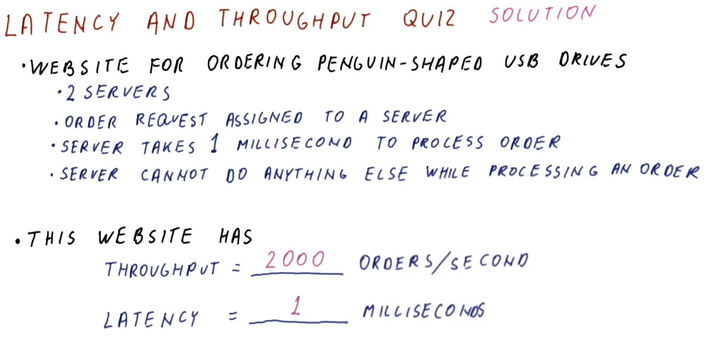
</center>

Consider a website for ordering penguin-shaped USB drives having the following features:
* `2` servers
* An order request is assigned to a server
* The server takes `1 ms` to process an order
* The server cannot perform any other tasks while processing an order

What is the throughput and latency for this website?
* Throughput
  * `(2 orders)/(1 ms) = 2000 orders/s` - both servers process an order simultaneously over the *same* `1 ms` time interval, thereby achieving a higher throughput relative to a *single* server processing orders by itself
* Latency
  * `1 ms` - as given in the prompt

## 5. Performance Comparison 1 Quiz and Answers

Assume that an old laptop takes `4 hours` to compress a video, while a new laptop can perform this same task in `10 minutes`.

What is the speedup of the new laptop relative to the old laptop?
* `speedup = latency(old)/latency(new) = (4 hr × 60 mins/hr)/(10 min) = 24`

***N.B.*** Intuitively, `speedup > 1` indicates that the new system is *faster* than the old system; conversely, `speedup < 1` indicates that the new system is *slower* than the old system. With this intuition, incorrectly calculating speedup in this example via throughputs (i.e., `speedup = 10/240 = 0.04`) yields an unintuitive result.

## 6. Performance Comparison 2 Quiz and Answers

Consider again the laptop which can compress a video in `10 minutes`. Now, assume that it falls down the storm drain, and we are forced to use the old laptop instead, which can compress the same video in `4 hours`.

What is the speedup of the old laptop relative to the new laptop?
* `speedup = latency(new)/latency(old) = (10 min)/(4 hr × 60 mins/hr) = 0.04`

***N.B.*** As before, intuition can help with interpreting the result. In this case, it is sensible that indeed the older system has a "slow speedup" (i.e., `speedup < 1`).

## 11. Performance Reporting Quiz and Answers

Which of the following uses code from real applications, but *not all* of the code? (Select the correct choice.)
* actual workload mix
  * `INCORRECT` - similarly to an application suite, an actual workload mix uses *all* of the real application code, and additionally includes actual usage patterns from a specific user
* application suite
  * `INCORRECT` - an application suite uses *all* of the real application code
* application kernel
  * `CORRECT` - an application kernel tests that subset of real application's code which is performance-critical
* synthetic benchmarks
  * `INCORRECT` - synthetic benchmarks do not use code from real applications, but rather use code specifically designed for testing
* peak performance
  * `INCORRECT` - peak performance doe snot use any code

## 14. Speedup Averaging Quiz and Answers

Consider the following benchmark comparing an old laptop to a new laptop:

| Representative Application Workload | Old-to-New Speedup |
|:---:|:---:|
| Homework Formatting | `2` |
| Virus Scanner | `8` |

What is the ***overall*** speedup going from the old laptop to the new laptop?
* `(2*8)^(1/2) = 4`

***N.B.*** As indicated previously (cf. Section 13), arithmetic means (e.g., `(2 + 8)/2 = 5`) are ***not*** appropriate for comparison when dealing with ratios (e.g., speedups), therefore, the geometric mean is used instead.

## 16. Iron Law Quiz and Answers

Consider the following system:
* The program executes `3 billion` instructions
* The processor spends `2 cycles` on each instruction
* The processor clock cycle speed/frequency is `3 GHz`

What is the total execution time of the program on this processor?
* `(3 * 10^9 instructions) × (2 cycles/instruction) × [1/(3 * 10^9 cycles/s)] = 2 s`

## 18. Iron Law 2 Quiz and Answers

Consider the following system:
* The program executes `50 billion` instructions
  * `10 billion` are branches, with `4 cycles` per instruction
  * `15 billion` are loads, with `2 cycles` per instruction
  * `5 billion` are stores, with `3 cycles` per instruction
  * The remainder are integer adds, with `1 cycle` per instruction
* The processor clock cycle speed/frequency is `4 GHz`

What is the total execution time of the program on this processor?
* `[(10 * 10^9 ins * 4 cycles/ins) + (15 * 10^9 ins * 2 cycles/ins) + (5 * 10^9 ins * 3 cycles/ins) + (20 * 10^9 ins * 1 cycle/ins)] × [1/(4 * 10^9 cycles/s)] = 105/4 s = 26.25 s`

## 20. Amdahl's Law Quiz and Answers

Consider the following system:
* The program executes `50 billion` instructions
* The processor clock cycle speed/frequency is `2 GHz`
* The instruction `BRANCH` is improved from `4` to `2` cycles per instruction

Furthermore, the following are given:

| Instruction Type | % of Total Instructions in the Program | CPI |
|:---:|:---:|:---:|
| `INT` | `40%` | `1` |
| `BRANCH` | `20%` | `4` → `2` |
| `LOAD` | `30%` | `2` |
| `STORE` | `10%` | `3` |

What is the overall speedup of the system?
* via Iron Law:
  ```
  speedup = {[(0.4 * 1) + (0.2 * 4) + (0.3 * 2) + (0.1 * 3) cycles/ins] × (50 * 10^9 ins) × [1/(2 * 10^9 cycles/s)]} /
            {[(0.4 * 1) + (0.2 * 2) + (0.3 * 2) + (0.1 * 3) cycles/ins] × (50 * 10^9 ins) × [1/(2 * 10^9 cycles/s)]}
          = 1.24
  ```

***N.B.*** While it may seem appropriate to apply Amdahl's Law as follows (via `Frac`<sub>`ENH`</sub>` = 20%` per instruction `BRANCH`):
```
speedup = 1/[(1 - 0.2) + (0.2/(4/2))] = 1/0.9 = 1.111
```
this does ***not*** apply here. This is because `Frac`<sub>`ENH`</sub> is only with respect to the instruction `BRANCH` (i.e., its quantity), ***not*** with respect to the overall execution time of the system/program. Recall (cf. Section 19) that Amdahl's Law only applies to execution time, but ***not*** to instructions count or to other such factors.

## 22. Amdahl's Law 2 Quiz and Answers

Assume the following are given:

| Instruction Type | % of Execution Time | CPI |
|:---:|:---:|:---:|
| `INT` | `40%` | `1` |
| `BRANCH` | `20%` | `4` |
| `LOAD` | `30%` | `2` |
| `STORE` | `10%` | `3` |

Furthermore, the clock frequency is `2 GHz`.

Which of the following possible improvements is the best? (Select the correct option.)
* Decrease CPI from `4` to `3` for instruction `BRANCH`
  * `INCORRECT` - `1/[(1-0.2) + 0.2/(4/3)] = 1.05`
* Increase clock frequency from `2 GHz` to `2.3 GHz`
  * `CORRECT` - `1/[(1-1) + 1/(2.3/2)] = 1.15`
* Decrease CPI from `3` to `2` for instruction `STORE`
  * `INCORRECT` - `1/[(1-0.1) + 0.1/(3/2)] = 1.034`

***N.B.*** Observe that increasing the clock frequency impacts `100%` of the system execution time, compared to the relatively smaller system-wide impacts of the instructions `BRANCH` (`20%`) AND `STORE` (`10%`).

# Pipelining

## 4. Laundry Pipelining Quiz and Answers

<center>
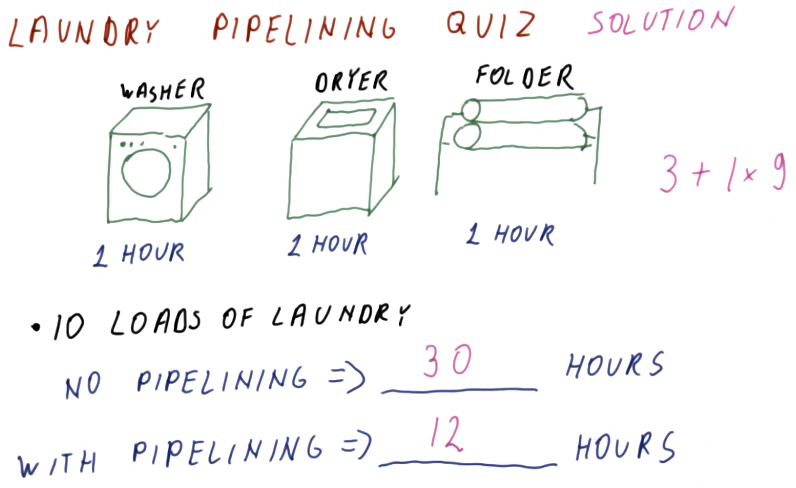
</center>

Assume the following devices are available for doing laundry:

| Device | Execution Time per Operation |
|:---:|:---:|
| Washer | `1 hr` |
| Dryer | `1 hr` |
| Folder | `1 hr` |

For `10` loads of laundry, what is the total completion time required:
* Without pipelining?
  * `1*10 + 1*10 + 1*10 = 30 hr`
* With pipelining?
  * `3*1 + 1*(10-1) = 12 hr`

Therefore, pipelining reduces the total completion time dramatically, by minimizing idle time on any particular device.

## 5. Instruction Pipelining Quiz and Answers

Consider a `5`-stage processor pipeline (with `1` clock cycle per stage) executing a program comprised of `10` instructions.

What is the total program execution time (in cycles):
* Without pipelining?
  * `(5 stages/instruction)*(1 cycle/stage)*(10 instructions/program) = 50 cycles/program`
* With pipelining?
  * `5*1*1 + 1*1*(10-1) = 14 cycles/program`

***N.B.*** As before, with pipelining, it takes a full instruction (i.e., there is latency) to fill the pipeline first.

## 10. Control Dependency Quiz and Answers

Consider the following pipeline:
* `25%` of all instructions are taken as branches/jumps
* The pipeline has `10` stages
* The correct target for branch/jump instructions is detected in the sixth stage
* Everything else flows "smoothly"

What is the actual CPI for this pipeline?
* `1 + 0.25*5 = 2.25`

The result of this suggests that branching more than *halves* the throughput of the pipeline!

## 12. Data Dependencies Quiz and Answers

<center>
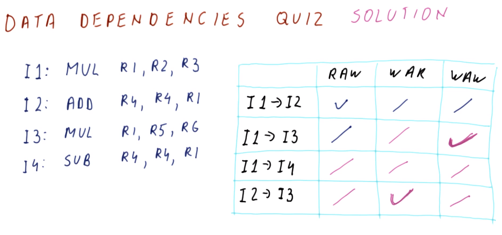
</center>

Consider the program composed of the following instructions:
```mips
MUL R1, R2, R3  # I1
ADD R4, R4, R1  # I2
MUL R1, R5, R6  # I3
SUB R4, R4, R1  # I4
```

Identify (via `√`) the data dependencies (if any) among the following pairs of instructions:

| Dependencies Pair | RAW | WAR | WAW |
|:---:|:---:|:---:|:---:|
| `I1` → `I2` | `√` | | |
| `I1` → `I3` | | | `√` |
| `I1` → `I4` | | | |
| `I2` → `I3` | | `√` | |

Explanation:

| Dependencies Pair | RAW | WAR | WAW |
|:---:|:---:|:---:|:---:|
| `I1` → `I2` | `√` | ("freebie" given initially in the prompt) | ("freebie" given initially in the prompt) |
| `I1` → `I3` | There are no shared registers between these instructions | `I3` does not write a result into a register that is previously read by `I1` | `√` - `I3` overwrites the result produced by `I1` in register `R1` |
| `I1` → `I4` | `I4` reads register `R1`, however, the value it reads is *not* that produced by `I1` (but rather that produced by `I3`) | `I4` does not write a result into a register that is previously read by `I1` | `I4` writes to register `R4`, which is not used by `I1`; furthermore, even if `I4` were to have written to register `R1`, this would have been a data dependency with `I3` (via register `R1`) rather than with `I1` |
| `I2` → `I3` | `I2` does not write to a register that is subsequently read by `I3` | `√` - `I3` overwrites register `R1`, which is previously read by `I2` | `I3` and `I2` each access *different* registers for writing (`R1` and `R4`, respectively) |

## 14. Dependencies and Hazards Quiz and Answers

<center>
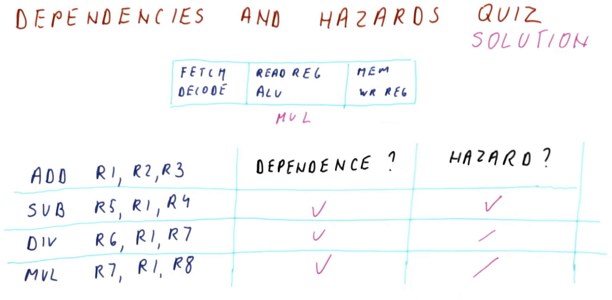
</center>

Consider a three-stage pipeline, with the following stages (`S1`, `S2`, and `S3`, respectively):
  1. fetch, decode
  2. read register, ALU
  3. read memory, write to register

Furthermore, the following program proceeds through the pipeline:
```mips
ADD R1, R2, R3  # I1
SUB R5, R1, R4  # I2
DIV R6, R1, R7  # I3
MUL R7, R1, R8  # I4
```

What (if any) dependencies are there between instructions `I1` and the others? (Indicate via `√`)

| Dependency Pair | Dependency? | Hazard? |
|:---:|:---:|:---:|
| `I1` → `I2` | `√` - There is a dependency via register `R1` | `√` - In cycle C1 (see below), instruction `SUB` may not receive the updated value for `R1` from instruction `ADD` "in time," and therefore may read a stale value instead |
| `I1` → `I3` | `√` - There is a dependency via register `R1` | In cycle C2 (see below), instruction `DIV` is reading the value of `R1` that was already written by instruction `ADD`, and therefore there is *no* hazard |
| `I1` → `I4` | `√` - There is a dependency via register `R1` | In cycle C3 (see below), instruction `MUL` is reading the value of `R1` that was already written by instruction `ADD` (the same value also read previously by instruction `DIV` in cycle C2), and therefore there is *no* hazard  |

| Cycle | `S1` | `S2` | `S3` |
|:---:|:---:|:---:|:---:|
| C1 | `DIV` | `SUB` | `ADD` |
| C2 | `MUL` | `DIV` | `SUB` |
| C3 | `...` | `MUL` | `DIV` |

***N.B.*** Recall that dependencies can exist irrespectively of the pipeline, and therefore can be determined on the basis of the ***program*** alone. Conversely, hazards must be analyzed with respect to the ***pipeline***, which is determined by the relationship between the stages in which the corresponding read and write operations occur.

## 16. Flushes, Stalls, and Forwarding Quiz and Answers

<center>
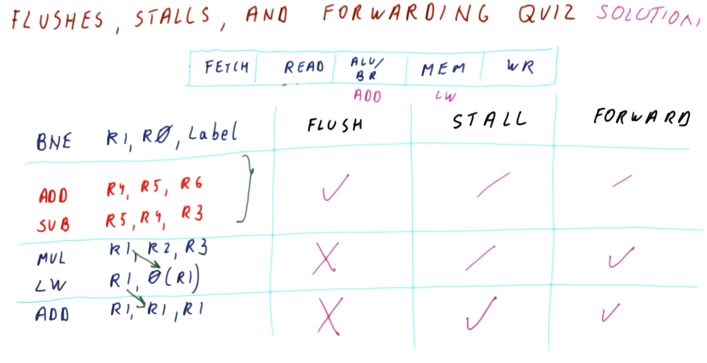
</center>

Consider a five-stage pipeline comprised of the following stages:
  1. fetch instruction
  2. decode instruction and read registers
  3. perform ALU operation and evaluate branch operation
  4. load and store memory
  5. write result to register

The following program executes in the pipeline:
```mips
BNE R1, R0, Label  # I1
ADD R4, R5, R6     # I2 - begin control hazard
SUB R5, R4, R3     # I3 - end control hazard
MUL R1, R2, R3     # I4 - begin data dependency A (via `R1`)
LW  R1, 0(R1)      # I5 - end data dependency A, begin data dependency B (via `R1`)
ADD R1, R1, R1     # I6 - end data dependency B
```

***N.B.*** A control hazard occurs here because after instruction `I1`, we fetch two incorrect instructions (`I2` and `I3`) before finally fetching the correct instruction `I4`.

For each group of instructions, should we flush, stall, and/or forward?

| Instructions Group | Flush | Stall | Forward |
|:---:|:---:|:---:|:---:|
| `I2` & `I3` | `√` - We must flush to resolve a control dependency | Stalling cannot be used for control dependencies | Forwarding cannot be used for control dependencies |
| `I4` & `I5` | Flushing cannot be used for data dependencies | Since forwarding is a viable corrective action, it is preferred over stalling | `√` - In cycle C1 (see below), instruction `LW` reads register `R1` in stage `R` while instruction `MUL` writes the value in stage `A/B`, therefore, this value can be forwarded accordingly so that it is available to instruction `LW` upon its entry into stage `A/B` |
| `I5` & `I6` | Flushing cannot be used for data dependencies | `√` - In cycle C2 (see below), when the instruction `ADD` reads register `R1` in stage `R`, the instruction `LW` (in stage `A/B`) is computing the address and still has not accessed memory at this point. Subsequently, in cycle C3 (see below), the instruction `ADD` is computing using the *incorrect*/stale value in register `R1`, while instruction `LW` is still loading the memory (which it does not complete until the end of this cycle). Therefore, due to this "temporal mismatch," it is necessary to stall.  | `√` - After stalling for a cycle (i.e., in cycle C3, see below), we can forward in order to avoid additional stalling |

| Cycle | `F` | `R` | `A/B` | `M` | `W` |
|:---:|:---:|:---:|:---:|:---:|:---:|
| C1 | `ADD` | `LW` | `MUL` | `SUB` | `ADD` |
| C2 | `...` | `ADD` | `LW` | `MUL` | `SUB` |
| C3 | `...` | `...` | `ADD` | `LW` | `MUL` |

# Branches

## 5. Branch Prediction Benefit Quiz and Answers

<center>
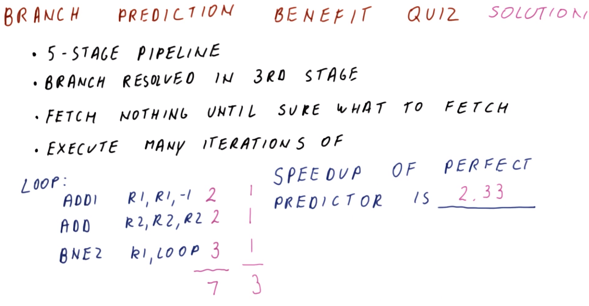
</center>

Consider the following pipelined processor system:
* A five-stage pipeline
* Branches are fully resolved in the third stage (ALU), i.e., the correct PC to be fetched is determined at this point
* Nothing is fetched until there is certainty as to what instruction to fetch
* The program executes many iterations of the following loop:
    ```mips
    LOOP:
      ADDI R1, R1, -1
      ADD  R2, R2, R2
      BNEZ R1, LOOP
    ```

What is the speedup achieved if we have a ***perfect*** predictor (i.e., the next instruction to be fetched is always known correctly)?
* `7/3 = 2.33` (i.e., over twice the performance compared to fetching nothing until the correct instruction to fetch can be determined)

***Explanation***:

The number of cycles spent in each instruction within the loop are as follows:
```mips
LOOP:
  ADDI R1, R1, -1  # 2 -> this instruction is determined in stage 2/`D`
  ADD  R2, R2, R2  # 2 -> this instruction is determined in stage 2/`D`
  BNEZ R1, LOOP    # 3 -> this instruction's branching behavior is indeterminate until stage 3/`A`
```

Therefore, overall, it takes `2 + 2 + 3 = 7` cycles per loop iteration to perform these instructions.

Furthermore, with a perfect predictor, the number of cycles spent in each instruction to determine the subsequent instruction are as follows:
```mips
LOOP:
  ADDI R1, R1, -1  # 1
  ADD  R2, R2, R2  # 1
  BNEZ R1, LOOP    # 1
```

Therefore, overall, it takes `1 + 1 + 1 = 3` cycles per loop iteration to determine the instructions.

## 7. Multiple Predictions Quiz and Answers

<center>
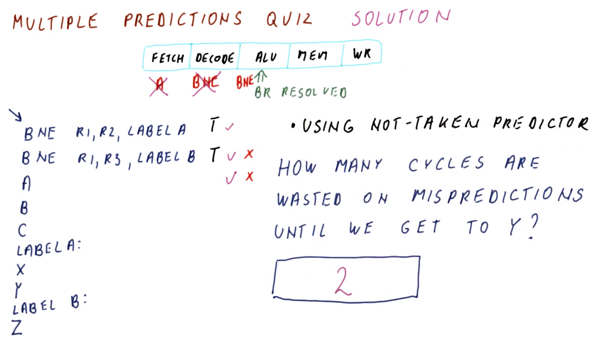
</center>

Assume a five-stage pipeline as before, and suppose that branches are resolve in the third stage (i.e., `A`/`ALU`). Consider the following program running on this system:
```mips
  BNE R1, R2, LABEL A  # actually taken
  BNE R1, R3, LABEL B  # actually taken
  A
  B
  C
LABEL A:
  X
  Y
LABEL B:
  Z
```

where generic instructions `A`, `B`, `C`, `X`, `Y`, and `Z` are *not* branching instructions.

If we use a "not-taken" predictor and assuming that the branching instructions *are* taken, how many cycles are wasted on mispredictions until we arrive at instruction `Y`?
* `2` cycles

***Explanation***:

| Cycle | `F` | `D` | `A` | `M` | `W` |
|:---:|:---:|:---:|:---:|:---:|:---:|
| C1 | `BNE` | `...` | `...` | `...` | `...` |
| C2 | `BNE` | `BNE` | `...` | `...` | `...` |
| C3 | `A` |  `BNE` | `BNE` | `...` | `...` |

Since branches are resolved in the third stage, the first three cycles are as in the table shown above.

| Cycle | `F` | `D` | `A` | `M` | `W` |
|:---:|:---:|:---:|:---:|:---:|:---:|
| C1 | `BNE` | `...` | `...` | `...` | `...` |
| C2 | `BNE` | `BNE` | `...` | `...` | `...` |
| C3 | (flush) |  (flush) | `BNE` | `...` | `...` |

When `BNE R1, R2, LABEL A` is resolved in the third stage (`A`), this cancels the two upstream instructions in the pipeline, and in the next cycle the program will proceed to instruction `X` via branching. Therefore, overall, `2` cycles are wasted. Furthermore, note that this penalty is the *same* as if the second instruction `BNE` were not a branch at all (i.e., in reality, we have mispredicted *two* branches in this situation, however, this is effectively no different than had the first branching instruction been correctly predicted, as this would have jumped passed the second branching instruction anyways).

Therefore, when a branch is mispredicted, it is most important to redirect to the correct path as quickly/efficiently as possible (while incurring any necessary penalty in the process), as there is no additional penalty incurred when skipping mispredicted branching instructions that will have never been executed anyways (e.g., there is no additional `2`-cycle penalty incurred by the second instruction `BNE`, as it is flushed before reaching stage `A` to trigger its own flushes).

## 10. Predictor Impact Quiz and Answers

<center>
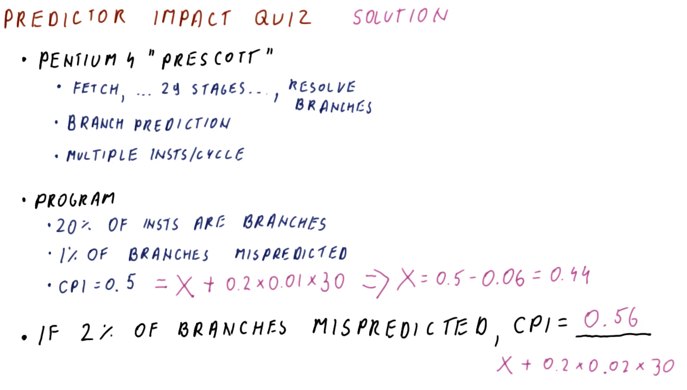
</center>

Consider the Intel Pentium 4 "Prescott" processor, which has the following specifications:
* Performs a `FETCH` operation, then a subsequent `29` stages, and then it resolves branches at stage `31`
* Uses branch prediction
* Executes multiple instructions per cycle

Furthermore, a program is given with the following attributes:
* `20%` of the instructions are branches
* `1%` of branches are mispredicted
* `CPI = 0.5`

If a slightly worse predictor is used, which instead mispredicts `2%` of branches, how would this change the CPI?
* `0.44 + 0.2*0.02*(31-1) = 0.56`

***Explanation***:

Given an overall CPI of `0.5`, this is comprised of the following components (where `X` is unknown):
```
0.5 = X + 0.2*0.01*(31-1)
```

Solving for `X`, this suggests an ideal CPI (i.e., with a perfect branch predictor) of `X = 0.5 - 0.06 = 0.44` for this processor pipeline.

## 15. BTB Quiz and Answers

<center>
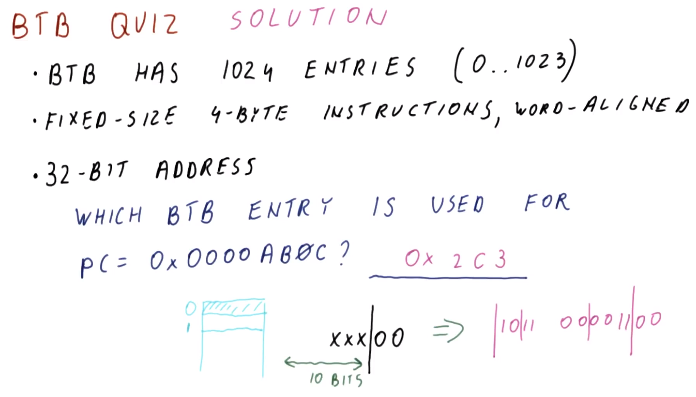
</center>

Consider a system comprised of the following:
* A BTB table with `1024` entries, which are zero-indexed (i.e., `0, 1, ..., 1023`).
* The system architecture uses fixed-size `4`-byte instructions which must be **word-aligned** (i.e., each instruction must begin at an address that is divisible by `4`).
* The program counter (PC) is a `32`-bit register (i.e., the processor uses `32`-bit addresses)

Which BTB table entry should be used for address value `PC = 0x0000AB0C`?
* `0x2C3`

***Explanation***:

While it may seem as trivially simple as using the 10 least-significant bits (LSBs) of the given PC address value, it is not so simple; this is due to the constraint of fixed-size 4-byte instructions which are word-aligned (i.e., this constraint will not be *generally* satisfied by the 10 LSBs). Therefore, in general, only addresses `0x0`, `0x4`, `0x8`, etc. (but *not* `0x1`, `0x2`, `0x3`, etc.) are suitable candidates for BTB table entries.

Therefore, a more general approach would be to use BTB table entry values having the general form `...00` to ensure that this constraint is satisfied. Furthermore, we can offset by these two positions and use the offset-by-two 10 LSBs (i.e., right-padded with `00`) as follows:
```
      A---B---0---C---
  ... 1010101100001100
          |        |^^
```
***N.B.*** `^` denotes the padding `0`s.

This gives the value (denoted by `|...|` above) `1011000011`<sub>`2`</sub>, or equivalently `0x2C3` or `707`<sub>`10`</sub>.

## 17-21. BTB and BHT Quizzes and Answers

### Problem Statement

Consider the following program:
```mips
      MOV R2, 100       # 0xC000
      MOV R1, 0         # 0xC004
Loop: BEQ R1, R2, Done  # 0xC008
      ADD R4, R3, R1    # 0xC00C 
      LW  R4, 0(R4)     # 0xC010
      ADD R5, R5, R4    # 0xC014
      ADD R1, R1, 1     # 0xC018
      B   Loop          # 0xC01C
Done:                   # 0xC020
```

***N.B.*** Observe that each program instruction address is 4 bytes in size.

Suppose we are given the following:
* A branch history table (BHT) having `16` entries and which makes perfect branch predictions
* A branch target buffer (BTB) table having `4` entries which that makes perfect branch predictions 

### 17. Quiz 1 and Answers

<center>
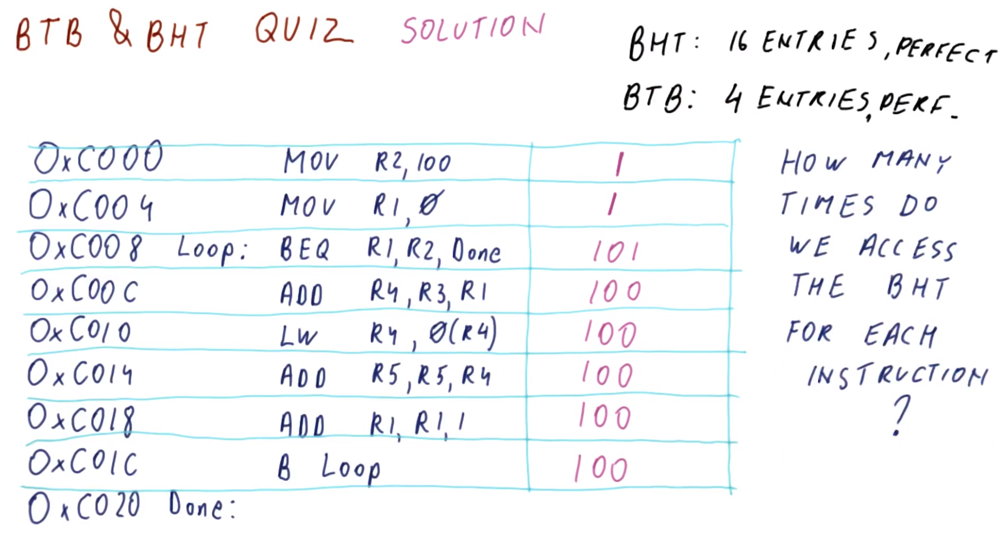
</center>

How many times do we access the BHT for *each* instruction?

| Instruction Address | Instruction | Number of BHT Accesses |
|:---:|:---:|:---:|
| `0xC000` | `MOV R2, 100` | `1` |
| `0xC004` | `MOV R1, 0` | `1` |
| `0xC008` | (`Loop:`) `BEQ R1, R2, Done` | `101` |
| `0xC00C` | `ADD R4, R3, R1` | `100` |
| `0xC010` | `LW R4, 0(R4)` | `100` |
| `0xC014` | `ADD R5, R5, R4` | `100` |
| `0xC018` | `ADD R1, R1, 1` | `100` |
| `0xC01C` | `B Loop` | `100` |

***Explanation***:

The BHT is accessed in order to determine whether a given instruction is a taken branch; this is done every time we fetch an instruction, and because we have perfect prediction (for both the BTB table and the BHB), this implies that we will never fetch any instruction that will not actually execute.

The first two instructions at addresses `0xC000` and `0xC004` execute only once. The third instruction at address `0xC008` is the branch instruction, which only executes once and causes entry into the loop/branching logic (denoted by label `Loop`).

The loop executes as long as `R1` and `R2` are not equal, which are initialized by the first two instructions to values `0` and `100` (respectively). The last two instructions of the `Loop` segment increment `R1` by `1` and then jump back to `Loop`. Therefore, this proceeds for 100 iterations, until `R1` and `R2` are equal (i.e., both equaling `100`, which occurs on the 101st iteration), at which point the loop is exited and the program proceeds to label `Done` (i.e., at this point in the program, the branch is *taken* to `Done`).

### 18. Quiz 2 and Answers

<center>
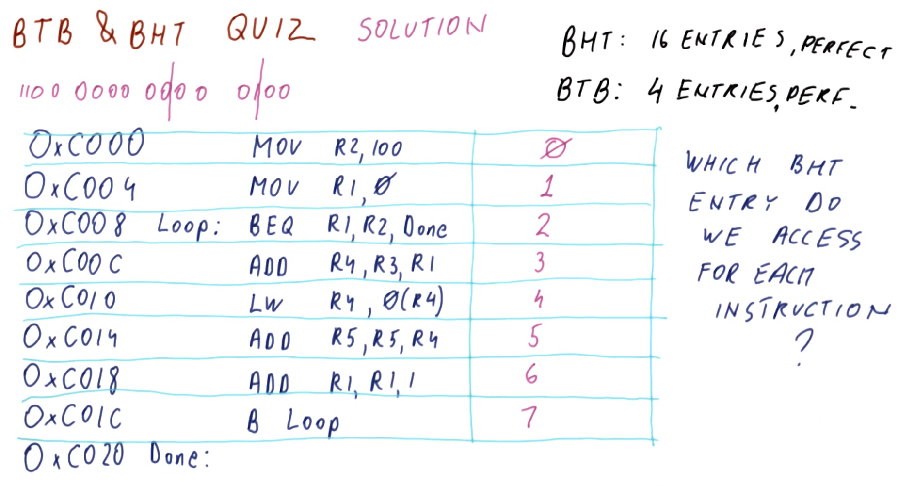
</center>

Which branch history table (BHT) entry do we access for each instruction?

| Instruction Address | Instruction | BHT Entry |
|:---:|:---:|:---:|
| `0xC000` | `MOV R2, 100` | `0` |
| `0xC004` | `MOV R1, 0` | `1` |
| `0xC008` | (`Loop:`) `BEQ R1, R2, Done` | `2` |
| `0xC00C` | `ADD R4, R3, R1` | `3` |
| `0xC010` | `LW R4, 0(R4)` | `4` |
| `0xC014` | `ADD R5, R5, R4` | `5` |
| `0xC018` | `ADD R1, R1, 1` | `6` |
| `0xC01C` | `B Loop` | `7` |

***Explanation***:

There are `16` entries in the BHT, which can be accessed via the offset least-significant bits (LSBs) of the corresponding instruction addresses. Therefore:

| Instruction Address | BHT Entry |
|:---:|:---:|
| `0xC000` (`1100 0000 00\|00 00\|00`) | `0` |
| `0xC004` (`1100 0000 00\|00 01\|00`) | `1` |
| `0xC008` (`1100 0000 00\|00 10\|00`) | `2` |
| `0xC00C` (`1100 0000 00\|00 11\|00`) | `3` |
| `0xC010` (`1100 0000 00\|01 00\|00`) | `4` |
| `0xC014` (`1100 0000 00\|01 01\|00`) | `5` |
| `0xC018` (`1100 0000 00\|01 10\|00`) | `6` |
| `0xC01C` (`1100 0000 00\|01 11\|00`) | `7` |

***N.B.*** If `15` were reached in this manner, the subsequent instruction would result in a wraparound back to `0`, however, this does not occur in this particular program.

### 19. Quiz 3 and Answers

<center>
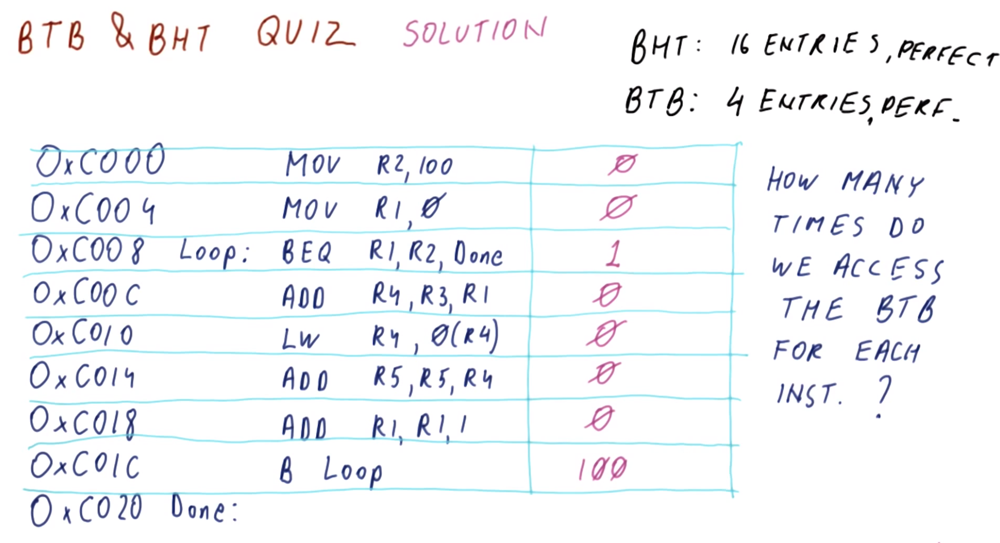
</center>

How many times do we access the branch target buffer (BTB) table for each instruction?

| Instruction Address | Instruction | Number of BTB Table Accesses |
|:---:|:---:|:---:|
| `0xC000` | `MOV R2, 100` | `0` |
| `0xC004` | `MOV R1, 0` | `0` |
| `0xC008` | (`Loop:`) `BEQ R1, R2, Done` | `1` |
| `0xC00C` | `ADD R4, R3, R1` | `0` |
| `0xC010` | `LW R4, 0(R4)` | `0` |
| `0xC014` | `ADD R5, R5, R4` | `0` |
| `0xC018` | `ADD R1, R1, 1` | `0` |
| `0xC01C` | `B Loop` | `100` |

***Explanation***:

The BTB table is only accessed if the branch history table (BHT) indicates to take the branch (recall that we assume both tables predict perfectly); otherwise, if the branch is *not* taken, then we simply increment the program counter (PC) without accessing the BTB table at all.

Therefore, by inspection, all non-branching instructions do not access the BTB table at all. The instruction `B Loop` at instruction `0xC01C` is *always* taken, and this occurs `100` times in the program loop. Furthermore, with respect to the instruction `BEQ R1, R2, Done` at instruction address `0xC008`, in every iteration that stays in the loop (i.e., when `R1` and `R2` are not equal, which occurs for `100` iterations, as per the quiz in Section 17), the branch is not taken and therefore the BTB table is not accessed; conversely, when `R1` and `R2` become equal (i.e., both having the value `100`, which occurs once in the final iteration), this causes an access of the BTB table (and consequent branch to `Done`).

### 20. Quiz 4 and Answers

<center>
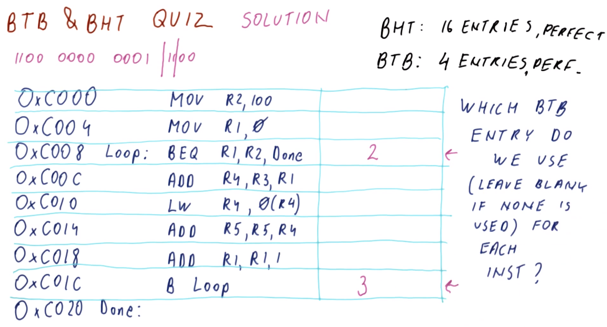
</center>

Which branch target buffer (BTB) table entry do we use for each instruction? (Leave blank if no entry is used.)

| Instruction Address | Instruction | BHT Entry |
|:---:|:---:|:---:|
| `0xC000` | `MOV R2, 100` | |
| `0xC004` | `MOV R1, 0` | |
| `0xC008` (`1100 0000 0000 \|10\|00`) | (`Loop:`) `BEQ R1, R2, Done` | `2` |
| `0xC00C` | `ADD R4, R3, R1` | |
| `0xC010` | `LW R4, 0(R4)` | |
| `0xC014` | `ADD R5, R5, R4` | |
| `0xC018` | `ADD R1, R1, 1` | |
| `0xC01C` (`1100 0000 0001 \|11\|00`) | `B Loop` | `3` |

***Explanation***:

Recall from the previous quiz (cf. Section 19) that only the branching instructions will access the BTB table; therefore, for the remaining non-branching instructions, by inspection, there are no corresponding BHT entries.

To determine the BHT entries of the branching instructions, this can be achieved by examining their instruction addresses. Since the BTB table has `4` entries, we use the four least-significant bits (LSBs) offset by two bits (i.e., `00`, which is are common to all of the instructions).

### 21. Quiz 5 and Answers

<center>
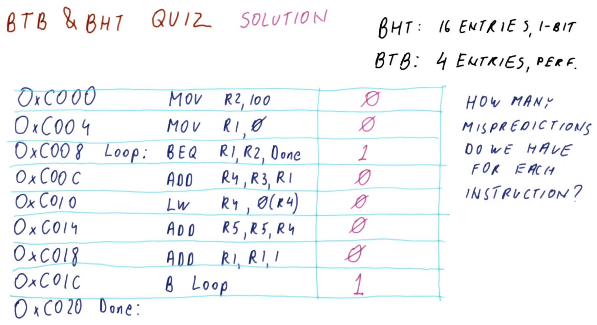
</center>

Consider the same system as before, however, with the following slight modification:
* A branch history table (BHT) having `16` entries, with each entry being a `1`-bit predictor and initialized to value `0` (i.e., all predict "not taken")
  * This is ***different*** from the initial system, which made perfect branch predictions
* A branch target buffer (BTB) table having `4` entries which that makes perfect branch predictions 
  * This is the ***same*** as before

How many mispredictions occur for each instruction during program execution?

| Instruction Address | Instruction | Number of Mispredictions |
|:---:|:---:|:---:|
| `0xC000` | `MOV R2, 100` | `0` |
| `0xC004` | `MOV R1, 0` | `0` |
| `0xC008` | (`Loop:`) `BEQ R1, R2, Done` | `1` |
| `0xC00C` | `ADD R4, R3, R1` | `0` |
| `0xC010` | `LW R4, 0(R4)` | `0` |
| `0xC014` | `ADD R5, R5, R4` | `0` |
| `0xC018` | `ADD R1, R1, 1` | `0` |
| `0xC01C` | `B Loop` | `1` |

***Explanation***:

Recall (cf. Section 18, Quiz 2) that each BHT entry is unique in this program, therefore, none of the instructions will generate collisions in the BTB table.

By inspection, the first two (non-branching) instructions generate `0` mispredictions.

Upon entry into the loop, the first iteration is as follows:
* The branching instruction `BEQ R1, R2, Done` at instruction address `0xC008` is *not* taken, which is a correct prediction (because the BHT entries are initialized to `0`).
* The subsequent (non-branching) instructions are *not* taken, which is similarly a correct prediction.
* The tail-end branching instruction `B Loop` at address `0xC01C` *is* taken, and this is an *misprediction*, since the BHT entry is initialized to `0`, thereby contradictorily suggesting the branch would *not* be taken. Consequently, the BHT entry is updated to `1`.

In subsequent loop iterations, the program proceeds similarly; furthermore, with the tail-end instruction's BHT entry set to `1` in the first iteration, this is no longer a misprediction in these iterations.

In the final loop iteration (for which the values `R1` and `R2` both become equal to `100`, i.e., on the 101st iteration), the branching instruction `BEQ R1, R2, Done` at instruction address `0xC008` is now *taken*, and this is a *misprediction* since the BHT entry (initialized to `0`) suggests otherwise. Consequently, the BHT entry is updated to `1` and the program takes the branch to label `Done`.

As these results suggest, over the course of the program, the prediction is very accurate (i.e., only 2 mispredictions out of hundreds of executed instructions!).
* ***N.B.*** As demonstrated here, 1-bit predictors are effective for iterative constructs such as loops. However, as we will see later, 1-bit predictors are not as effective when dealing with other constructs (e.g., those which do not have many iterations and/or those which do not have many if-else statements).

## 25. 2-Bit Predictor (2BT) Quiz and Answers

<center>
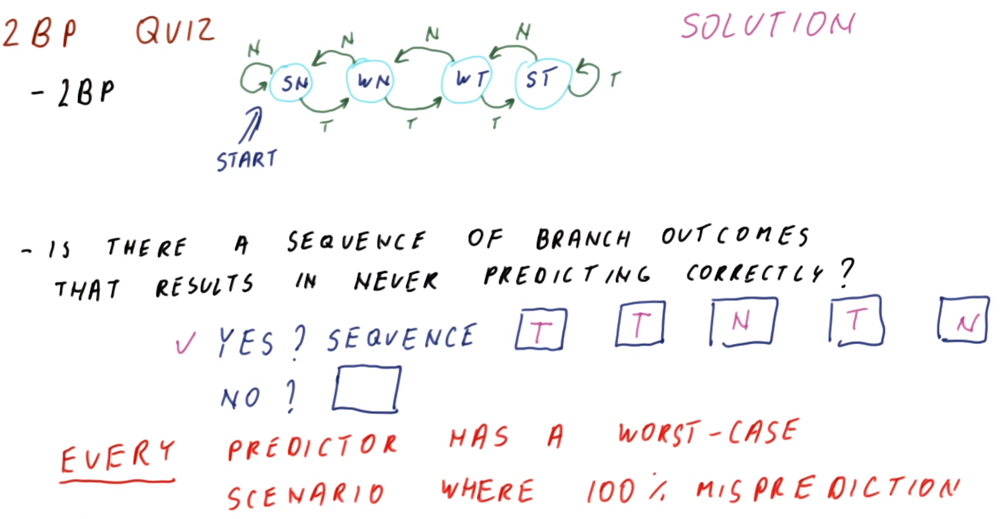
</center>

Consider a 2-bit predictor having the four states as described previously (cf. Section 24), defined as follows:

| State | Bit Pattern |
|:---:|:---:|
| Strong Not-Taken (SN) | `00` |
| Weak Not-Taken (WN) | `01` |
| Weak Taken (WT) | `10` |
| Strong Taken (ST) | `11` |

Assume we start at state `00` (Strong Not-Taken).

Is there a sequence of branch outcomes that results in ***never*** predicting correctly? If so, indicate the first five steps of the state transitions sequence.
* `Yes`: `T` → `T` → `N` → `T` → `N`

***Explanation***:
```
SN WN WT WN WT ...
00 01 10 01 10 ...
T  T  N  T  N  ...
X  X  X  X  X  ...
```

***N.B.*** It is possible to change this particular predictor such that this behavior does not result in 100% misprediction, however, in general, ***every*** predictor inherently has the possible worst-case scenario of 100% misprediction; it is merely a matter of how likely such a sequence will occur in practice (a good predictor ensures this is exceedingly rare).

## 29. 1-Bit History Predictor Quiz and Answers

<center>
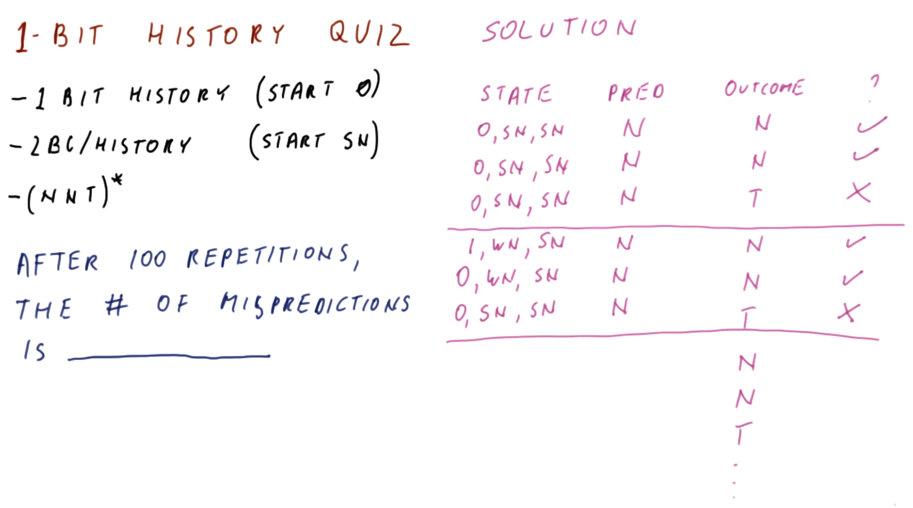
</center>

Consider the following system:
* 1-bit history, initialized to `0`
* 2-bit predictor per each history state, both initialized to `SN` (Strong Not-Taken)

Furthermore, the pattern to predict is `(NNT)*`.

After `100` repetitions of the pattern (i.e., 300 total outcomes), what is the overall number of mispredictions that occur?
* `100`

***Explanation***:

Consider the corresponding sequence as follows:

| Sequence | Predictor State | Prediction | Actual Branch Outcome | Correct Prediction? |
|:---:|:---:|:---:|:---:|:---:|
| S1 | `(0, SN, SN)` | `N` | `N` | `√` |
| S2 | `(0, SN, SN)` | `N` | `N` | `√` |
| S3 | `(0, SN, SN)` | `N` | `T` | `X` |
| S4 | `(1, WN, SN)` | `N` | `N` | `√` |
| S5 | `(0, WN, SN)` | `N` | `N` | `√` |
| S6 | `(0, SN, SN)` | `N` | `T` | `X` |
| S7 | `(0, SN, SN)` | `N` | `N` | `√` |
| ⋮ | ⋮ | ⋮ | ⋮ | ⋮ |

Since sequence S7 has the same state and prediction behavior as the initial state (i.e., sequence S1), it can be inferred by inspection that this pattern will continue. Therefore, in the overall `300` sequences, a third of these will be incorrect predictions (i.e., each third of the triplets, e.g., `S3` in `S1` to `S3`, `S6` in `S4` to `S6`, etc.), or `100` total. Therefore, a 1-bit history predictor is not particularly effective for this pattern.

## 32. *N*-Bit History Predictor Quiz and Answers

<center>
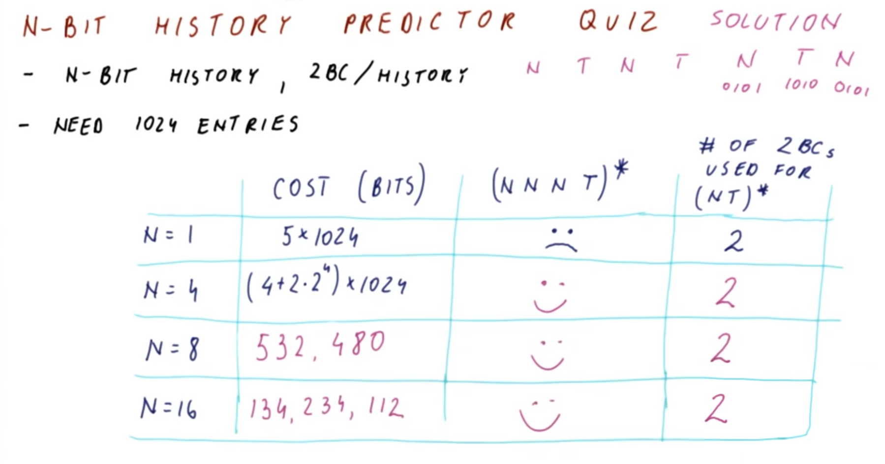
</center>

Consider the following system:
* *n*-bit history
* 2-bit predictor per each history state
* `1024` entries are required uniquely identify each branch instruction in the branch history table (BHT)

For *`n`* values of `1`, `4`, `8`, and `16`:
* What is the cost in bits?
* How well does the predictor work on pattern `(NNNT)*`?
* What is the number of 2-bit counters required for the pattern `(NT)*`?

***Answer and Explanation***:

| *`n`* | Cost (bits) | Predicts Pattern `(NNNT)*` Accurately? | Number of 2-Bit Counters Required for Pattern `(NT)*` | Usage of Available 2-Bit Counters |
|:---:|:---:|:---:|:---:|:---:|
| `1` | `[(1 + 2*2`<sup>`1`</sup>`)]*1024 = 5*1024 = 5120` | no | `2` | `2/(2`<sup>`1`</sup>`) = 1` (`100%`) |
| `4` | `[(4 + 2*2`<sup>`4`</sup>`)]*1024 = 36*1024 = 36864` | yes |`2` | `2/(2`<sup>`4`</sup>`) = 0.125` (`12.5%`) |
| `8` | `[(8 + 2*2`<sup>`8`</sup>`)]*1024 = 520*1024 = 532480` | yes | `2` | `2/(2`<sup>`8`</sup>`) = 7.8125 × 10`<sup>`-3`</sup> (`~0.78%`) |
| `16` | `[(16 + 2*16`<sup>`16`</sup>`)]*1024 = 131088*1024 = 134234112` | yes | `2` | `2/(2`<sup>`16`</sup>`) ≈ 3.05176 × 10`<sup>`-5`</sup> (`~0.003%`) |

By inspection, in general, recall (cf. Section 31) that an `n`-bit history predictor will be accurate for a pattern of length `≤ `*`n`*` + 1`.

With respect to the 2-bit counters requirement:

(*1-bit history predictor*)
```
N T N ⋯
  0 1
```
(*4-bit history predictor*)
```
N T N T N    T    N    ⋯
        0101 1010 0101
```
* uses patterns `01` and `10` exclusively, thereby requiring ***two*** 2-bit counters (i.e., from the available `2`<sup>`4`</sup>` = 16`)

(...and similarly for the 8-bit and 16-bit history predictors)

## 33. History Predictor Quiz and Answers

<center>
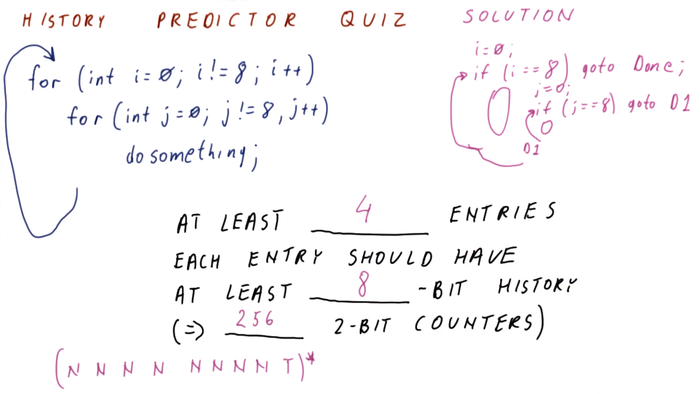
</center>

Consider the following common nested loop structure:
```c
for (int i = 0; i != 8; i++)
  for (int j = 0; j != 8; j++)
    // do something
```

In order to execute this code effectively, how may entries are required by the history predictor?
* At least `4` entries (i.e., two for each `for` loop, accounting for branching in each)

How many history bits should each entry have?
* At least an `8`-bit history, to account for full traversal of the inner `for` loop

How many 2-bit counters should each entry have?
* `2`<sup>`8`</sup>` = 256` 2-bit counters

***N.B.*** The pattern of the outer-`for` loop's condition-check branch statement is `(N N N N N N N N T)*`. Therefore, using `256` will result in many unused/wasted bits, since realistically only `9` are required to effectively predict this pattern.

## 38. Pshare vs. Gshare Quiz and Answers

<center>
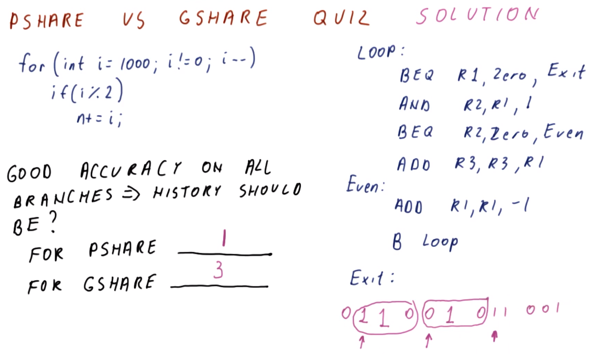
</center>

Consider the following C code fragment:
```c
for (int i = 1000; i != 0; i--)
  if (i % 2)
    n += i;
```

The equivalent assembly code is as follows:
```mips
LOOP:
  BEQ R1, zero, EXIT  # test to exit `for` loop
  AND R2, R1, 1       # test least-significant bit of `R1`
  BEQ R2, zero, EVEN  # jump to `EVEN` if even number occurs
  ADD R3, R3, R1      # add `R1` (`i`) to `R3` (`n`) if odd
EVEN:
  ADD R1, R1, -1      # decrement `i`
  B   LOOP            # branch unconditionally back to LOOP
EXIT:
  # end of code fragment
```

To achieve good prediction accuracy on *all* branches in this code segment, how many bits should be used for entries using pshare vs. gshare?
* pshare - `1` bit
* gshare - `3` bits

***Explanation***:

This code contains three branches (`BEQ ...`, `BEQ ...`, `B ...`).
* (1) By inspection, `B LOOP` is trivially predicable, even without any history; therefore, any history will work.
* (2) `BEQ R1, zero, EXIT` is taken all `1000` times, except for the last iteration. Even with a 2-bit counter, this branch will be predicted accurately `1000` times followed by only one misprediction, which overall is still very accurate.
* (3) `BEQ R2, zero, EVEN`, which makes even-odd decision, requires the "most attention" with respect to history. In particular, it is important to know whether the previous iteration was even or odd in order to predict accurately.
  * For pshare, this can be handled simply with `1` history bit. This will also cover branches (1) and (2).
  * For gshare, the previous outcome should exist in the global history. The global history yields the following pattern (via `BEQ ...`, `BEQ ...`, `B ...`, respectively): `011 001 ...`. Accordingly, there are effectively two patterns that must be captured: `110` and `010` (i.e., the second branch is varying, while the other two branches have the predictable pattern `1_0` or `0_0`), thereby requiring `3` history bits accordingly.

Therefore, gshare can achieve similar performance to pshare, however, generally this will require more history bits to accomplish. Additionally, gshare can effectively handle "correlated branches" (cf. Section 37), unlike pshare which cannot.

## 43. Multi-Predictor Quiz and Answers

<center>
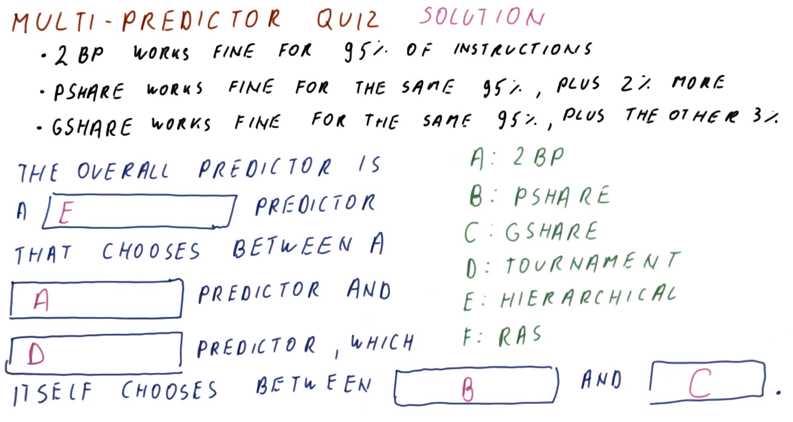
</center>

Consider a program with the following characteristics, which uses a multi-predictor scheme to combine decisions:
* A 2-bit predictor which works well for `95%` of instructions
* A pshare predictor which works well for the same `95%` of instructions, and for an additional `2%` not covered by the 2-bit predictor (i.e., giving an overall `97%` prediction)
* A gshare predictor which works well for the same `95%` of instructions, as well as for an additional `3%` not covered by either the 2-bit predictor or the pshare predictor (i.e., giving an overall `98%` prediction)

Therefore, cumulatively, the three predictors can predict virtually 100% of instructions.

How can we describe such a multi-predictor? (Given options: `2-bit predictor`, `pshare`, `gshare`, `tournament`, `hierarchical`, `return address stack (RAS)`)
* The overall predictor is a `hierarchical` predictor that choses between a `2-bit counter` predictor and a `tournament` predictor, which itself choses between `pshare` and `gshare`.

***Explanation***:

Because the 2-bit counter is the cheapest predictor which can cover the most branches, it is sensible to use it to predict most of the branches. In such a multi-predictor scheme, the 2-bit counter is combined with a (more expensive) tournament predictor, which is reserved for branches which are mispredicted by the 2-bit counter. The tournament predictor in turn is composed of a pshare and gshare, which have complementary prediction capabilities (i.e., covering the remaining `5%` of mispredictions) but are otherwise not advantageous relative to one another.

## 46. RAS Quiz and Answers

<center>
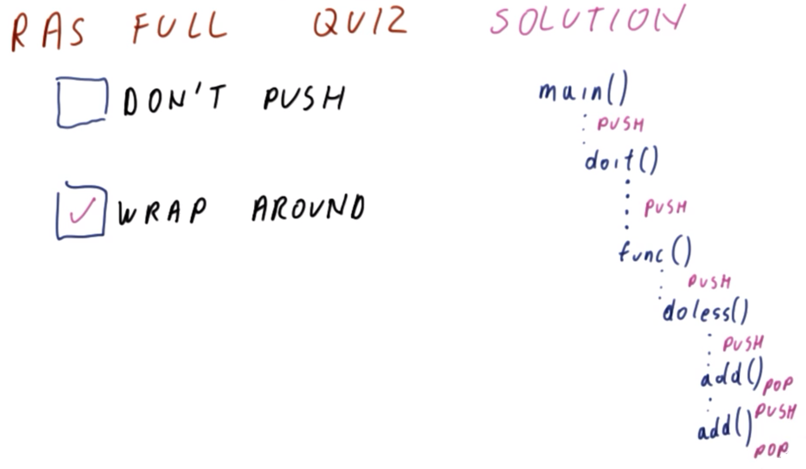
</center>

Which approach is better for resolving a full RAS stack?
* do not push
* wrap around
  * `CORRECT`

***Explanation***:

To understand why the wrap around approach is better, consider a typical program (as in the figure shown above, starting with top-level `main()`). The function `main()` proceeds with extensive work until it eventually calls the function `doit()`, which correspondingly pushes onto the RAS stack. Similarly, a cascade of nested function calls may occur subsequently, with corresponding pushes onto the RAS stack.

To demonstrate simply, consider the call sequence (within `main()`) of `doit()`, `func()`, `doless()`, and then subsequent repeated calls to `add()` (i.e., the functions become increasingly less complex and more frequently called).
* With only *one* entry in the RAS stack and using *do not push* approach, then this is occupied by the initial call to `doit()`, which might be a very large function. As long as we stay in this function (i.e., because it does the majority of the actual work in the program), all of the subsequent function calls will be mispredicted due to running out of space on the RAS, with the only *correct* prediction occurring upon final return from `doit()`.
* With *two* entries on the RAS stack and using *do not push* approach, the first entry is occupied by the return address of `doit()`, which ultimately will save *one* missed prediction upon final return to `doit()`; and similarly, the second entry will ultimately save *one* missed prediction upon return to `func()`.

Therefore, with the *do not push* approach, this results in a series of mispredictions in downstream (shorter, more frequent) function calls, to ultimately yield correct predictions for the final returns of the (longer, less frequent) parent-function calls.

Conversely, in the *wrap around* approach, correct prediction occurs with respect to the smaller, downstream/terminal function calls' returns (of which there are many), with mispredictions only occurring for the final returns with respect to the (infrequently called) parent-function calls. Therefore, because the innermost, more-frequent function calls dominate, the few entries on the RAS stack are utilized more effectively with the *wrap around* approach (i.e., by minimizing mispredictions).

Another consideration with respect to RAS is that it *is* a *predictor*, after all; therefore, either way, there will inherently be some mispredictions occurring (which can be recovered from appropriately). However, the objective here is to *minimize mispredictions*, and therefore inasmuch as neither approach is a *perfect* predictor, the wrap around approach is still the more optimal between the two with respect to this objective.

# Predication

## 5. `MOVZ`/`MOVN` Quiz and Answers

<center>
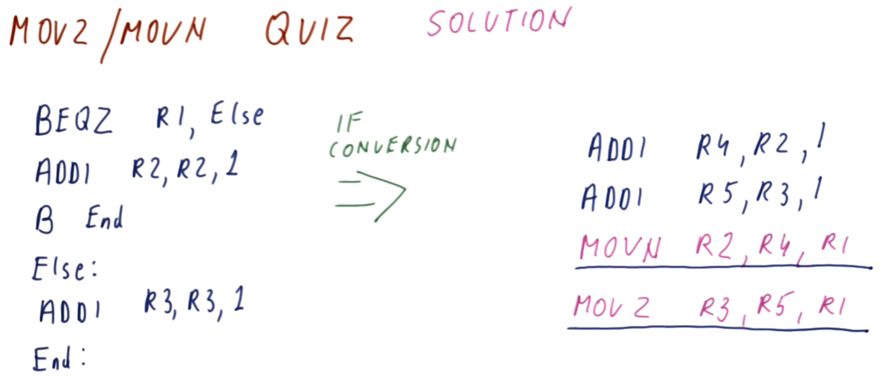
</center>

Consider how conditional move instruction are used, given the following MIPS code:
```mips
  BEQZ R1, Else
  ADDI R2, R2, 1
  B    End
Else:
  ADDI R3, R3, 1
End:
```
After if conversion, the result is as follows:
```mips
ADDI R4, R2, 1
ADDI R5, R3, 1
# ?
# ?
```

What are instructions (`?`) required to perform the if conversion?

***Answer and Explanation***:

```mips
ADDI R4, R2, 1
ADDI R5, R3, 1
MOVN R2, R4, R1 # answer
MOVZ R3, R5, R1 # answer
```

Recall that if conversion amounts to doing the work of *both* (i.e., then/taken *and* else/not-taken) paths, and then selecting among the two results such that only *one* of them is active.

The first two instructions of the if conversion (`ADDI ...`) correspond to these two paths.
* If the taken path is correct, then `R2` is assigned the value of `R4`.
* If the not-taken path is correct, then `R3` is assigned the value of `R5`.

Subsequently:
* `MOVN` performs the taken path via `R1` as the condition, moving `R4` into `R2`
* `MOVZ` performs the non-taken path via `R1` as the condition, moving `R5` into `R3`

In the if-conversion form, the branches are therefore removed and replaced with four total sequential steps/instructions; in contrast, pre-conversion, there are more instructions, as well as a more difficult-to-predict branching (via `BEQZ R1, Else`).

## 7. `MOVZ`/`MOVN` Performance Quiz and Answers

<center>
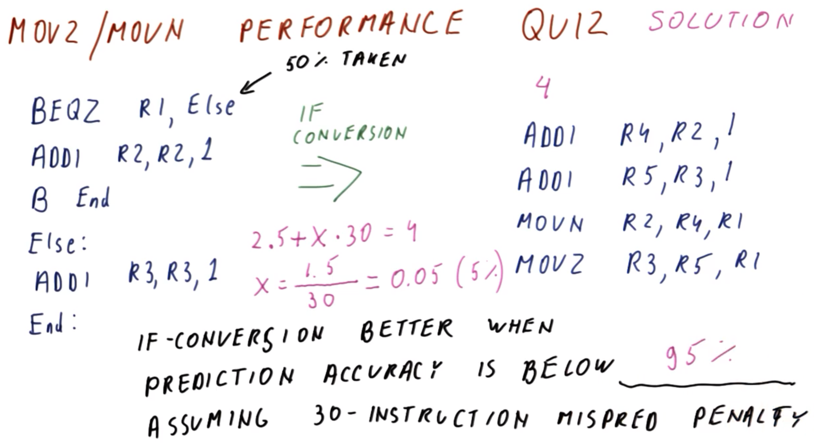
</center>

Consider the code shown above. The branch designated by the first instruction (`BEQZ R1, Else`) is taken `50%` of the time. Given this information, the if conversion is better when the prediction accuracy is below what (i.e., *specify* a percentage), assuming a `30`-instruction misprediction penalty?
* `95%`

***Explanation***:

Given a `50%` taken rate, *perfect* prediction implies an execution of `3*0.5 + 2*0.5 = 2.5` instructions between the two branches (in contrast, the if-converted version executes `4` instructions).

Therefore, the critical level for prediction accuracy can be determined as follows:
```
2.5 + x*30 = 4
x = (4 - 2.5)/30 = 0.05
```

which implies a critical threshold of `1 - 0.5 = 0.95` (`95%`) prediction accuracy.

## 11. Full Predication Quiz and Answers

<center>
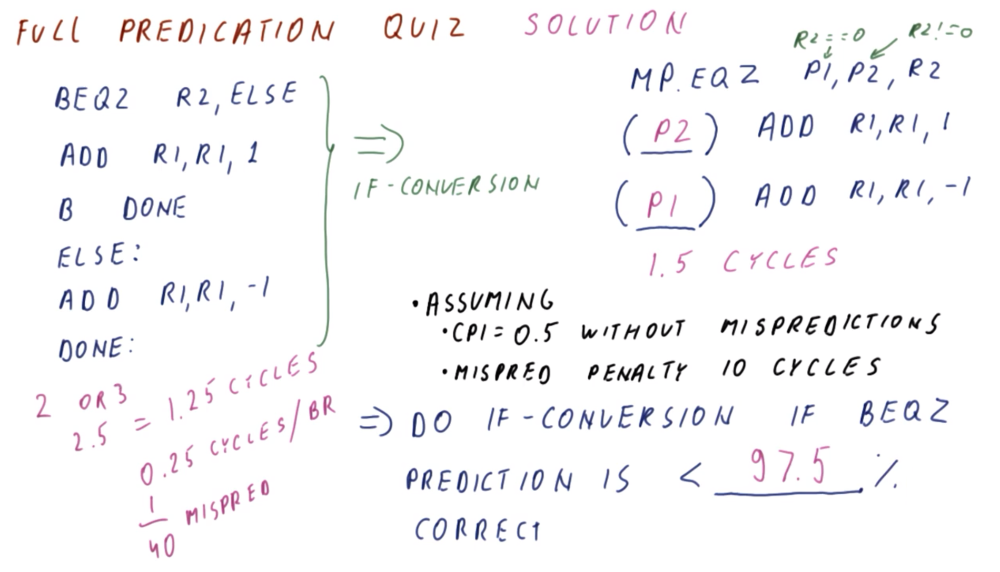
</center>

Consider the following code:

```mips
  BEQZ R2, Else
  ADD  R1, R1, 1
  B    Done
Else:
  ADD  R1, R1, -1
Done:
```

which yields the following if conversion via full predication:

```mips
      MP.EQZ P1, P2, R2
(P?) ADD    R1, R1, 1
(P?) ADD    R1, R1, -1
```

(***N.B.*** Recall that here `P1` is set if `R2 == 0`, otherwise `P2` is set if `R2 != 0`)

Furthermore, assume the following:
* This code achieves `CPI = 0.5` without mispredictions
* The misprediction penalty is `10` cycles

Given this information, what are the corresponding predicates (denoted `(P?)` above) in the post-full-predication-if-converted code? Additionally, at what threshold should if-conversion be performed, below which `BEQZ` prediction is incorrect (i.e., `<_%` accuracy)?

***Answer and Explanation***:

```mips
      MP.EQZ P1, P2, R2
(P2) ADD    R1, R1, 1
(P1) ADD    R1, R1, -1
```

By inspection, since `R2` set to `0` corresponds to the branch `Else`, this corresponds to `P1`; correspondingly, the other ("then") branch corresponds to `P2`.

Regarding the critical threshold for accuracy:
* Post-conversion, there are `3` instructions, requiring `0.5*3 = 1.5` cycles (assuming other things are performed in the rest of the cycle)
* Pre-conversion, there are `3` instructions in the then path and `2` instructions in the `Else` path, therefore (assuming no bias) this requires `2.5` cycles on average, and additionally factoring in the CPI this yields `2.5 * 0.5 = 1.25` cycles.

Critically, these two schemes perform equally when the cost of mispredictions is `1.5 - 1.25 = 0.25` cycles per branch (i.e., this net loss can be incurred on average in the critical case). Since the misprediction penalty is `10` cycles, this implies a critical misprediction rate of `(0.25 cycles/branch)/(10 cycles) = 1/40` (i.e., 1 in 40 branches mispredicted, or `2.5%`). Therefore, the critical threshold is `1 - 0.025 = 0.975` (`97.5%`), i.e., the correct prediction rate must be at least 97.5% to avoid performing the if conversion via full predication.

# Instruction-Level Parallelism (ILP)

## 6. Dependency Quiz and Answers

<center>
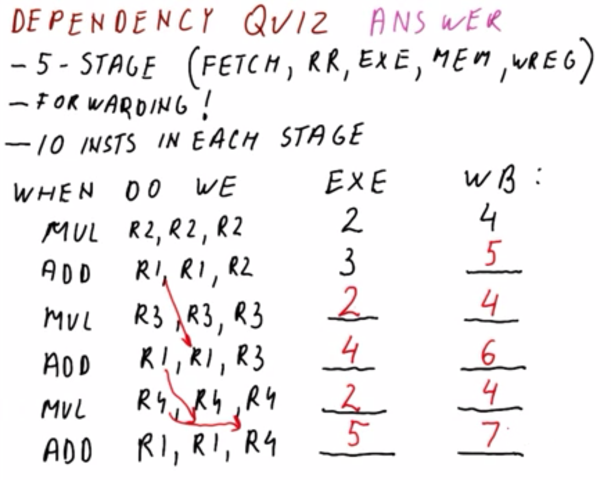
</center>

Now that we have seen two types of dependencies (i.e., read-after-write/RAW and write-after-write/WAW) and how they can affect the scheduling of instructions in a processor attempting to perform at `CPI > 1`, consider the following scenario.

A processor is given with a classical five-stage pipeline (`F`, `D`, `E`, `M`, `W`) and which can also perform ***forwarding*** (i.e., if the result has been produced, it is fed into the instruction correctly, even though it has not been written to a register yet). Furthermore, each stage can execute `10` instructions (i.e., ideally, it can perform all `10` instructions within `5` cycles--assuming no dependencies, etc.).

Given this processor, in which cycle does the operation `WB` (write back) occur for the following instructions?

| Instruction | `E` | `WB` |
|:--:|:--:|:--:|
| `MUL R2, R2, R2` | `C2` | `C4` |
| `ADD R1, R1, R2` | `C3` | ? |
| `MUL R3, R3, R3` | ? | ? |
| `ADD R1, R1, R3` | ? | ? |
| `MUL R4, R4, R4` | ? | ? |
| `ADD R1, R1, R4` | ? | ? |

(***N.B.*** Cycles are numbered relative to `C0` for initial fetch/`F` of first instruction.)

***Answer and Explanation***:

| Instruction | `E` | `WB` |
|:--:|:--:|:--:|
| (1) `MUL R2, R2, R2` | `C2` | `C4` |
| (2) `ADD R1, R1, R2` | `C3` | `C5` |
| (3) `MUL R3, R3, R3` | `C2` | `C4` |
| (4) `ADD R1, R1, R3` | `C4` | `C6` |
| (5) `MUL R4, R4, R4` | `C2` | `C4` |
| (6) `ADD R1, R1, R4` | `C5` | `C7` |

In the second instruction, the operation `ADD` requires a one-cycle delay to read the result of the previous instruction (i.e., dependence via `R2`), resulting in `WB` occurring in cycle `C5`.

In the third instruction, there is no dependency, since the instruction only involves the single register `R3` (which does not depend on either upstream instructions). Therefore, `WB` can occur in cycle `C4` "as usual."

In the fourth instruction, there is a dependency (via `R1` and `R3`) on the upstream instructions (via the second and third instructions, respectively). In particular, this instruction must wait to execute in cycle `C3` for `R1` to be available/valid for writing to, consequently resulting in a `WB` in cycle `C6`.
* ***N.B.*** This `ADD` operation will also overwrite `R1` in the which was written in the previous `ADD` (i.e., the second instruction), however, this has no impact on the second instruction (which also reads `R1`), due to the latter having already completing `WB` in cycle `C5`.

In the fifth instruction, there is no dependency, since the instruction only involves the single register `R4` (which does not dependent on any upstream instructions). Therefore, `WB` can occur in cycle `C4` "as usual."
* ***N.B.*** This instruction is analogous to the second instruction, ie., no dependencies involved.

In the sixth instruction, there is a dependency (via `R1` and `R4`) on the upstream instructions (via the fourth and fifth instructions, respectively). Correspondingly, the execution of the sixth instruction must occur subsequently to the latest-occurring dependency, i.e., subsequently to cycle `C4` (via the fourth instruction, which does not execute until cycle `C4`). Consequently, the sixth instruction does not execute until cycle `C5` and subsequently performs `WB` in cycle `C7`.
* ***N.B.*** Cycle `C7` is valid for `WB` of the sixth instruction, because there is no other write dependency (i.e., in any upstream instructions) by the time of cycle `C7`, i.e., this would be the latest-occurring `WB` with respect to register `R1`.

## 11. Register Renaming Quiz and Answers

<center>
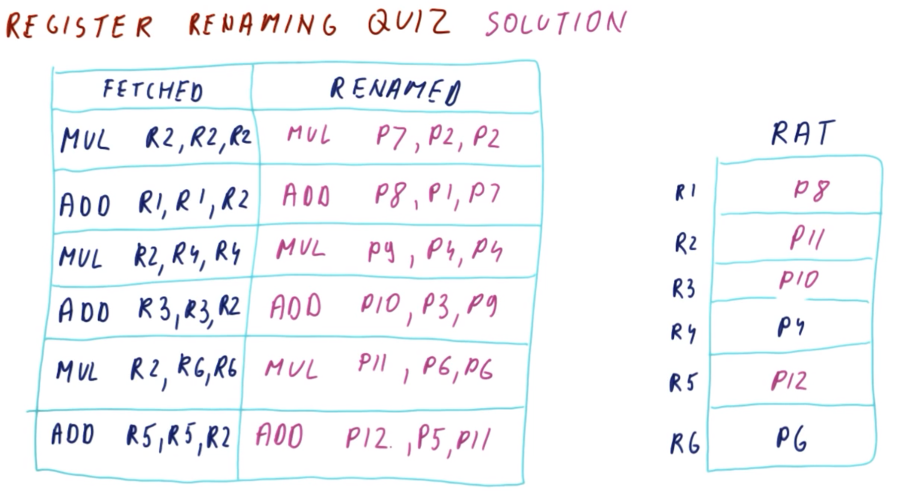
</center>

| Fetched | Renamed |
|:--:|:--:|
| `MUL R2, R2, R2` | `MUL P7, P2, P2` |
| `ADD R1, R1, R2` | `??` |
| `MUL R2, R4, R4` | `??` |
| `ADD R3, R3, R2` | `??` |
| `MUL R2, R6, R6` | `??` |
| `ADD R5, R5, R2` | `??` |

| Architectural Register | Physical Register |
|:--:|:--:|
| `R1` | `P1` |
| `R2` | `P2` |
| `R3` | `P3` |
| `R4` | `P4` |
| `R5` | `P5` |
| `R6` | `P6` |

Consider the sequence of instructions shown above (given as a fetched-renamed pairs, in order of occurrence) and corresponding initial state of the RAT (immediately prior to execution of the first instruction).

| Architectural Register | Physical Register |
|:--:|:--:|
| `R1` | `P1` |
| `R2` | `P7` |
| `R3` | `??` |
| `R4` | `??` |
| `R5` | `??` |
| `R6` | `??` |

Furthermore, The RAT entries post-execution are as shown above (the entry after the first instruction is executed is given here). 

What are the corresponding post-execution renamed instructions and RAT physical register values (i.e., `??`s per above)?

***Answer and Explanation***:

| Fetched | Renamed |
|:--:|:--:|
| `MUL R2, R2, R2` | `MUL P7, P2, P2` |
| `ADD R1, R1, R2` | `ADD P8, P1, P7` |
| `MUL R2, R4, R4` | `MUL P9, P4, P4` |
| `ADD R3, R3, R2` | `ADD P10, P3, P9` |
| `MUL R2, R6, R6` | `MUL P11, P6, P6` |
| `ADD R5, R5, R2` | `ADD P12, P5, P11` |

| Architectural Register | Physical Register |
|:--:|:--:|
| `R1` | `P8` |
| `R2` | `P11` |
| `R3` | `P10` |
| `R4` | `P4` |
| `R5` | `P12` |
| `R6` | `P6` |

The final state of the renamed (physical) registers are assigned sequentially per the corresponding write-to-register operations, as shown above.
* After the first instruction (given initially):

| Architectural Register | Physical Register |
|:--:|:--:|
| `R1` | `P1` |
| `R2` | `P7` |
| `R3` | `R3` |
| `⋮ ` | `⋮ ` |

* After the second instruction:

| Architectural Register | Physical Register |
|:--:|:--:|
| `R1` | `P8` |
| `R2` | `P7` |
| `R3` | `R3` |
| `⋮ ` | `⋮ ` |

* After the third instruction:

| Architectural Register | Physical Register |
|:--:|:--:|
| `R1` | `P8` |
| `R2` | `P9` |
| `R3` | `R3` |
| `⋮ ` | `⋮ ` |

* After the fourth instruction:

| Architectural Register | Physical Register |
|:--:|:--:|
| `R1` | `P8` |
| `R2` | `P9` |
| `R3` | `P10` |
| `⋮ ` | `⋮ ` |

* After the fifth instruction:

| Architectural Register | Physical Register |
|:--:|:--:|
| `R1` | `P8` |
| `R2` | `P11` |
| `R3` | `P10` |
| `⋮ ` | `⋮ ` |

* After the sixth (final) instruction:

| Architectural Register | Physical Register |
|:--:|:--:|
| `R1` | `P8` |
| `R2` | `P11` |
| `R3` | `P10` |
| `R4` | `P4` |
| `R5` | `P12` |
| `R6` | `P6` |

## 15. ILP Quiz and Answers

<center>
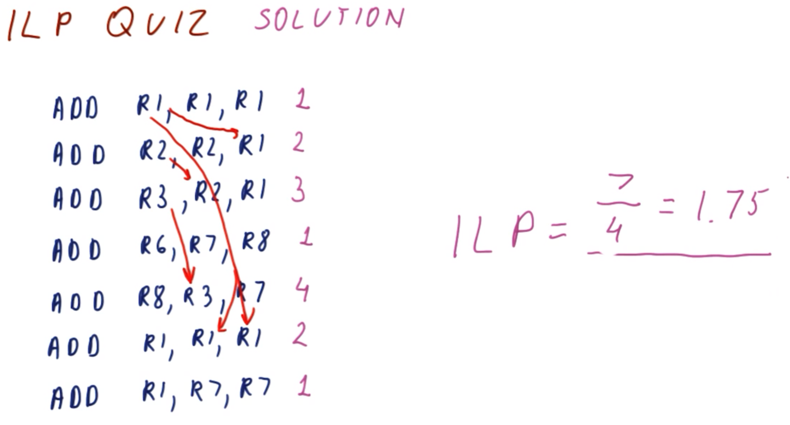
</center>

```mips
ADD R1, R1, R1
ADD R2, R2, R1
ADD R3, R2, R1
ADD R6, R7, R8
ADD R8, R3, R7
ADD R1, R1, R1
ADD R1, R7, R7
```

Given the program shown above, what is the ILP?

***Answer and Explanation***:

```mips
ADD R1, R1, R1 # I1 - C1
ADD R2, R2, R1 # I2 -     C2
ADD R3, R2, R1 # I3 -         C3
ADD R6, R7, R8 # I4 - C1
ADD R8, R3, R7 # I5 -             C4
ADD R1, R1, R1 # I6 -     C2
ADD R1, R7, R7 # I7 - C1
```

Ignoring output and anti dependencies, the following true dependencies occur in the program:
* `I1` and `I2` via register `R1`
* `I2` and `I3` via register `R2`
  * ***N.B.*** There is also dependency between `I1` and `I3` via register `R1`, however, both `R1` and `R2` are effectively "bottlenecking" similarly with respect to instruction `I3`
* `I3` and `I5` via register `R3`
* `I1` and `I6` via register `R1`

Therefore, the true dependencies give rise to four sequential cycles (as denoted above, i.e., `C1` through `C4`), giving rise to the following:
```
ILP = 7 instructions / 4 cycles = 1.75
```

## 18. IPC & ILP Quiz and Answers

<center>
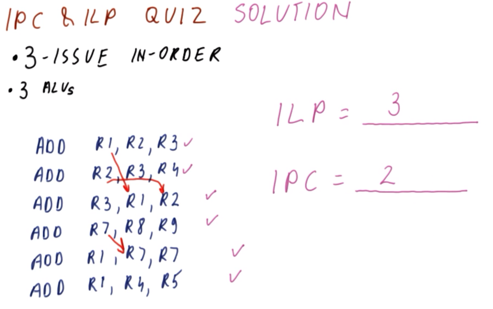
</center>

```mips
ADD R1, R2, R3 # I1
ADD R2, R3, R4 # I2
ADD R3, R1, R2 # I3
ADD R7, R8, R9 # I4
ADD R1, R7, R7 # I5
ADD R1, R4, R5 # I6
```

Consider the program shown above, running on the real processor characterized by the following:
* `3`-issue, in-order
* `3` ALUs (i.e., general purpose, for any arbitrary instruction)

What is the ILP and IPC for this program?

***Answer and Explanation***

First, examining the dependencies gives:
* between instructions `I1` and `I3` via register `R1`
* between instructions `I2` and `I3` via register `R2`
* between instructions `I4` and `I5` via register `R7`

```mips
ADD R1, R2, R3 # I1 - C1
ADD R2, R3, R4 # I2 - C1
ADD R3, R1, R2 # I3 -     C2
ADD R7, R8, R9 # I4 - C1
ADD R1, R7, R7 # I5 -     C2
ADD R1, R4, R5 # I6 - C1
```

With respect to ILP (as annotated in the code above), two cycles result from the data dependencies, giving the following:

```
ILP = 6 instructions / 2 cycles = 3
```

```mips
ADD R1, R2, R3 # I1 - C1
ADD R2, R3, R4 # I2 - C1
ADD R3, R1, R2 # I3 -     C2
ADD R7, R8, R9 # I4 -     C2
ADD R1, R7, R7 # I5 -         C3
ADD R1, R4, R5 # I6 -         C3
```

With respect to IPC on the real processor (as annotated in the code above), in addition to the two cycles resulting from the data dependencies, instruction `I3` is delayed to cycle `C2` because the processor is in-order, and therefore must wait for `I2` to execute first (which similarly bottlenecks/delays downstream instructions with respect to "in-order"). Similarly, instruction `I4` can execute in cycle `C2`, however, the data dependency (i.e., between `I4` and `I5` via register `R7`) causes an additional one-cycle delay, with instructions `I5` and `I6` consequently occurring in the subsequent cycle `C3`.

This yields the following:

```
IPC = 6 instructions / 3 cycles = 2
```

***N.B.*** In this particular case, even if this were a 2-issue processor, the in-order property is even more rate-limiting here, inasmuch as it causes delays by virtue of the inherent data dependencies in the program, thereby yielding the same IPC of `2`. Therefore, in general, many of these factors act in aggregate to impact the IPC of a real processor.

# Instruction Scheduling

## 7. `Issue` Quiz and Answers

<center>
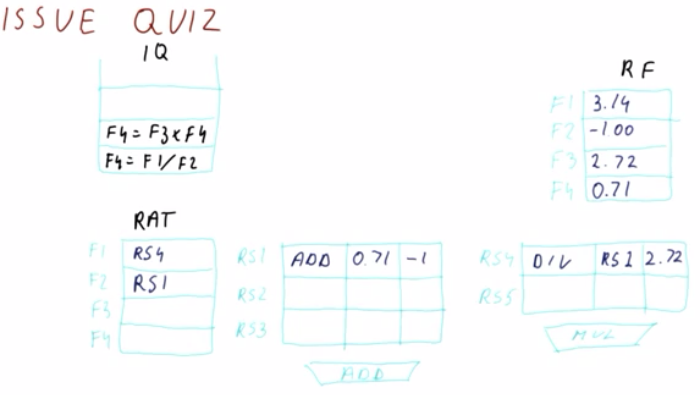
</center>

Consider the operation `Issue` as in the figure shown above. Two instructions are already present in the register stations (RS) immediately prior to execution of the next instruction in the instruction queue (IQ).

From here, perform the `Issue` operation on the next two instructions, or otherwise describe what occurs if the instruction cannot be issued. (For simplicity, do not consider execution of in-progress instructions in the other RSes, but rather simply issue with respect to the next-in-line instructions.)

***Answer and Explanation***:

<center>
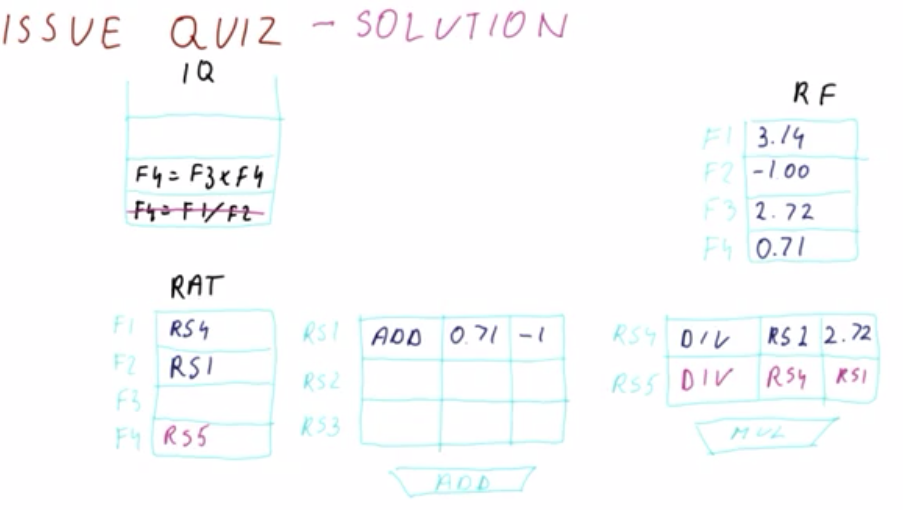
</center>

The next instruction to be issued from the IQ is instruction `I1` (`F4 = F1 / F2`), which is issued to `RS5`, with corresponding register allocation table (RAT) entry being set to `RS5`. Furthermore, note that both operands of `I1` depend on the in-progress instructions existing prior to this cycle (i.e., `F1` and `F2` via `RS4` and `RS1`, respectively).

The next instruction in the IQ after instruction `I1` is instruction `I2` (`F4 = F3 × F4`). This instruction *cannot* be issued in the current cycle, due to the RSes for the execution unit `MUL` being currently *full*. Therefore, the operation issue is currently stalled, pending availability of the next-available RS.

## 10. `Dispatch` Quiz and Answers

<center>
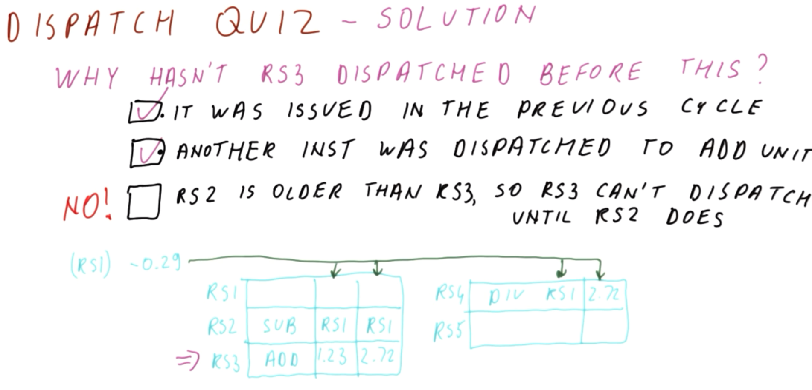
</center>

Consider the configuration in the figure shown above, immediately prior to a `Dispatch` operation. Why has not `RS3` (which already has executable operand values) dispatched already prior to reaching this cycle? (Select all valid possibilities.)
* `RS3` was issued in the previous cycle.
  * `APPLIES` - If `RS3` were indeed issued in the previous cycle (i.e., it arrived within the reservation station), then depending on when instructions for execution are selected (e.g., towards the end of the cycle), there may be a temporal "mismatch" (i.e., the next-available instruction was not ready yet at that point)
* Another instruction was dispatched to the execution unit `ADD`.
  * `APPLIES` - This is possible, for example, if `RS1` was sent in the previous cycle to the execution unit; in that case, the execution unit (assumed here to only execute one instruction per cycle) would be "occupied" and therefore unable to execute `RS3`.
* `RS2` is older than `RS3` (i.e., `RS2` precedes `RS3` in program-order), so `RS3` cannot dispatch until `RS2` does.
  * `DOES NOT APPLY` - In an out-of-order algorithm (which Tomasulo's algorithm *is* characterized by), there *is* a dispatch of an instruction as soon as its operands are ready. If this factor were of concerned, then the dispatch of the instruction could simply be delayed (i.e., even if the operands *are* ready at this point); however, note that this would yield an in-order processor, which is not desirable here (i.e., due to sub-optimal performance). In fact, the reason why this is an out-of-order processor is precisely because instructions such as `R3` *can* execute even if they are *not* the oldest one in the reservation stations.

## 16-18. One-Cycle Quizzes

### Introduction

The following set of quizzes tests understanding of what occurs in one cycle via Tomasulo's algorithm.

### 16. Part 1 Quiz and Answers

<center>
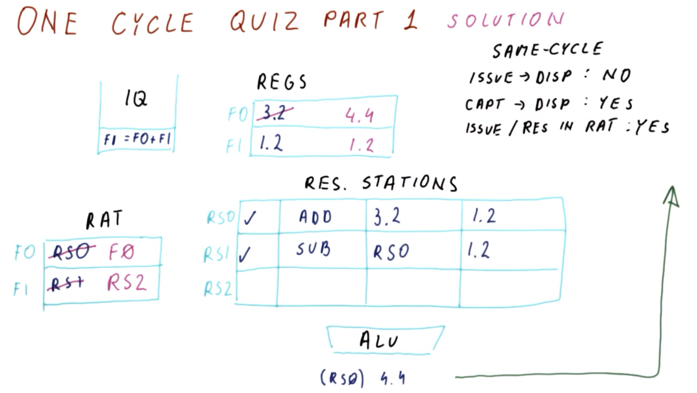
</center>

Consider the configuration shown above (blue text and annotations denote the state at the beginning of the cycle). Furthermore, the following are permissible based on the hardware itself:
* Operations `Issue` and `Dispatch` *cannot* occur in the same cycle
* Operations `Capture` and `Dispatch` *can* occur in the same cycle
* Update of RAT following simultaneous operations `Issue` and `Broadcast` *can* occur in the same cycle

At the end of the cycle, what will be the contents of the two entries in both the RAT and REGS?

***Answer and Explanation***:

Consider all possible events in this cycle, as follows:
* 1 - Issuing of an instruction from IQ will update the RAT correspondingly
* 2 - `(RS0) 4.4` will be broadcasted from the execution unit `ALU`, which in turn will correspondingly update the RAT and REGS

These events can be analyzed in any arbitrary order, however, their resulting effects must be further examined and reconciled accordingly as necessary (denoted in purple text and annotations in the figure shown above).
* 1 - Issuing of the instruction from IQ (`F1 = F0 + F1`) examines the entries for `F0` and `F1` in the RAT, followed by writing of `F1` into the corresponding reservation station(s). Because there is an available RS (`RS2`), the instruction is issued there, with corresponding update for entry `F1` in the RAT. Furthermore, there is no corresponding update to the REGS.
* 2 - Broadcasting of `(RS0) 4.4` from the execution unit `ALU` makes the corresponding update to `REGS` for entry `F0`, and also invalidates the existing entry for `F0` in `RAT` (which now directs back to REGS).

Lastly, the entry `F1` in REGS remains unchanged, since neither event affected that value.

### 17. Part 2 Quiz and Answers

<center>
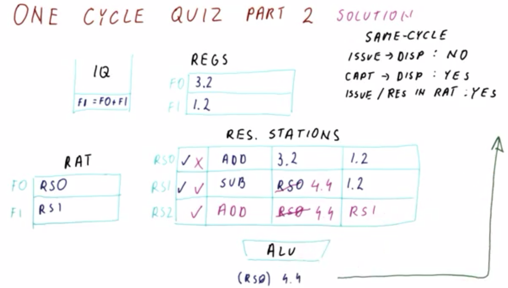
</center>

Continuing from the previous example (cf. Section 17), the same initial state is observed as previously.

By the end of this cycle, what is the final state of reservation stations (RSes)? In particular, are `RS0` and/or `RS1` still busy? And will `RS2` be used at all?

***Answer and Explanation***:

To determine the downstream effects on the RSes, it is first necessary to determine whether an instruction is issued from the IQ, as well as the impact of the currently broadcasting instruction from the execution unit (i.e., is there any capturing of the result by the RSes). These can be analyzed in arbitrary order, however, caution must be exercised in examining multiple updates to the *same* field.

With respect to issuing from IQ:
* `RS2` is identified as an available reservation station, and becomes ***occupied*** by the instruction (`F1 = F0 + F1`) accordingly. Furthermore, both operands `F0` and `F1` have corresponding entries in the RAT (`RS0` and `RS1`, respectively)

With respect to the broadcast from `ALU`:
* pre-broadcast:
  * `RS0` frees its reservation station, thus `RS0` is ***not occupied*** at the end of the cycle.
  * `RS1` remains ***occupied*** due to dependence on `RS0` for one of its operands.
* post-broadcast:
  * `RS1` entry for `RS0` is captured as `4.4`
  * `RS2` entry (which was issued in this same cycle) for `RS0` is captured as `4.4`; furthermore, this is necessary to occur in the *same* cycle, because with `RS0` freed, that value is now stale/invalid. `RS0` entry for `RS1` is still pending a result (which is permissible here, since `RS1` has not yet executed).

### 18. Part 3 Quiz and Answers

<center>
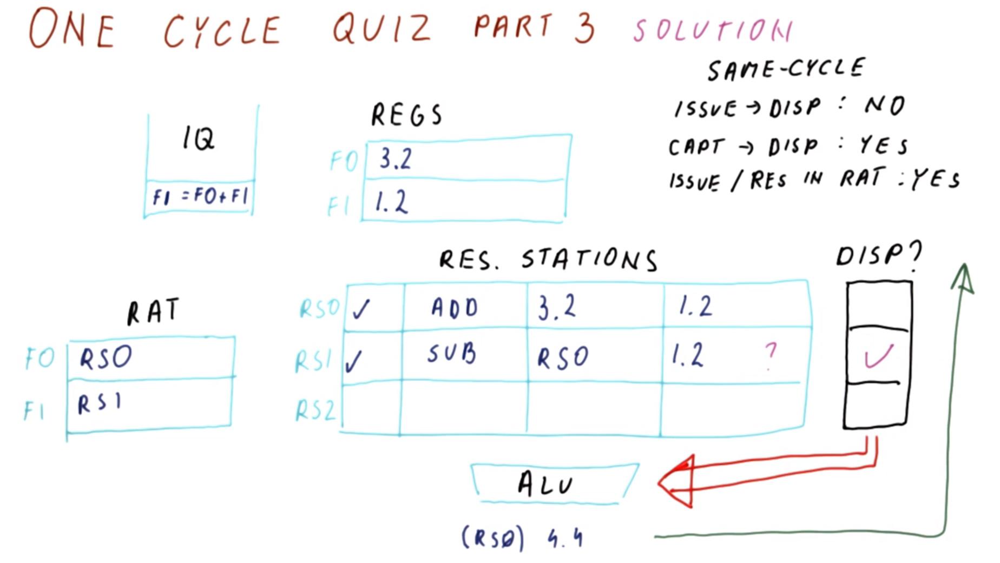
</center>

Continuing from the previous example (cf. Sections 17 and 18), the same reference state is observed as previously.

Which instruction (if any) will dispatch into the execution `ALU` by the end of this cycle? (Note: "No cycle" is a possible option.)

***Answer and Explanation***:

Recall (cf. Section 18) that `RS0` will free its reservation station and is in process of executing, therefore it ***will not*** dispatch (i.e., *again*) in this cycle.

`RS1` will capture its last-remaining operand during this cycle, thereby making it eligible for dispatch immediately thereafter. Since simultaneous capture and dispatch *is* possible on this hardware (as per the given parameters, cf. Section 17), `RS1` ***will*** consequently dispatch.

`RS2` is occupied during this cycle via issuing of the instruction (`F1 = F0 + F1`). However, since simultaneous issue and dispatch is *not* possible on this hardware (as per the given parameters, cf. Section 17), `RS2` ***will not*** dispatch in this cycle (i.e., even if its operands were available/ready).

***N.B.*** In this case, since there is only *one* available instruction for dispatch, there is no ambiguity here. However, if there were *more than one* instructions available for dispatch, some type of mechanism (e.g., oldest first) would have to be devised/implemented to select among these, since there is only one execution unit (`ALU`) available.

## 19. Tomasulo's Algorithm Quiz and Answers

<center>
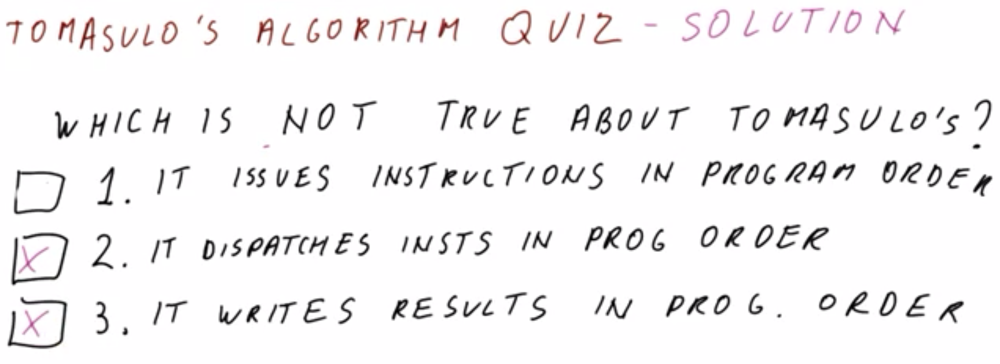
</center>

Which of the following is ***not*** true regarding Tomasulo's algorithm?
* It issues instructions in program-order
  * `DOES NOT APPLY` - Instructions arrive via the instruction queue (IQ) in program-order. Consequently, it is not possible to issue instructions out-of-order.
* It dispatches instructions in program-order
  * `APPLIES` - Instructions *can* be dispatched in out-of-program-order, hence why Tomasulo's algorithm is characterized as an out-of-order algorithm (i.e., running on an out-of-order processor).
* It writes results in program-order
  * `APPLIES` - This is not necessarily true. Results can be written in the order in which they are *produced*, which may be out-of-program-order.

## 28-29. Tomasulo's Algorithm Timing Quizzes

### Introduction

<center>
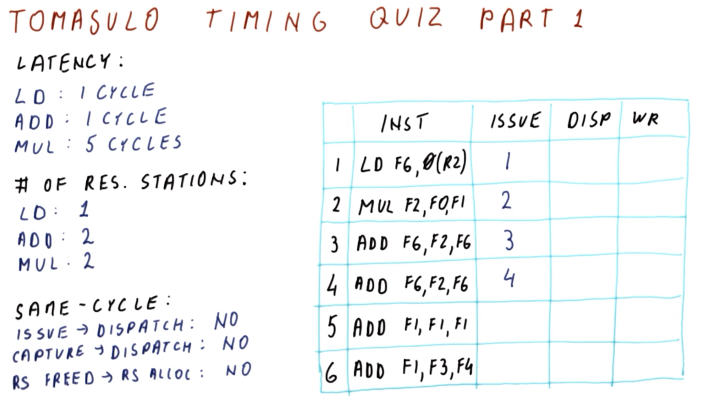
</center>

Consider the processor characterized as in the figure shown above.

The processor has the following latencies for the corresponding operations:
* Instruction `LD` requires `1` cycle
* Instruction `ADD` requires `1` cycle
* Instruction `MUL` requires `5` cycles

The processor has the following reservation stations (RS) available:
* `1` RS available for `LD`
* `2` RSes available for `ADD`
* `2` RSes available for `MUL`

The processor has the following restrictions:
* *Cannot* perform operations `Issue` and `Dispatch` in the *same* cycle
* *Cannot* perform operations `Capture` and `Dispatch` in the *same* cycle
* *Cannot* simultaneously free an RS and re-allocate it (i.e., for a subsequent instruction) in the *same* cycle (i.e., the RS is only available to be issued to starting in the *next* cycle)

The corresponding program running on this processor is the following:
```mips
LD  F6, 0(R2)
MUL F2, F0, R1
ADD F6, F2, F6
ADD F6, F2, F6
ADD F1, F1, F1
ADD F1, F3, F4
```

The quiz which analyzes this processor via Tomasulo's algorithm is split into two parts, as covered in the following subsections.

### 28. Part 1 Quiz and Answers

<center>
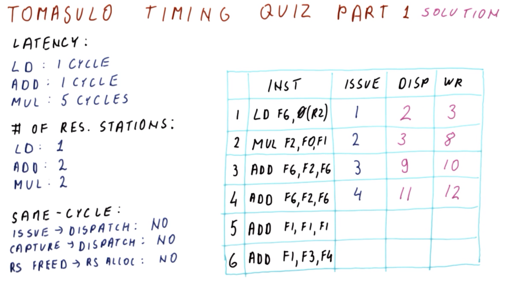
</center>

| Instruction Label | Instruction | Cycle of `Issue` | Cycle of `Execute` | Cycle of `Write Result` |
|:--:|:--:|:--:|:--:|:--:|
| `I1` | `LD  F6, 0(R2)` | `C1` | | |
| `I2` | `MUL F2, F0, R1` | `C2` | | |
| `I3` | `ADD F6, F2, F6` | `C3` | | |
| `I4` | `ADD F6, F2, F6` | `C4` | | |
| `I5` | `ADD F1, F1, F1` | | | |
| `I6` | `ADD F1, F3, F4` | | | |

Given the system shown previously (cf. subsection "Introduction"), perform the corresponding time analysis for instructions `I1` through `I4`. The initial starting point (i.e., issued instructions) is given in the table shown above.

***Answer and Explanation***:

| Instruction Label | Instruction | Cycle of `Issue` | Cycle of `Execute` | Cycle of `Write Result` |
|:--:|:--:|:--:|:--:|:--:|
| `I1` | `LD  F6, 0(R2)` | `C1` | `C2` | `C3` |
| `I2` | `MUL F2, F0, R1` | `C2` | `C3` | `C8` |
| `I3` | `ADD F6, F2, F6` | `C3` | `C9` | `C10` |
| `I4` | `ADD F6, F2, F6` | `C4` | `C11` | `C12` |
| `I5` | `ADD F1, F1, F1` | | | |
| `I6` | `ADD F1, F3, F4` | | | |

The final result is as per the table shown above.

| Instruction Label | Instruction | Cycle of `Issue` | Cycle of `Execute` | Cycle of `Write Result` |
|:--:|:--:|:--:|:--:|:--:|
| `I1` | `LD  F6, 0(R2)` | `C1` | `C2` | `C3` |

With respect to instruction `I1` (as in the table shown above), there are no dependencies, however, it cannot dispatch in the same cycle as its issue (i.e., cycle `C1`), therefore, dispatch can only occur as soon as cycle `C2`. Furthermore, a tentative write result can occur in cycle `C3` for this operation (which requires `1` cycles to execute).

| Instruction Label | Instruction | Cycle of `Issue` | Cycle of `Execute` | Cycle of `Write Result` |
|:--:|:--:|:--:|:--:|:--:|
| `I1` | `LD  F6, 0(R2)` | `C1` | `C2` | `C3` |
| `I2` | `MUL F2, F0, R1` | `C2` | `C3` | `C8` |

With respect to instruction `I2` (as in the table shown above), there are no dependencies, however, it cannot dispatch in the same cycle as its issue (i.e., cycle `C2`), therefore, dispatch can only occur as soon as cycle `C3`. Furthermore, a tentative write result can occur in cycle `C3` for this operation (which requires `5` cycles to execute).

| Instruction Label | Instruction | Cycle of `Issue` | Cycle of `Execute` | Cycle of `Write Result` |
|:--:|:--:|:--:|:--:|:--:|
| `I1` | `LD  F6, 0(R2)` | `C1` | `C2` | `C3` |
| `I2` | `MUL F2, F0, R1` | `C2` | `C3` | `C8` |
| `I3` | `ADD F6, F2, F6` | `C3` | `C9` | `C10` |

With respect to instruction `I3` (as in the table shown above), it cannot dispatch in the same cycle as its issue (i.e., cycle `C3`); furthermore, it has dependencies with respect to its operands `F2` (via `I2`) and `F6` (via `I1`), which further precludes dispatch. Since the earliest-available result is in cycle `C8` (via `I2`), and additionally per the hardware restriction of not having simultaneous capture and dispatch in the same cycle, the earliest-possible dispatch for instruction `I3` is cycle `C9`. Furthermore, a tentative write result can occur in cycle `C10` for this operation (which requires `1` cycle to execute).

| Instruction Label | Instruction | Cycle of `Issue` | Cycle of `Execute` | Cycle of `Write Result` |
|:--:|:--:|:--:|:--:|:--:|
| `I1` | `LD  F6, 0(R2)` | `C1` | `C2` | `C3` |
| `I2` | `MUL F2, F0, R1` | `C2` | `C3` | `C8` |
| `I3` | `ADD F6, F2, F6` | `C3` | `C9` | `C10` |
| `I4` | `ADD F6, F2, F6` | `C4` | `C11` | `C12` |

Finally, with respect to instruction `I4` (as in the table shown above), it cannot dispatch in the same cycle as its issue (i.e., cycle `C3`); furthermore, it has dependencies with respect to its operands `F2` (via `I2`) and `F6` (via `I3`), which further precludes dispatch. Since the earliest-available result is in cycle `C10` (via `I3`), and additionally per the hardware restriction of not having simultaneous capture and dispatch in the same cycle, the earliest-possible dispatch for instruction `I3` is cycle `C11`. Furthermore, a tentative write result can occur in cycle `C12` for this operation (which requires `1` cycle to execute).

### 29. Part 2 Quiz and Answers

<center>
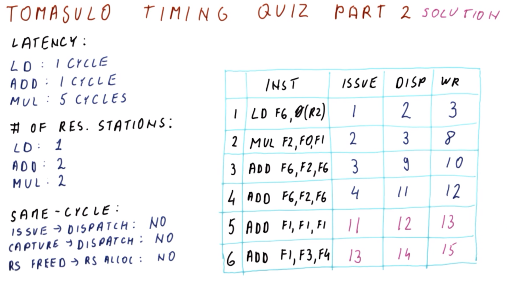
</center>

| Instruction Label | Instruction | Cycle of `Issue` | Cycle of `Execute` | Cycle of `Write Result` |
|:--:|:--:|:--:|:--:|:--:|
| `I1` | `LD  F6, 0(R2)` | `C1` | `C2` | `C3` |
| `I2` | `MUL F2, F0, R1` | `C2` | `C3` | `C8` |
| `I3` | `ADD F6, F2, F6` | `C3` | `C9` | `C10` |
| `I4` | `ADD F6, F2, F6` | `C4` | `C11` | `C12` |
| `I5` | `ADD F1, F1, F1` | | | |
| `I6` | `ADD F1, F3, F4` | | | |

Continuing with the same system (cf. Section 28), analysis through cycle `C4` is as per the table shown above.

Complete the remaining analysis with respect to pending instructions `I5` and `I6`.

***Answer and Explanation***:

| Instruction Label | Instruction | Cycle of `Issue` | Cycle of `Execute` | Cycle of `Write Result` |
|:--:|:--:|:--:|:--:|:--:|
| `I1` | `LD  F6, 0(R2)` | `C1` | `C2` | `C3` |
| `I2` | `MUL F2, F0, R1` | `C2` | `C3` | `C8` |
| `I3` | `ADD F6, F2, F6` | `C3` | `C9` | `C10` |
| `I4` | `ADD F6, F2, F6` | `C4` | `C11` | `C12` |
| `I5` | `ADD F1, F1, F1` | `C11` | `C12` | `C13` |
| `I6` | `ADD F1, F3, F4` | `C13` | `C14` | `C15` |

The final result is as per the table shown above.

| Instruction Label | Instruction | Cycle of `Issue` | Cycle of `Execute` | Cycle of `Write Result` |
|:--:|:--:|:--:|:--:|:--:|
| `I1` | `LD  F6, 0(R2)` | `C1` | `C2` | `C3` |
| `I2` | `MUL F2, F0, R1` | `C2` | `C3` | `C8` |
| `I3` | `ADD F6, F2, F6` | `C3` | `C9` | `C10` |
| `I4` | `ADD F6, F2, F6` | `C4` | `C11` | `C12` |
| `I5` | `ADD F1, F1, F1` | `C11` | `C12` | `C13` |

With respect to instruction `I5` (as in the table shown above), it cannot issue yet in cycle `C5`, because no reservation station is available yet at this point (i.e., execution of instructions `I3` and `I4` is ongoing at this point); furthermore, a reservation station cannot be reallocated simultaneously as the previously-executing instruction is dispatched from it, so the earliest-possible issue for instruction `I5` is cycle `C11` (via freed RS of instruction `I3`, which frees in cycle `C10`). There are no dependencies, however, it cannot dispatch in the same cycle as its issue (i.e., cycle `C11`), therefore, dispatch can only occur as soon as cycle `C12`. Furthermore, a tentative write result can occur in cycle `C13` for this operation (which requires `1` cycle to execute).

| Instruction Label | Instruction | Cycle of `Issue` | Cycle of `Execute` | Cycle of `Write Result` |
|:--:|:--:|:--:|:--:|:--:|
| `I1` | `LD  F6, 0(R2)` | `C1` | `C2` | `C3` |
| `I2` | `MUL F2, F0, R1` | `C2` | `C3` | `C8` |
| `I3` | `ADD F6, F2, F6` | `C3` | `C9` | `C10` |
| `I4` | `ADD F6, F2, F6` | `C4` | `C11` | `C12` |
| `I5` | `ADD F1, F1, F1` | `C11` | `C12` | `C13` |
| `I6` | `ADD F1, F3, F4` | `C13` | `C14` | `C15` |

Finally, with respect to instruction `I6` (as in the table shown above), it cannot issue yet in cycle `C12`, because no reservation station is available yet at this point (i.e., execution of instructions `I4` and `I5` is ongoing at this point); furthermore, a reservation station cannot be reallocated simultaneously as the previously-executing instruction is dispatched from it, so the earliest-possible issue for instruction `I6` is cycle `C13` (via freed RS of instruction `I4`, which frees in cycle `C12`). There are no dependencies, however, it cannot dispatch in the same cycle as its issue (i.e., cycle `C13`), therefore, dispatch can only occur as soon as cycle `C14`. Furthermore, a tentative write result can occur in cycle `C15` for this operation (which requires `1` cycle to execute).

# ReOrder Buffer (ROB)

## 7. Free Reservation Stations Quiz and Answers

<center>

</center>

We have seen that the reorder buffer (ROB) changes when a reservation station (RS) is made available. Now, suppose an instruction *cannot* issue because there is no available RS for it. In which of the following configurations is the more likely? (Select one.)
* Configuration 1 - `CORRECT`
  * No ROB available (but otherwise following Tomasulo's algorithm)
  * Two `ADD` and two `MUL` RSes available
* Configuration 2
  * Has ROB available
  * Two `ADD` and two `MUL` RSes available

***Explanation***:

If the instruction cannot issue due to no available RSes, this means that all of the RSes are currently busy. Therefore, with a processor *lacking* a ROB, the RSes are retained from the time of instruction issue until the instruction broadcasts its result. Consequently, issuing of an instruction once the RSes are busy will necessitate waiting until the next instruction broadcast the result.

Conversely, in a ROB-based processor, all else equal (i.e., otherwise with the same number and types of RSes available), the RSes are occupied simultaneously with instruction issue, but then correspondingly freed simultaneously with dispatch of the instructions for execution (i.e., the RSes are freed relatively sooner compared to the non-ROB-based processor, all else equal). This in turn allows the next-available instruction to occupy the next-available RS.

## 10. ROB Quiz and Answers

<center>
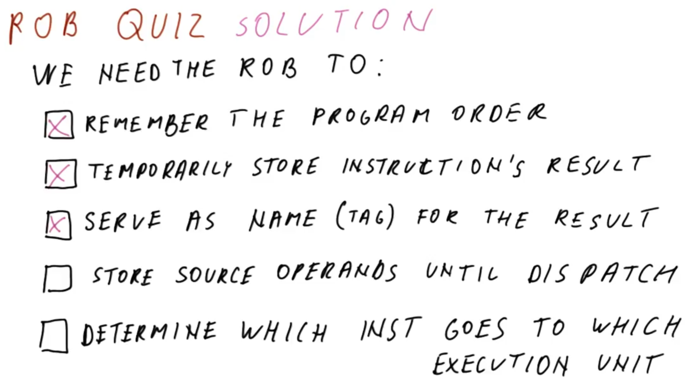
</center>

The reorder buffer (ROB) is required in order to (Select all applicable choices):
* Remember the program order
  * `APPLIES` → The ROB is the only intermediary between issue (which is performed in program-order) and commit (which is also performed in program-order) which preserves program-order (whereas other intermediate steps between these generally occur out-of-order)
* Temporarily store the instruction's result
  * `APPLIES` → The ROB stores the instruction's result between the time when the instruction is produced (i.e., when a broadcast occurs on the bust) and the time when the instruction's result is committed to the register file.
* Serve as the name (tag) for the result
  * `APPLIES` → With Tomasulo's algorithm, the reservation station served this role; however, with a ROB configuration, the ROB entry is the one performing this role instead
* Store source operands until dispatch
  * `DOES NOT APPLY` → This role is still performed by the reservation station, even with the ROB configuration
* Determine which instruction goes to which execution unit
  * `DOES NOT APPLY` → The ROB is typically unified (i.e., *all* instructions go to the ROB, but they generally receive different/distinct entries in the ROB itself); therefore, it is evident/unambiguous which execution unit the instructions are directed to, because different execution units have distinct/dedicated reservation stations, and thus when an instruction is issued, it is sent to the *intended* set of reservations stations (which in turn dictate the corresponding execution unit)

## 15. Exceptions with ReOrder Buffer (ROB) Quiz and Answers

<center>
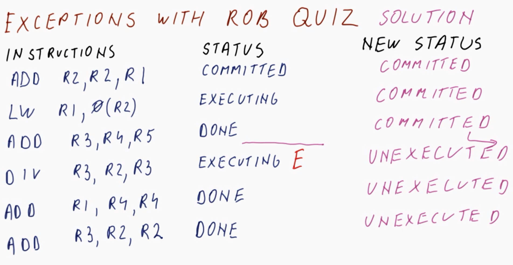
</center>

| Instruction (in program-order) | Status | New Status |
|:-|:-:|:-:|
| `ADD R2, R2, R1` | Committed | |
| `LW  R1, 0(R2) ` | Executing | |
| `ADD R3, R4, R5` | Done | |
| `DIV R3, R2, R3` | Executing | |
| `ADD R1, R4, R4` | Done | |
| `ADD R3, R2, R2` | Done | |

Consider the program in the table shown above. Here, the instructions statuses are as follows:
* ***Committed*** → The instruction has exited the pipeline and its result has been committed from the reorder buffer (ROB) to the register file (REGS)
* ***Executing*** → The instruction has left the reservation station (RS) and is commencing execution in the execution unit, however, its result has not yet been broadcasted on the bus (i.e., it has not yet *committed*)
* ***Done*** → The instruction has arrived at the RS, subsequently left the RS, computed its result, deposited its result somewhere else, but the result is not yet *committed* (i.e., the instruction has not yet left the processor)

The current statuses of the program's instructions are as given in the table shown above. Consider the situation where an **exception** (denoted `E` in the figure shown above) occurs in the instruction `DIV ...` (e.g., a divide-by-zero exception via operand `R3`). What is the *new* status of these instructions after the exception has been handled (i.e., the point immediately prior to which the program can now proceed onto the exception handler)?

***Answer and Explanation***:

| Instruction (in program-order) | Status | New Status |
|:-|:-:|:-:|
| `ADD R2, R2, R1` | Committed | Committed |
| `LW  R1, 0(R2) ` | Executing | Committed |
| `ADD R3, R4, R5` | Done | Committed |
| `DIV R3, R2, R3` | Executing | Unexecuted |
| `ADD R1, R4, R4` | Done | Unexecuted |
| `ADD R3, R2, R2` | Done | Unexecuted |

At the point in which the exception occurs (i.e., with respect to instruction `DIV`), what should occur by this point is that the upstream instructions have already finished executing, with the subsequent instructions not executing (as far as the programmer is concerned).

Because the programmer only "sees" the program state up to the point of the most recent commit, then the fact that the downstream `ADD` instructions are already Done means that these must now be "undone" (i.e., the instructions starting with `DIV` onwards must be flushed from the pipeline), with the processor state correspondingly restored to the correct state immediately prior to encountering the exception (i.e., as expected in program-order).

To perform this "rollback," since the first instruction `ADD` is already committed (which cannot be undone at this point), the subsequent two instructions (immediately prior to `DIV`) must first be committed in order to proceed to the exception itself (***N.B.*** since the third instruction is already Done in the initial state, the change to commit is relatively trivial, however, the instruction `LW` may be slightly "bottlenecking" before proceeding through all necessary Commit statuses).

At this point, the instruction `DIV` now carries the exception condition into the status Commit itself; therefore, upon attempting to commit the instruction, it is determined that this cannot be done, and the exception is consequently generated. Therefore, now, the processor ceases committing further and instead flushes all subsequent instructions from the pipeline, resulting in these latter instructions being effectively Unexecuted (i.e., insofar as the programmer is concerned, these instructions were "never" fetched in the first place). Now, the program can proceed transfer of control to the exception handler (as denoted by the purple right-pointing arrow in the figure shown above).

## 23-30. ReOrder Buffer (ROB) Quizzes and Answers

### 23. Quiz 1 and Answers

<center>
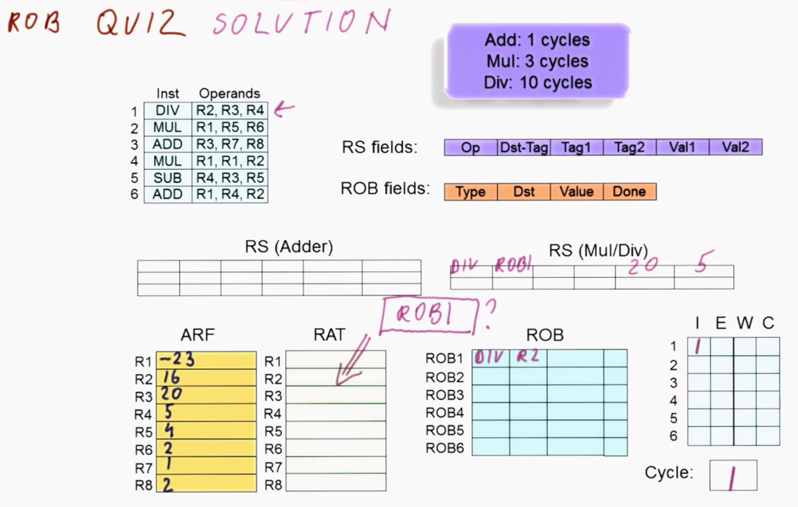
</center>

Consider the system characterized as in the figure shown above. Furthermore, assume that the same issue, dispatch, and broadcast behavior applies to this system as from previously (cf. Lesson 7), summarized briefly as follows:
* If a result is captured, then the instruction can dispatch from registration station (RS) in the *same* cycle
* If a result is dispatched, execution can commence in the *next* cycle
* If an instruction is issued and has fully determinate operands on issuing, then the instruction can dispatch in the *same* cycle
* Upon completing execution of an instruction, the result can be broadcast in the *next* cycle

In cycle `C1`, instruction `I1` issues. What is the corresponding entry in the register allocation table (RAT) for register `R2` (i.e., via instruction `I1`)?

***Answer and Explanation***:

In cycle `C1`, instruction `I1` issues, with corresponding occupation of the appropriate reservation station (RS) and entry in the reorder buffer (ROB) table, as in the figure shown above.

At this point, both of instruction `I1`s operands (i.e., `R3` and `R4`) are directly available from the architecture register file (ARF), with the corresponding values (i.e., `20` and `5`, respectively) populated accordingly in the RS.

Furthermore, the RAT entry is populated with entry `ROB1` for register `R2`.

### 24. Quiz 2 and Answers

<center>
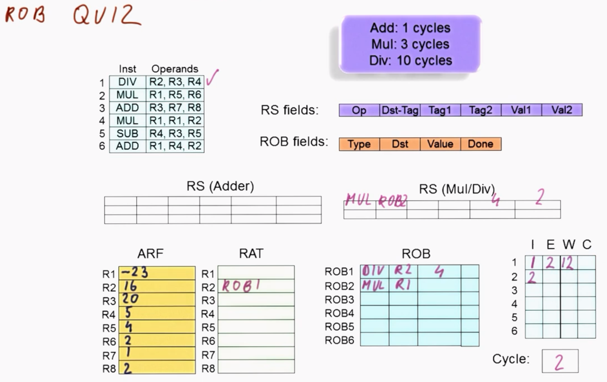
</center>

In cycle `C2`, instruction `I2` issues, with corresponding occupation of the appropriate reservation station (RS) and entry in the reorder buffer (ROB) table, as in the figure shown above. Furthermore, instruction `I1` commences execution in this cycle (producing result `4`) and frees its RS on dispatch accordingly, and will continue to execute until cycle `C12` (as per `10` cycles requirement for instruction `DIV`).

Instruction `I2` obtains its operands directly from ARF, with assigned destination tag (Dst-Tag) `ROB2` for eventual broadcast.

<center>
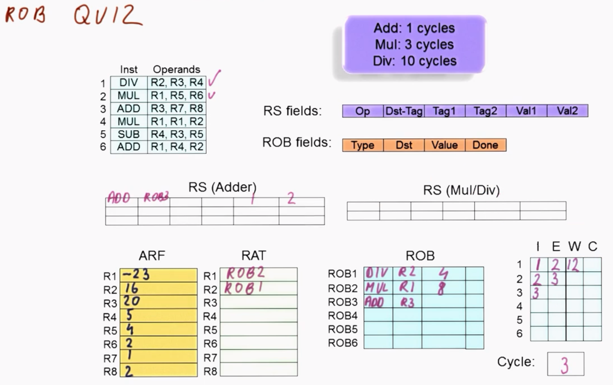
</center>

In cycle `C3`, instruction `I3` issues, with corresponding occupation of the appropriate reservation station (RS) and entry in the reorder buffer (ROB) table, as in the figure shown above. Furthermore, instruction `I2` commences execution in this cycle (producing result `8`) and frees its RS on dispatch accordingly, and will continue to execute until cycle `C6` (as per `3` cycles requirement for instruction `MUL`).

Instruction `I3` obtains its operands directly from ARF, with assigned destination tag (Dst-Tag) `ROB3` for eventual broadcast.

<center>
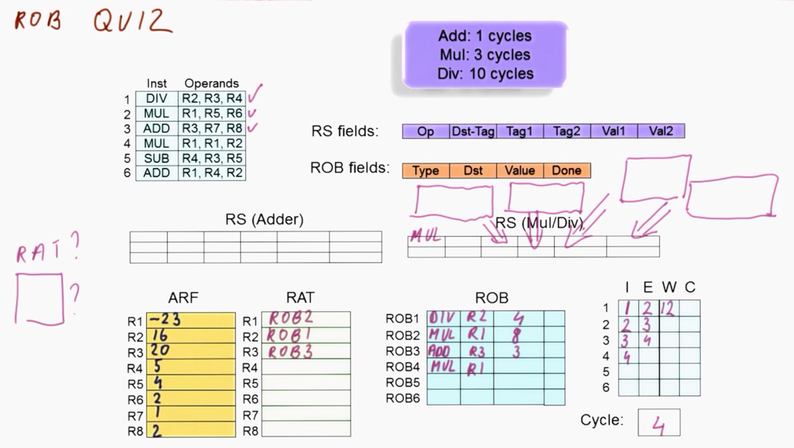
</center>

In cycle `C4`, instruction `I4` issues, with corresponding occupation of the appropriate reservation station (RS) and entry in the reorder buffer (ROB) table, as in the figure shown above. Furthermore, instruction `I3` commences execution in this cycle (producing result `3`) and frees its RS on dispatch accordingly, and will continue to execute until cycle `C5` (as per `1` cycle requirement for instruction `ADD`).

What are the appropriate RS field entries for instruction `I4`, and what is the corresponding RAT entry? 

***Answer and Explanation***:

<center>
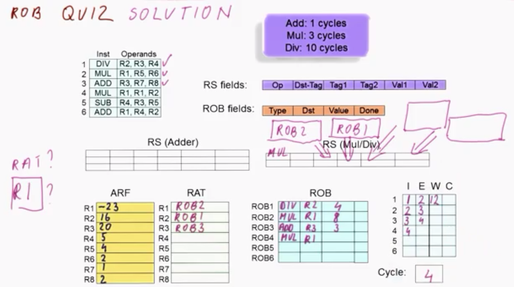
</center>

The entry for the RAT is simply `R1`, i.e., the result register of instruction `I4`. (Note that correspondingly, here, `ROB4` will overwrite the existing value `ROB2` for entry `R1` in RAT.)

| Op | Dst-Tag | Tag1 | Tag2 | Val1 | Val2 |
|:-:|:-:|:-:|:-:|:-:|:-:|
| MUL | `ROB4` | `ROB2` | `ROB1` | `(N/A)` | `(N/A)` |

Furthermore, the corresponding RS fields for instruction `I4` are as in the table shown above.

### 25. Quiz 3 and Answers

<center>
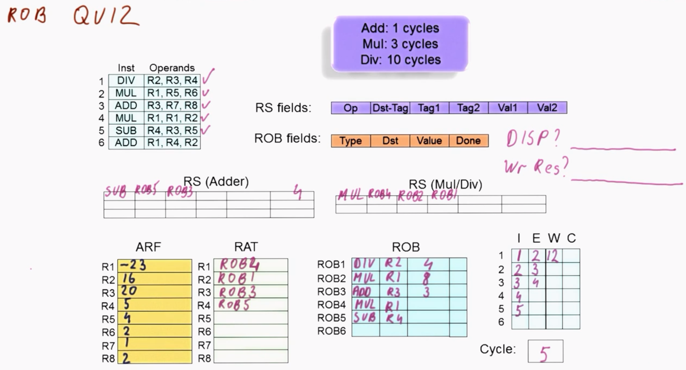
</center>

In cycle `C5`, instruction `I5` issues, with corresponding occupation of the appropriate reservation station (RS) and entry in the reorder buffer (ROB) table, as in the figure shown above. Furthermore, instruction `I4` is still present in its corresponding RS.

At this point, which instruction(s) (if any) is/are dispatched? (Specify the ROB entry.)

Furthermore, which instruction(s) (if any) write results in this cycle? (Specify the ROB entry.)

***Answer and Explanation***:

<center>
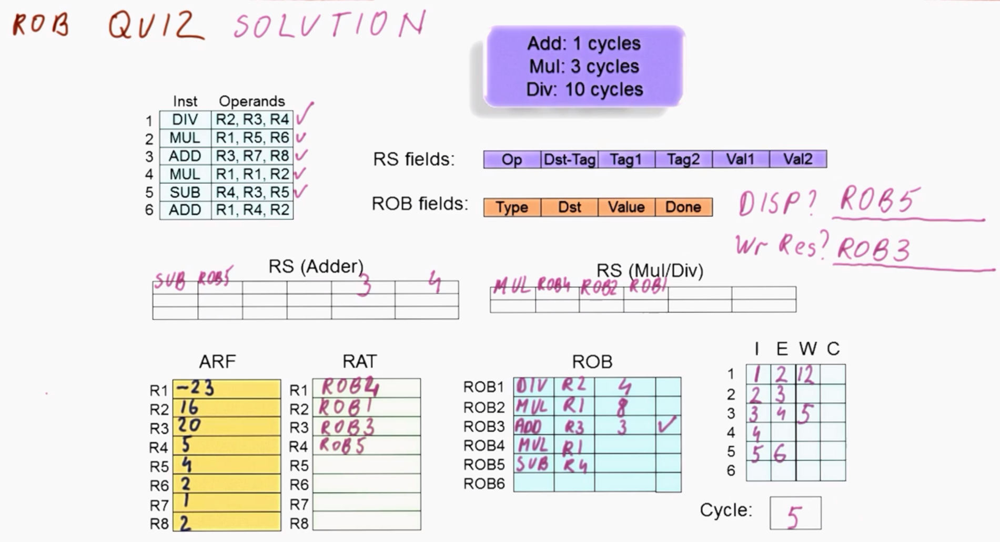
</center>

In cycle `C5`, no instruction is able to be dispatched yet at the start of the cycle, as both instruction-occupied RSes have pending broadcasts for their respective operands.

Furthermore, in cycle `C5`, instruction `I3` is now able to complete execution and consequently write its result (i.e., via corresponding tag `ROB3`). As a result of the write, entry `ROB3` has its `Done` bit set accordingly.

Since the broadcast and capture are able to occur in the same cycle in this system, and furthermore since the RS can dispatch in the same cycle as it captures, instruction `I5` (via tag `ROB5`) can now dispatch from its RS, since it has now received its last-pending operand result (i.e., `ROB3`). Correspondingly, instruction `I5` will execute (producing corresponding result `-1`) from cycles `C6` to `C7` (as per `1` cycle requirement for instruction `SUB`).

***N.B.*** Observe that in this cycle, instruction `I5` is able to issue, capture, and dispatch all in the *same* cycle!

### 26. Quiz 4 and Answers

<center>
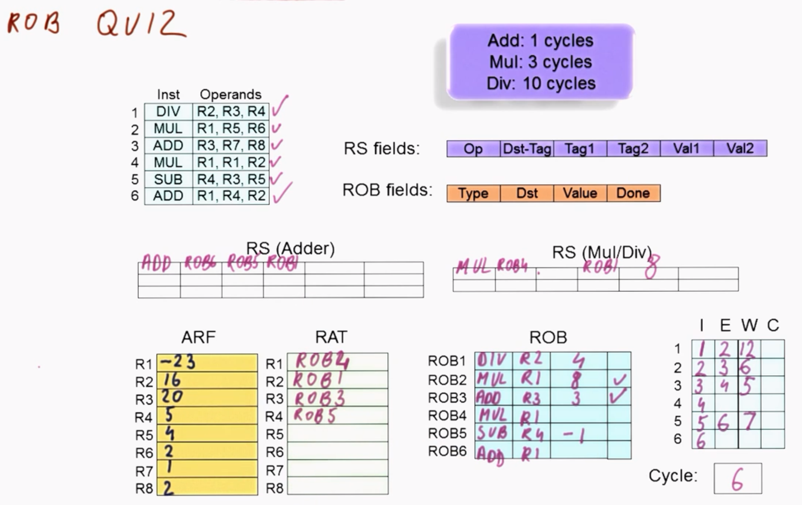
</center>

In cycle `C6`, instruction `I6` issues, with corresponding occupation of the appropriate reservation station (RS) and entry in the reorder buffer (ROB) table, as in the figure shown above. Furthermore, instruction `I4` is still present in its corresponding RS.

Furthermore, in cycle `C6`, instruction `I2` has completed execution and is able to write/broadcast its result (i.e., `8`), with a corresponding setting of its `Done` bit in its ROB entry. This value is consequently captured by the RS of instruction `I4`, which is still currently pending its other operand (`ROB1`) and thus not able to dispatch yet at this point.

<center>
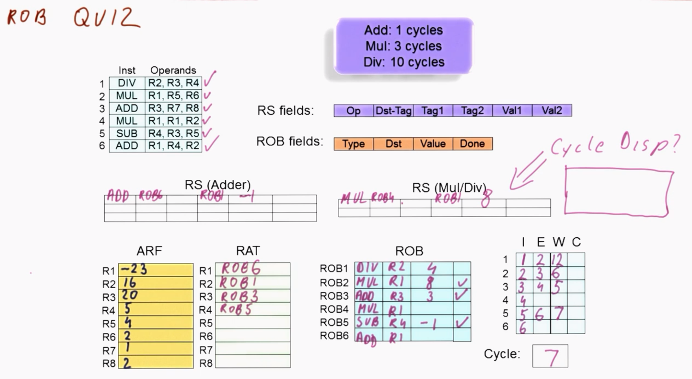
</center>

In cycle `C7`, instruction `I5` has completed execution and is able to write/broadcast its result (i.e., `-1`), with a corresponding setting of its `Done` bit in its ROB entry. This value is consequently captured by the RS of instruction `I6`, which is still currently pending its other operand (`ROB1`) and thus not able to dispatch yet at this point.

In which cycle does instruction `I4` get dispatched from its RS?

***Answer and Explanation***:

<center>

</center>

Observe that instruction `I4` (in its corresponding RS) is pending the result (i.e., `4`) of instruction `I1` (via corresponding tag `ROB1`). This will occur in cycle `C12`; at that point, instruction `I4` will also be able to dispatch from its RS in the same cycle upon receiving the broadcasted result, with execution commencing in the following cycle (i.e., `C13`).

***N.B.*** At this point, the system is "logjammed" (.e., via pending result `ROB1`) until cycle `C13`, so this cycle will be the focus of the next quiz accordingly.

### 27. Quiz 5 and Answers

<center>
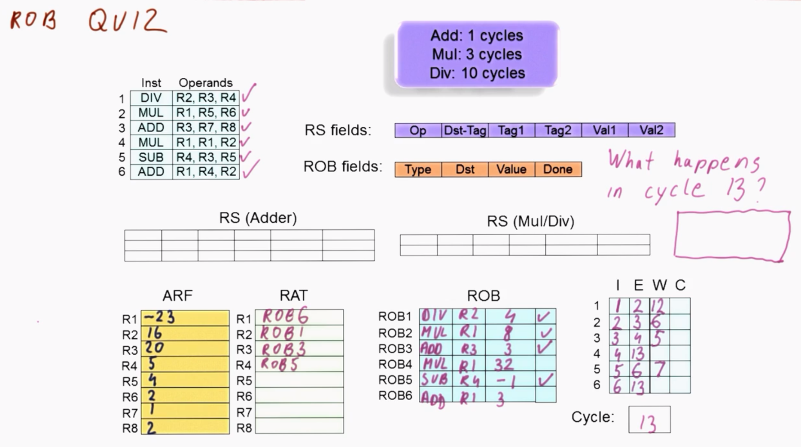
</center>

In cycle `C13`, instruction `I4` commences execution. Furthermore, instruction `I6` dispatches (correspondingly freeing its RS in the process) and will begin executing in the next cycle (i.e., `C14`) to produce its result (i.e., `3`) in cycle `C15` (as per `1` cycle requirement for instruction `ADD`).

In addition to these events, what else occurs in cycle `C13`? (Provide corresponding updates to the `IEWC` tracker table and to the ROB.)

***Answer and Explanation***:

<center>
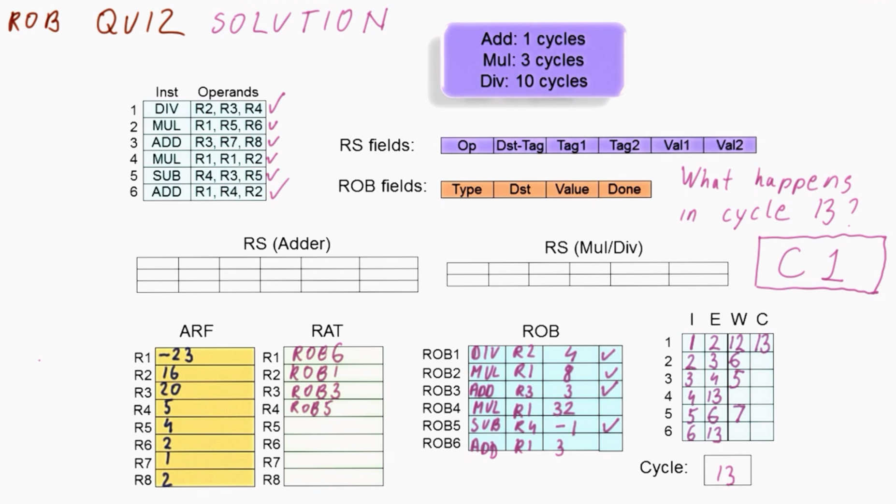
</center>

| Instruction | Issue | Execute | Write Result | Commit |
|:-:|:-:|:-:|:-:|:-:|
| `I1` | `C1` | `C2` | `C12` | `C13` |
| `I2` | `C2` | `C3` | `C6` | |
| `I3` | `C3` | `C4` | `C5` | |
| `I4` | `C4` | `C13` | | |
| `I5` | `C5` | `C6` | `C7` | |
| `I6` | `C6` | `C13` | | |

In cycle `C13` all instructions have been issued, and are additionally in progress of execution, as per the table shown above. Furthermore, neither instructions `I4` nor `I6` are able to write results at this point. However, by cycle `C13`, instruction `I1` is able to commit its result, and does so accordingly.

### 28. Quiz 6 and Answers

<center>
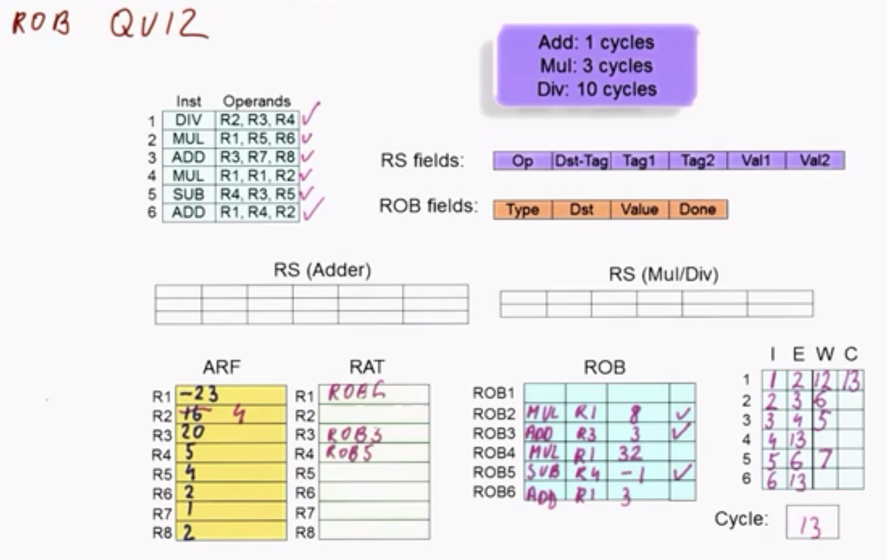
</center>

At the end of cycle `C13`, on commit of instruction `I1` (via `ROB1`), the corresponding update is made to ARF, with the RAT entry for register `R2` now blank (i.e., directing to ARF, rather than `ROB1`), with the value updated accordingly (i.e., `4`). Furthermore, entry `ROB1` is now also cleared in the ROB.

<center>
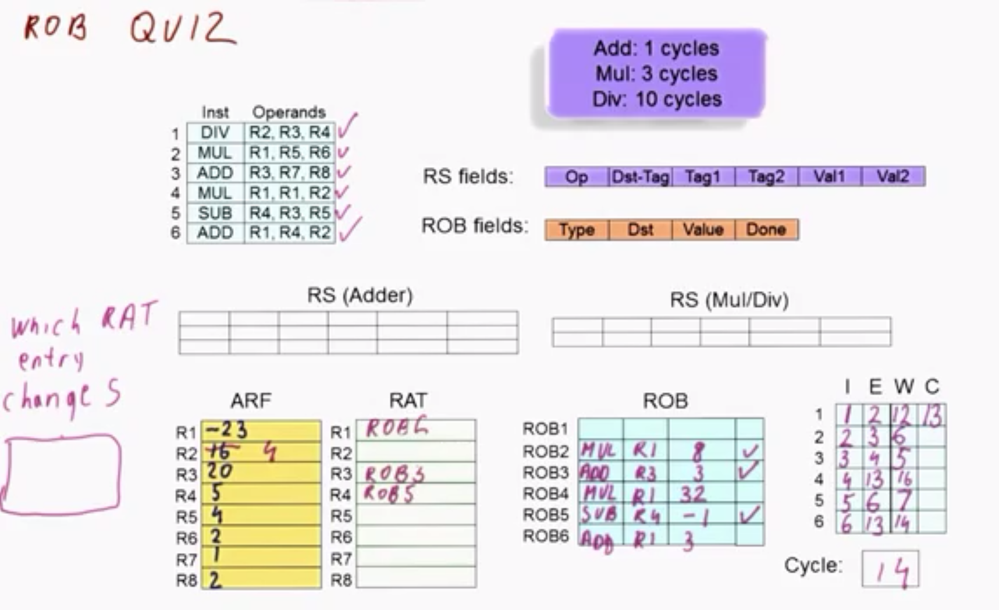
</center>

In cycle `C14`, instruction `I6` is now able to write its result (i.e., `3`).

What (if any) is/are the corresponding change(s) to the RAT in cycle `C14` consequently to the write result of instruction `I6`?

***Answer and Explanation***:

<center>
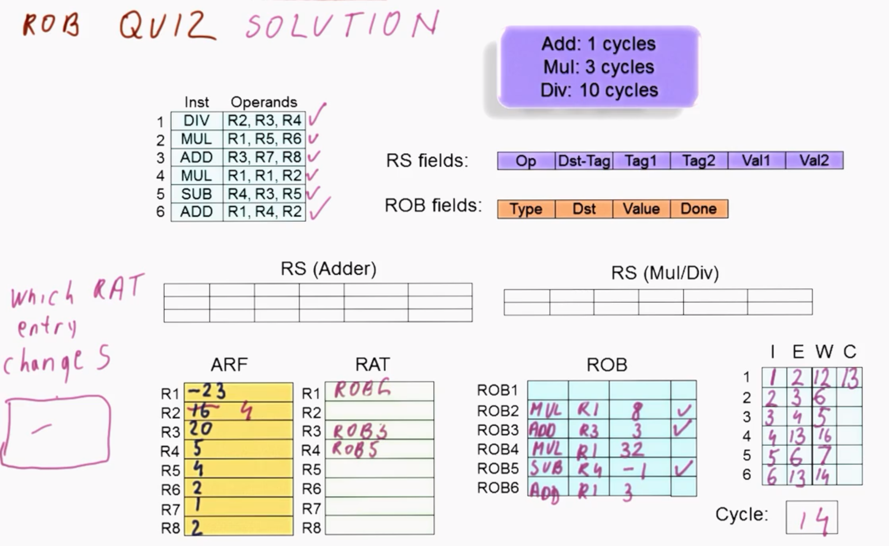
</center>

As a result of the write result of instruction `I6`, there is *no* corresponding change to the RAT. It is ***important*** to understand that write result does *not* correspondingly update the RAT; the RAT is only updated *on commit*. This in turn ensures proper in program-order execution.

### 29. Quiz 7 and Answers

<center>
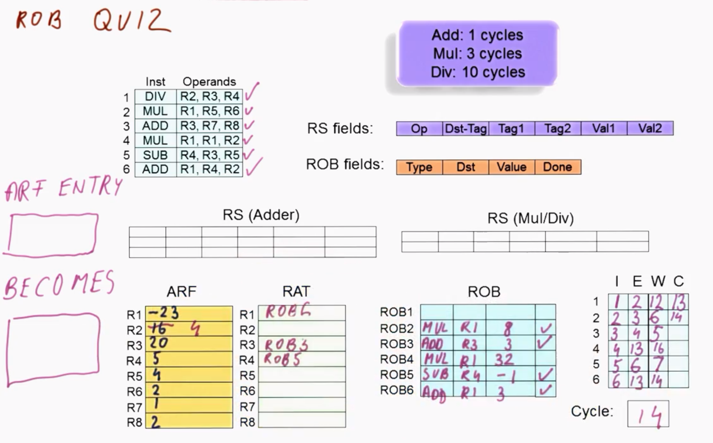
</center>

Further examining cycle `C14`, note that the `Done` bit is set appropriately for instruction `ROB6` (i.e., upon write result of corresponding instruction `I6`), with the corresponding result (`3`) broadcasted accordingly.

Furthermore, at this point, instruction `I2` can now be committed.

Which entry (if any) changes in the architectural registry file (ARF), and if so, what is the new value?

***Answer and Explanation***:

<center>
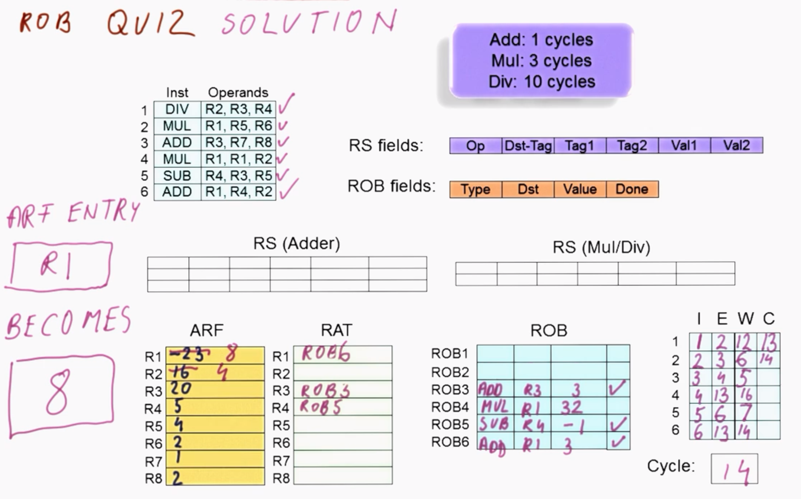
</center>

On commit of instruction `I2`, the ARF entry is correspondingly updated for register `R1` with result/value is `8`.

Furthermore, inspecting the RAT indicates current entry `ROB6`, which is the most recent value of register `R1`; since this entry differs from the currently committed instruction (i.e., `ROB2` via instruction `I2`), then the former entry is still retained in the RAT accordingly.

Lastly, the ROB entry for `ROB2` can now be cleared on commit.

### 30. Quiz 8 and Answers

<center>
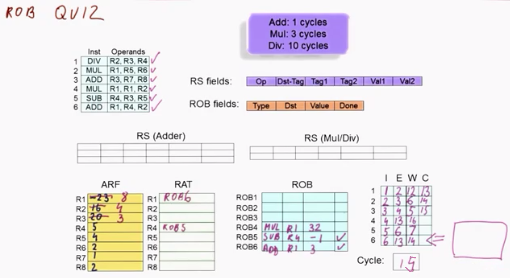
</center>

In cycle `C15`, there are no write results, however, instruction `I3` is able to commit. Consequently, the following occur:
* ARF entry for `R3` is updated with the new value via `ROB3` (i.e., `3`)
* Since entry `R3` in RAT currently points back to `ROB3` itself, this entry is cleared (i.e., read `R3` directly from `ARF` now)
* The entry `ROB3` in the ROB is cleared

When does the last instruction (i.e., `I6`) finally commit?

***Answer and Explanation***:

<center>
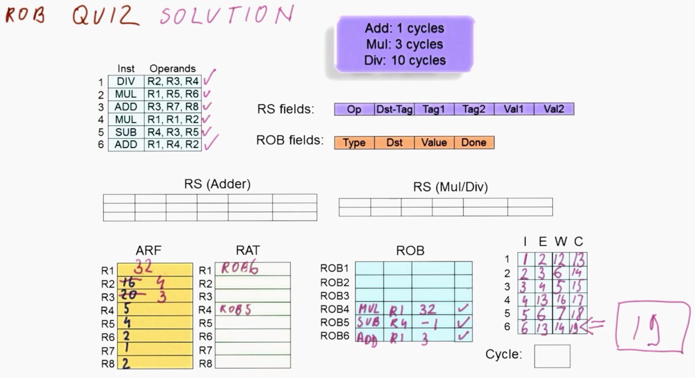
</center>

Since instruction `I4` writes its result in cycle `C16`, the earliest it can commit is in the subsequent cycle (i.e., `C17`). Proceeding similarly, the next two instructions (i.e., `I5` and `I6`) can correspondingly commit in the subsequent cycles (i.e., cycles `C18` and `C19`, respectively). Therefore, the last instruction `I6` commits in cycle `C19`.
* ***N.B.*** Observe that in this case, this analysis was performed "by inspection," without requiring any further examination of the other elements in the system (i.e., ROB, RAT, and AFT). For the sake of thoroughness, the corresponding analysis is performed accordingly in the remainder of this section.

In cycle `C17` (in which instruction `I4` commits), the following occur with respect to instruction `I4` (via `ROB4`):
* The `Done` bit is marked accordingly in the ROB for entry `ROB4`
* ARF is updated with the corresponding result (`32`) for register `R1`
* RAT has current entry `ROB6` (i.e., the most recent value of register `R1`), which differs from `ROB4`, so the former is left intact
* The ROB entry `ROB4` is cleared out

<center>

</center>

In cycle `C18` (in which instruction `I5` commits), the following occur with respect to instruction `I5` (via `ROB5`):
* The `Done` bit is marked accordingly in the ROB for entry `ROB5`
* ARF is updated with the corresponding result (`-1`) for register `R4`
* RAT has current entry `ROB5` (i.e., the most recent value of register `R4`), which is the same value, therefore, the RAT entry is cleared (i.e., indicating to retrieve the updated value directly from ARF)
* The ROB entry `ROB5` is cleared out

<center>
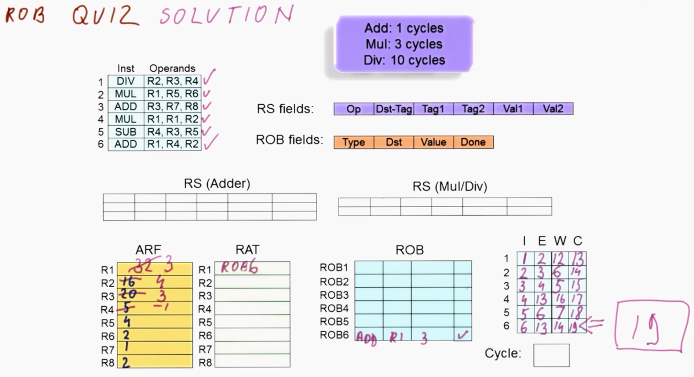
</center>

In cycle `C19` (in which instruction `I6` commits), the following occur with respect to instruction `I6` (via `ROB6`):
* The `Done` bit is marked accordingly in the ROB for entry `ROB6`
* ARF is updated with the corresponding result (`3`) for register `R1`
* RAT has current entry `ROB6` (i.e., the most recent value of register `R1`), which is the same value, therefore, the RAT entry is cleared (i.e., indicating to retrieve the updated value directly from ARF)
* The ROB entry `ROB6` is cleared out

<center>
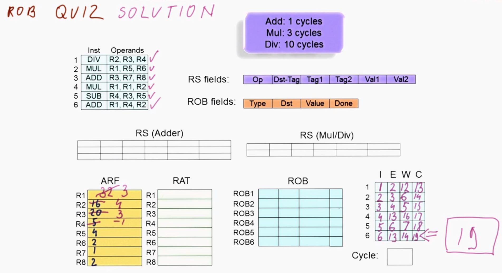
</center>

Upon completion of cycle `C19`, the current state of the system is as in the figure shown above, i.e., with ARF holding the most up-to-date values, and with the RAT, ROB, and RSes all empty.

## 32-34. ReOrder Buffer (ROB) Timing Quizzes and Answers

### 32. Quiz 1 and Answers

<center>
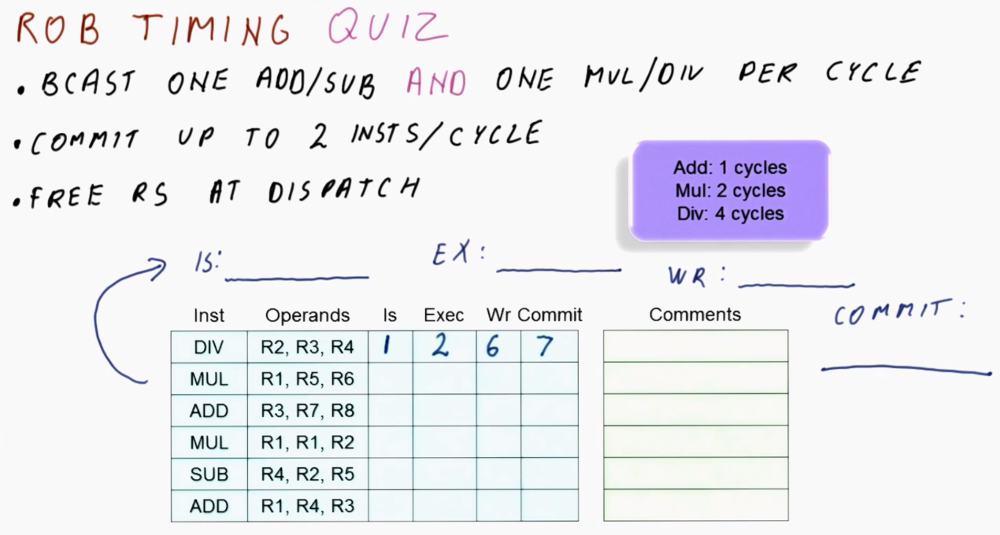
</center>

Consider the system as in the figure shown above.

```mips
DIV R2, R3, R4 # I1
MUL R1, R5, R6 # I2
ADD R3, R7, R8 # I3
MUL R1, R1, R2 # I4
SUB R4, R2, R5 # I5
ADD R1, R4, R3 # I6
```

The instructions in the system are as shown above.

The execution units are characterized as follows:
* Instructions `ADD` and `SUB` require `1` cycle to execute
* Instruction `MUL` requires `2` cycles to execute
* Instruction `DIV` requires `4` cycles to execute

Furthermore, the processor operations are characterized as follows:
* Broadcast of one `ADD`/`SUB` *and* one `MUL`/`DIV` can occur in the *same* cycle
* Up to two instructions can be committed in the *same* cycle
* The reservation station (RS) is freed on dispatch

Assume that there are arbitrarily many ROB entries available (i.e., at least `6` such entries), and that there are `2` RSes for operations `MUL`/`DIV` and `3` RSes for operations `ADD`/`SUB`.

| Instruction | Operands | Issue | Execute | Write Result | Commit | Comments |
|:-:|:-:|:-:|:-:|:-:|:-:|:-:|
| `DIV` | `R2, R3, R4` | `C1` | `C2` | `C6` | `C7` | |

In cycle `C1`, instruction `I1` is issued into one of the `MUL`/`DIV` RSes, as per the table shown above.

Being the first instruction, `I1` has no dependencies "by inspection," therefore, it commences execution in the subsequent cycle `C2`. Furthermore, instruction `DIV` requires `4` cycles, therefore, the earliest possible write result would be in cycle `C6`, which is noted tentatively at this point.

Furthermore, the commit will occur in the subsequent cycle (i.e., `C7`).

What is the corresponding analysis for the next cycle, cycle `C2`?

***Answer and Explanation***:

<center>
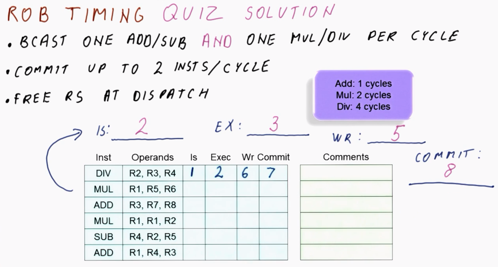
</center>

| Instruction | Operands | Issue | Execute | Write Result | Commit | Comments |
|:-:|:-:|:-:|:-:|:-:|:-:|:-:|
| `DIV` | `R2, R3, R4` | `C1` | `C2` | `C6` | `C7` | |
| `MUL` | `R1, R5, R6` | `C2` | `C3` | `C5` | `C8` | |

In cycle `C2`, instruction `I2` is issued into the other `MUL`/`DIV` RS, as per the table shown above.

Instruction `I2` has no dependencies "by inspection," therefore, it commences execution in the subsequent cycle `C3`. Furthermore, instruction `MUL` requires `2` cycles, therefore, the earliest possible write result would be in cycle `C5`, which is noted tentatively at this point.

Furthermore, the commit will be unable to occur until at least cycle `C8`, pending commit of the upstream instruction `I1`.

### 33. Quiz 2 and Answers

<center>
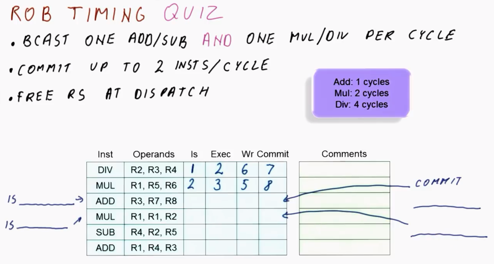
</center>

With respect to the subsequent instructions `I3` and `I4`, in which cycle(s) do they issue, and in which cycle(s) to they commit?

***Answer and Explanation***:

<center>
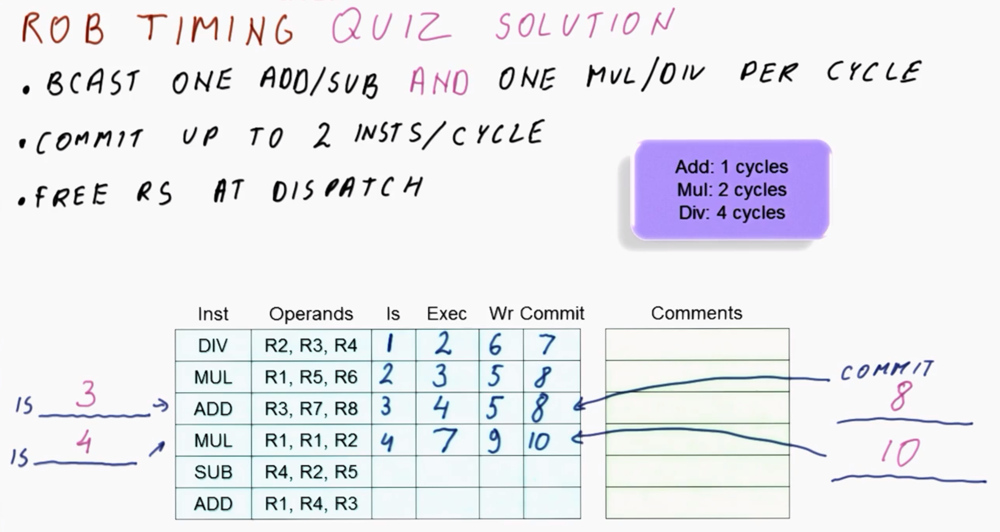
</center>

| Instruction | Operands | Issue | Execute | Write Result | Commit | Comments |
|:-:|:-:|:-:|:-:|:-:|:-:|:-:|
| `DIV` | `R2, R3, R4` | `C1` | `C2` | `C6` | `C7` | |
| `MUL` | `R1, R5, R6` | `C2` | `C3` | `C5` | `C8` | |
| `ADD` | `R3, R7, R8` | `C3` | `C4` | `C5` | `C8` | |

In cycle `C3`, instruction `I3` is issued into one of the `ADD`/`SUB` RSes, as per the table shown above.

Instruction `I3` has no dependencies "by inspection," therefore, it commences execution in the subsequent cycle `C4`. Furthermore, instruction `ADD` requires `1` cycle, therefore, the earliest possible write result would be in cycle `C5`, which is noted tentatively at this point.
* ***N.B.*** Since the processor is able to broadcast up to two instructions per cycle, this can occur concurrently with the broadcast of `I2` in cycle `C5`.

Furthermore, the commit will occur subsequently thereafter in cycle `C8`.
* ***N.B.*** Commit of instruction `I3` can occur concurrently with instruction `I2` in cycle `C2`, since the processor supports up to two commits per cycle.

| Instruction | Operands | Issue | Execute | Write Result | Commit | Comments |
|:-:|:-:|:-:|:-:|:-:|:-:|:-:|
| `DIV` | `R2, R3, R4` | `C1` | `C2` | `C6` | `C7` | |
| `MUL` | `R1, R5, R6` | `C2` | `C3` | `C5` | `C8` | |
| `ADD` | `R3, R7, R8` | `C3` | `C4` | `C5` | `C8` | |
| `MUL` | `R1, R1, R2` | `C4` | `C7` | `C9` | `C10` | |

In cycle `C4`, instruction `I4` is issued into one of the `ADD`/`SUB` RSes, as per the table shown above.

Furthermore, instruction `I4` has dependencies for both of its operands, however, both will have executed by the end of cycle `C6`, and therefore instruction `I4` can commence execution in cycle `C7`. Instruction `MUL` requires `2` cycles, therefore, the earliest possible write result would be in cycle `C9`, which is noted tentatively at this point.

Furthermore, the commit will occur subsequently thereafter in cycle `C10`.

### 34. Quiz 3 and Answers

<center>
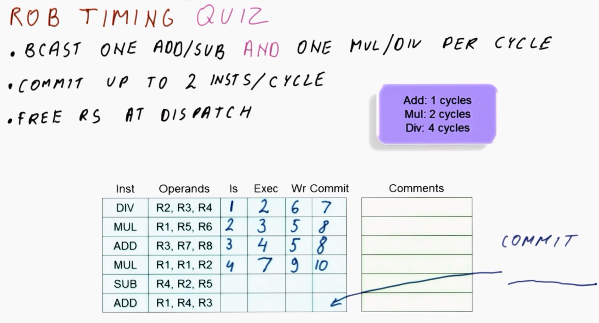
</center>

Finally, in concluding the analysis of this system, in which cycle does the final instruction (i.e., `I6`) get committed?

***Answer and Explanation***:

<center>
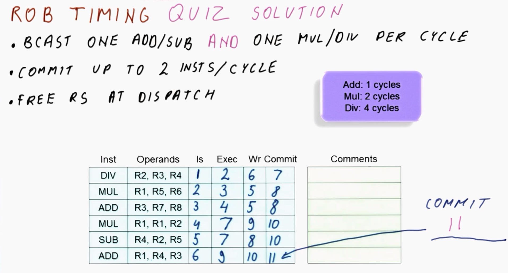
</center>

| Instruction | Operands | Issue | Execute | Write Result | Commit | Comments |
|:-:|:-:|:-:|:-:|:-:|:-:|:-:|
| `DIV` | `R2, R3, R4` | `C1` | `C2` | `C6` | `C7` | |
| `MUL` | `R1, R5, R6` | `C2` | `C3` | `C5` | `C8` | |
| `ADD` | `R3, R7, R8` | `C3` | `C4` | `C5` | `C8` | |
| `MUL` | `R1, R1, R2` | `C4` | `C7` | `C9` | `C10` | |
| `SUB` | `R4, R2, R5` | `C5` | `C7` | `C8` | `C10` | |

In cycle `C5`, instruction `I5` is issued into one of the `ADD`/`SUB` RSes, as per the table shown above.

Furthermore, instruction `I5` has a dependency via operand `R2`, whose value is not broadcasted until cycle `C6` (via instruction `I1`), and therefore instruction `I5` can commence execution in cycle `C7`. Instruction `SUB` requires `1` cycle, therefore, the earliest possible write result would be in cycle `C8`, which is noted tentatively at this point.

Furthermore, the commit will occur subsequently thereafter in cycle `C10`.
* ***N.B.*** Commit of instruction `I5` can occur concurrently with instruction `I4` in cycle `C10`, since the processor supports up to two commits per cycle.

| Instruction | Operands | Issue | Execute | Write Result | Commit | Comments |
|:-:|:-:|:-:|:-:|:-:|:-:|:-:|
| `DIV` | `R2, R3, R4` | `C1` | `C2` | `C6` | `C7` | |
| `MUL` | `R1, R5, R6` | `C2` | `C3` | `C5` | `C8` | |
| `ADD` | `R3, R7, R8` | `C3` | `C4` | `C5` | `C8` | |
| `MUL` | `R1, R1, R2` | `C4` | `C7` | `C9` | `C10` | |
| `SUB` | `R4, R2, R5` | `C5` | `C7` | `C8` | `C10` | |
| `ADD` | `R1, R4, R3` | `C6` | `C9` | `C10` | `C11` | |

In cycle `C6`, instruction `I6` is issued into one of the `ADD`/`SUB` RSes, as per the table shown above.

Furthermore, instruction `I6` has dependencies for both of its operands, however, both will have executed by the end of cycle `C8`, and therefore instruction `I6` can commence execution in cycle `C9`. Instruction `ADD` requires `1` cycle, therefore, the earliest possible write result would be in cycle `C10`, which is noted tentatively at this point.

Furthermore, the commit will occur subsequently thereafter in cycle `C11`.

## 39. In-Order vs. Out-of-Order Quiz and Answers

<center>
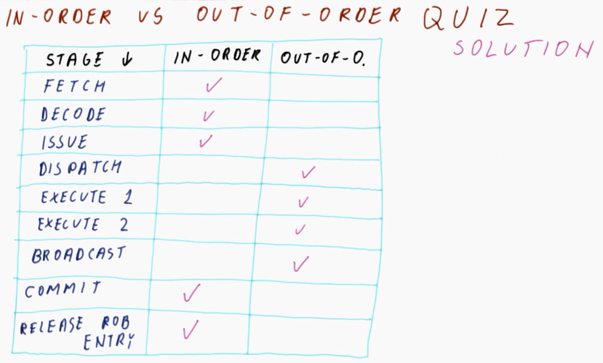
</center>

| Stage | In-Order | Out-of-Order |
|:-:|:-:|:-:|
| Fetch | | |
| Decode | | |
| Issue | | |
| Dispatch | | |
| Execution Stage 1 | | |
| Execution Stage 2 | | |
| Broadcast | | |
| Commit | | |
| Release ROB Entry | | |

Consider the processor described in the table shown above. For a given stage, indicate whether it occurs in either program-order or out-of-order, given an out-of-order processor.

***Answer and Explanation***

| Stage | In-Order | Out-of-Order |
|:-:|:-:|:-:|
| Fetch | `√` | |
| Decode |`√` | |
| Issue |`√` | |
| Dispatch | |`√` |
| Execution Stage 1 | |`√`|
| Execution Stage 2 | |`√`|
| Broadcast | |`√`|
| Commit |`√`| |
| Release ROB Entry |`√`| |

As indicated previously (cf. Section 38), stages Fetch through Decode must occur strictly in program-order.

Furthermore, stages Dispatch through Broadcast can occur out-of-order.
* ***N.B.*** In a strictly in program-order processor, these stages would also occur in program-order (i.e., rather than out-of-order).

Lastly, as indicated previously (cf. Section 38), Commit must occur strictly in program-order, and thus it follows by natural consequence that the subsequent release of the ROB entry will occur in program-order as well.

# Memory Ordering

## 8. Memory Ordering Quiz and Answers

<center>
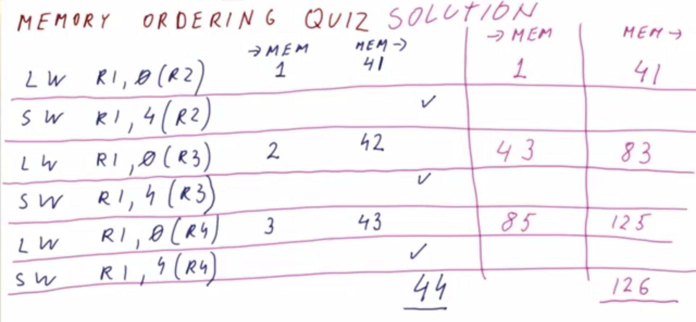
</center>

Consider the following program:

```mips
LW R1, 0(R2) # I1
SW R1, 4(R2) # I2
LW R1, 0(R3) # I3
SW R1, 4(R3) # I4
LW R1, 0(R4) # I5
SW R1, 4(R4) # I6
```

Assume that all of the load instructions (`LW`) are ***cache misses***, resulting in a `40`-cycle delay per cache miss.

The execution proceeds as follows:

| Instruction | Cycle of request to memory (`MEM`) | Cycle of response from memory (`MEM`) | Cycle of store execution |
|:--:|:--:|:--:|:--:|
| `I1` | `C1` | `C41` | (N/A) |
| `I2` | (N/A) | (N/A) | `C42` | 
| `I3` | `C2` | `C42` | (N/A) |
| `I4` | (N/A) | (N/A) | `C43` | 
| `I5` | `C3` | `C43` | (N/A) |
| `I6` | (N/A) | (N/A) | `C44` | 

Therefore, the overall execution requires `44` cycles in total. However, observe that load instructions (`LW`) are performed "***prematurely***" with respect to store instructions (`SW`), e.g., in the case of `I3`, since `R3 + 0 == R2 + 4` via `R2` in upstream instruction `I2`, then in actuality instruction `I3` must wait on instruction `I2` to obtain this correct memory value first (i.e., `R2`) before proceeding with `I3`'s own execution; and so on with respect to the remaining `LW`-`SW` instructions pairs.

Therefore, modify this sequence accordingly for in-order execution to ensure program correctness (i.e., in which cycle does each instruction send a request to memory, and when is the corresponding result returned).

***Answer and Explanation***:

| Instruction | Cycle of request to memory (`MEM`) | Cycle of response from memory (`MEM`) | Cycle of store execution |
|:--:|:--:|:--:|:--:|
| `I1` | `C1` | `C41` | (N/A) |
| `I2` | (N/A) | (N/A) | `C42` | 
| `I3` | `C43` | `C83` | (N/A) |
| `I4` | (N/A) | (N/A) | `C84` | 
| `I5` | `C85` | `C125` | (N/A) |
| `I6` | (N/A) | (N/A) | `C126` | 

As before, instruction `I1` sends a request to memory (`MEM`) in cycle `C1`, with a corresponding response in cycle `C41`. However, instruction `I2` cannot proceed fully, pending `R1` via upstream instruction `I1`. This resolution occurs in cycle `C42`.

Consequently, per the in-order execution requirement, instruction `I3` therefore cannot proceed until cycle `43`, with a corresponding response from `MEM` in cycle `83`. At this point, instruction `I4` can commence execution in cycle `C84`.

Analogously, instruction `I5` does not proceed until cycle `C85`, with a corresponding response from `MEM` in cycle `C126`. Finally, instruction `I6` commences execution in cycle `C126`.

Therefore, with in-order execution, this program executes in `126` total cycles. This is a nearly 3× delay relative to out-of-order execution (cf. `44` total cycles). This demonstrates that there is a marked ***advantage*** in reordering load-store instructions, however, this carries a ***risk*** of potentially requiring **recovery** in the event of loading an incorrect memory value.

## 12. Memory Ordering Quiz 1 and Answers

<center>
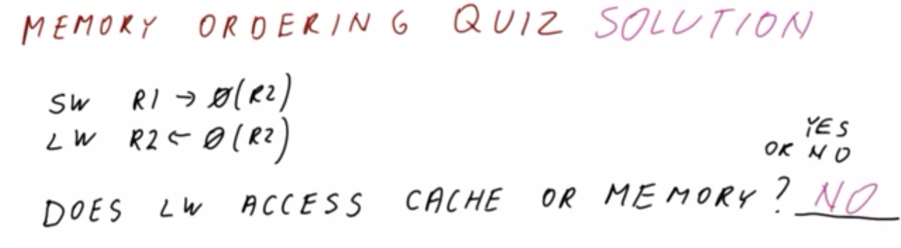
</center>

Given the following consecutive program instructions:

```mips
SW R1 → 0(R2)
LW R2 ← 0(R2)
```

Does the instruction `LW` access cache or memory? (Indicate `Yes` or `No`.)
* `No`

***Answer and Explanation***:

The instruction `LW` does ***not*** access cache or memory. Since `R2` refers to the ***same*** address, the instruction `LW` will retrieve this value from the ***store***.

## 13. Memory Ordering Quiz 2 and Answers

<center>
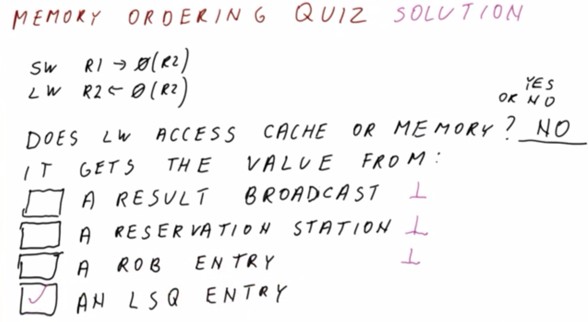
</center>

As a follow up to the quiz in the previous section, given that the instruction `LW` does *not* retrieve its value from the cache or memory (but rather the store),  where exactly does the instruction `LW` get its value from? (Select all applicable choices.)
* A result broadcast
  * `DOES NOT APPLY` - The store does *not* broadcast its resulting value; results are only broadcasted in this manner for instructions producing a *register* result (which does not apply for a store instruction).
* A reservation station (RS)
  * `DOES NOT APPLY` - RSes never provide any results to subsequent instructions, but rather only capture values for the *current* instruction. Furthermore, even in such a case, store instructions do not interact with RSes in this manner anyhow.
* A reorder buffer (ROB) entry
  * `DOES NOT APPLY` - A ROB entry *would* maintain a result for a register-producing instruction between the time of broadcast and the time of commit, however, because a store instruction is not a register-value-producing instruction, it does *not* correspondingly place its result in a ROB entry. (In fact, the store does not even technically have such a "result" to place in such a ROB entry in the first place.)
* A load-store queue (LSQ) entry
  * `APPLIES` - The store instruction *does* maintain the value in the load-store queue. This is where the downstream load instruction(s) searches for a value when attempting to match its address to the corresponding upstream store instruction(s).

# Compiler ILP

## 4. Tree Height Reduction Quiz and Answers

<center>
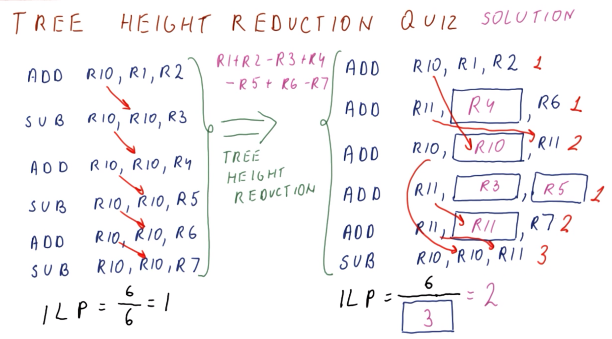
</center>

Consider the following program, which computes the arithmetic expression `R1 + R2 - R3 + R4 - R5 + R6 - R7`:

```mips
ADD R10, R1, R2  # I1
SUB R10, R10, R3 # I2
ADD R10, R10, R4 # I3
SUB R10, R10, R5 # I4
ADD R10, R10, R6 # I5
SUB R10, R10, R7 # I6
```

Observe that a dependency chain forms in this program via `R10`. Correspondingly, the instruction-level parallelism (ILP) of this program is as follows:

```
6 instructions / 6 cycles = 1 instruction/cycle
```

Perform a tree height reduction on this program, in order to improve instruction-level parallelism (ILP), and compute the correspondingly improved ILP.

***Answer and Explanation***:

To implement tree height reduction in this program, observe there are three addition operations (which *are* associative) and three subtraction operations (which are *not* associative). Correspondingly, we can reorder these operations to perform the additions first (and consequently in parallel), as well as use the distributive property with respect to the subtraction (i.e., correspondingly grouping the operands into upstream addition operations prior to subtracting), thereby transforming the target expression to the following: `((R1 + R2) + (R4 + R6)) - ((R3 + R5) + R7)`.

The resulting modified program is as follows:

```mips
ADD R10, R1, R2   # I1′
ADD R11, R4, R6   # I2′
ADD R10, R10, R11 # I3′
ADD R11, R3, R5   # I4′
ADD R11, R11, R7  # I5′
SUB R10, R10, R11 # I6′
```

The corresponding instruction-level parallelism (ILP) is as follows:
* Instructions `I1′` and `I2′` have no dependencies between them, however, instruction `I3′` depends on these upstream instructions' results.
* Instruction `I4′` has no upstream dependencies, and therefore can execute immediately on program start.
* Instruction `I5′` is dependent on the result of upstream instruction `I4′`.
* Instruction `I6′` is dependent on the results of upstream instructions `I3′` and `I5′`.

Correspondingly, these instructions can be executed as follows:

| Instruction | Earliest possible cycle of execution |
|:--:|:--:|
| `I1′` | `C1` |
| `I2′` | `C2` |
| `I3′` | `C1` |
| `I4′` | `C1` |
| `I5′` | `C2` |
| `I6′` | `C3` |

Therefore, the resulting ILP from this tree height reduction is:

```
6 instructions / 3 cycles = 2 instructions/cycle
```

Which is a 2× improvement over the original single-instruction-per-cycle (i.e., dependency-chain-limited) version of the program.

## 7. Instruction Scheduling Quiz and Answers

<center>
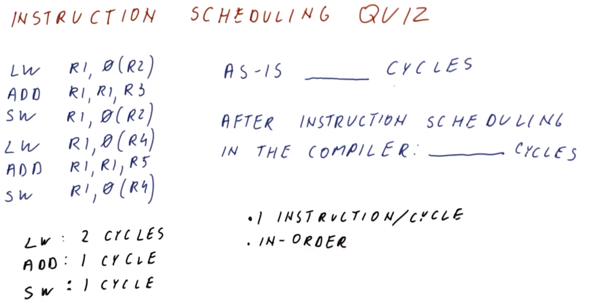
</center>

Consider the following program:

```mips
LW  R1, 0(R2)  # I1
ADD R1, R1, R3 # I2
SW  R1, 0(R2)  # I3
LW  R1, 0(R4)  # I4
ADD R1, R1, R5 # I5
SW  R1, 0(R4)  # I6
```

With respect to instructions' execution, assume the following:
* Instruction `LW` requires `2` cycles to execute
* Instruction `ADD` requires `1` cycle to execute
* Instruction `SW` requires `1` cycle to execute

Furthermore, assume that the processor is characterized as before (cf. Section 6), i.e., it performs strictly `1` instruction per cycle and executes in-program-order.

How many cycles does this program require to execute as-is? How many cycles does this program require after modification via instruction scheduling in the compiler?

***Answer and Explanation***:

<center>
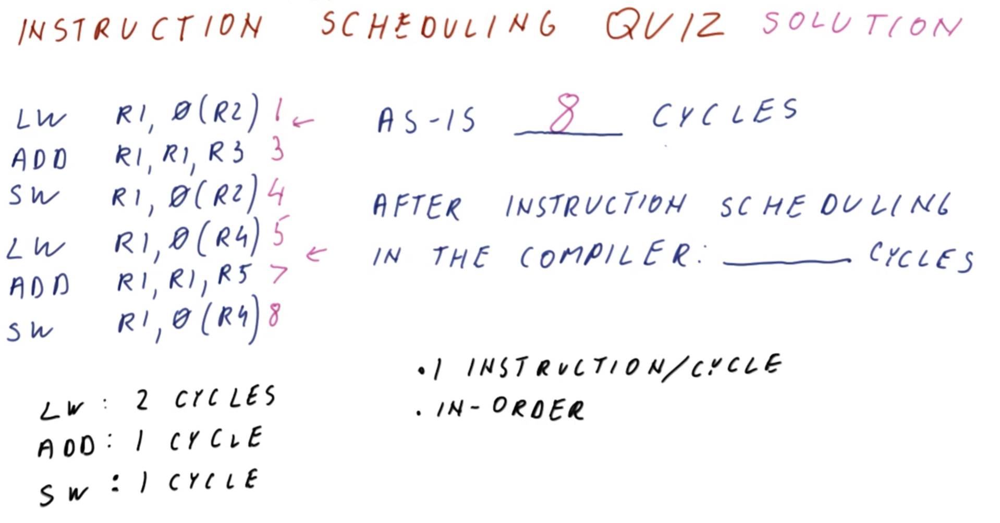
</center>

First, consider the as-is scenario. The corresponding per-cycle analysis is as follows:

<table style="width: 100%; text-align: center;">
  <tr>
    <th>Cycle</th>
    <th>Instruction Executed</th>
    <th>Description</th>
  </tr>
  <tr>
    <td><code>C1</code></td>
    <td><code>I1</code></td>
    <td rowspan="2">Instruction <code>I1</code> requires two cycles to fetch the value from the cache and place it in register <code>R1</code>, thereby requiring a stall of one cycle prior to executing subsequent instruction <code>I2</code></td>
  </tr>
  <tr>
    <td><code>C2</code></td>
    <td><code>stall</code></td>
  </tr>
  <tr>
    <td><code>C3</code></td>
    <td><code>I2</code></td>
    <td>Instruction <code>I2</code> requires one cycle to perform the addition operation (i.e., add <code>R3</code> to <code>R1</code>, with corresponding dependency on upstream instruction <code>I1</code> with respect to operand <code>R1</code>)</td>
  </tr>
  <tr>
    <td><code>C4</code></td>
    <td><code>I3</code></td>
    <td>Instruction <code>I3</code> requires one cycle to perform the store instruction</td>
  </tr>
  <tr>
    <td><code>C5</code></td>
    <td><code>I4</code></td>
    <td rowspan="2">Instruction <code>I4</code> requires two cycles to fetch the value from the cache and place it in register <code>R1</code>, thereby requiring a stall of one cycle prior to executing subsequent instruction <code>I5</code></td>
  </tr>
  <tr>
    <td><code>C6</code></td>
    <td><code>stall</code></td>
  </tr>
  <tr>
    <td><code>C7</code></td>
    <td><code>I5</code></td>
    <td>Instruction <code>I5</code> requires one cycle to perform the addition operation (i.e., add <code>R5</code> to <code>R1</code>, with corresponding dependency on upstream instruction <code>I4</code> with respect to operand <code>R1</code>)</td>
  </tr>
  <tr>
    <td><code>C8</code></td>
    <td><code>I6</code></td>
    <td>Instruction <code>I6</code> requires one cycle to perform the store instruction</td>
  </tr>
</table>

Therefore, as-is, this program requires `8` cycles.

<center>
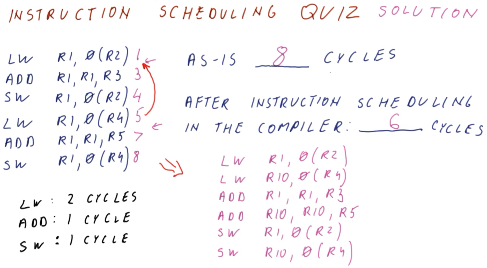
</center>

Now, consider the compiler-facilitated instruction scheduling scenario. To avoid the stall in cycle `C2`, we must "move up" a downstream instruction which does not otherwise depend on instruction `I1` as-is. This can be achieved by moving instruction `I4` to the now second-instruction position (and correspondingly using a non-conflicting register for its target operand, i.e., from `R1` to `R10`), and similarly moving instruction `I3` to the now-fifth instruction position. The updated program is thus as follows:

```mips
LW  R1, 0(R2)    # I1
LW  R10, 0(R4)   # I2′
ADD R1, R1, R3   # I3′
ADD R10, R10, R5 # I4′
SW  R1, 0(R2)    # I5′
SW  R10, 0(R4)   # I6′
```

The corresponding per-cycle analysis in the updated program is as follows:

<table style="width: 100%; text-align: center;">
  <tr>
    <th>Cycle</th>
    <th>Instruction Executed</th>
    <th>Description</th>
  </tr>
  <tr>
    <td><code>C1</code></td>
    <td><code>I1</code></td>
    <td>Instruction <code>I1</code> requires two cycles to fetch the value from the cache and place it in register <code>R1</code></td>
  </tr>
  <tr>
    <td><code>C2</code></td>
    <td><code>I2′</code></td>
    <td>Instruction <code>I2′</code> requires two cycles to fetch the value from the cache and place it in register <code>R10</code></td>
  </tr>
  <tr>
    <td><code>C3</code></td>
    <td><code>I3′</code></td>
    <td>Instruction <code>I3′</code> requires one cycle to perform the addition operation (i.e., add <code>R3</code> to <code>R1</code>, with corresponding dependency on upstream instruction <code>I1</code> with respect to operand <code>R1</code>), however, there is no stalls-induced delay, as the two-cycle execution of instruction <code>I1</code> will have already completed by the start of cycle <code>C3</code></td>
  </tr>
  <tr>
    <td><code>C4</code></td>
    <td><code>I4′</code></td>
    <td>Instruction <code>I4′</code> requires one cycle to perform the addition operation (i.e., add <code>R5</code> to <code>R10</code>, with corresponding dependency on upstream instruction <code>I2′</code> with respect to operand <code>R10</code>), however, there is no stalls-induced delay, as the two-cycle execution of instruction <code>I2′</code> will have already completed by the start of cycle <code>C4</code></td>
  </tr>
  <tr>
    <td><code>C5</code></td>
    <td><code>I5′</code></td>
    <td>Instruction <code>I5′</code> requires one cycle to perform the store instruction</td>
  </tr>
  <tr>
    <td><code>C6</code></td>
    <td><code>I6′</code></td>
    <td>Instruction <code>I6′</code> requires one cycle to perform the store instruction</td>
  </tr>
</table>

In this compiler-facilitated instruction scheduling, *both* of the intermediate stalls have been eliminated, resulting in a net reduction from `8` cycles to `6` cycles.

## 14. Loop Unrolling Quiz and Answers

<center>
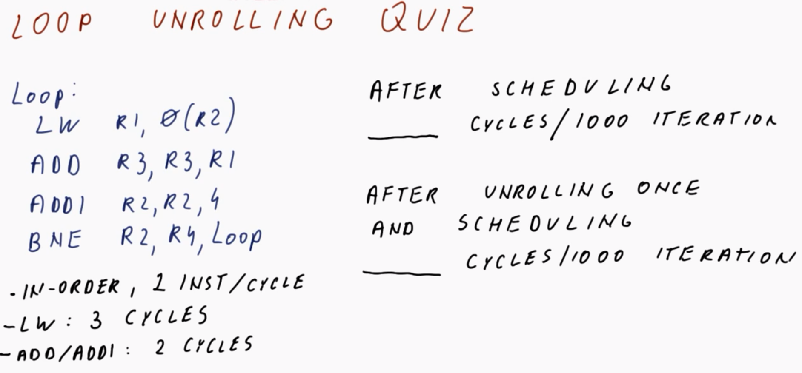
</center>

Consider the following loop instructions, which computes the sum of the elements of an array:

```mips
Loop:
  LW   R1, 0(R2)    # I1
  ADD  R3, R3, R1   # I2
  ADDI R2, R2, 4    # I3
  BNE  R2, R4, Loop # I4
```

Furthermore, assume the given processor is specified as follows:
* in-order execution of `1` instruction per cycle
* Load operation `LW` requires `3` cycles
* Addition operations `ADD` and `ADDI` require `2` cycles

After compiler-facilitated instruction scheduling (but without otherwise applying loop unrolling), how many cycles are required to perform `1000` loop iterations?

Furthermore, after compiler-facilitated scheduling ***with*** once-unrolled loop unrolling, how many cycles are required to perform `1000` loop iterations?

***Answer and Explanation***:

(***N.B.*** The "solution" video is not officially published for this course, however, the corresponding solution is described in [video notes](https://learn.udacity.com/courses/ud007/lessons/e4e2a1d6-9603-4219-95d2-776ec78adfd0/concepts/7639dd97-5ac1-4de8-a11d-59502f0e0d78/quiz) for preceding "Quiz" video, reproduced here as follows.)

In the unmodified code, the per-cycle analysis is as follows:

| Instruction | `C1` | `C2` | `C3` | `C4` | `C5` | `C6` | `C7` | `C8` | ⋯ |
|:--:|:--:|:--:|:--:|:--:|:--:|:--:|:--:|:--:|:--:|
| `I1` | commence execution | (`stall`) | (`stall`) | | | | | commence execution | ⋯ |
| `I2` | | | | commence execution | (`stall`) | | | | ⋯ |
| `I3` | | | | | commence execution | (`stall`) | | | ⋯ |
| `I4` | | | | | | | commence execution |  | ⋯ |

Note the corresponding dependencies between via mutual/common operands `R1` and `R2`. Furthermore, there are `3` net additional cycles introduced by `stall`s as per the cycle requirements for the corresponding operations. Also, note that this particular processor (as specified) can only execute strictly *one* instruction per cycle.

Therefore, after the initial load (i.e., instruction `I1`), which incurs an initial three-cycle cost, on commencing the first loop iteration, there is a `7` cycle requirement ***per loop*** to perform all `4` of the loop instructions. Correspondingly, for `1000` loop iterations, this requires `7 × 1000 = 7000` total instructions.

After ***compiler-facilitated instruction scheduling*** (but ***without*** otherwise applying loop unrolling), the modified instructions are as follows:

```mips
Loop:
  LW   R1, 0(R2)    # I1
  ADDI R2, R2, 4    # I2′
  ADD  R3, R3, R1   # I3′
  BNE  R2, R4, Loop # I4
```

In this manner, compiler-facilitated instruction scheduling provides an opportunity to partially "absorb" the inefficiency introduced by the `stall` cycles. The corresponding per-cycle analysis is as follows:

| Instruction | `C1` | `C2` | `C3` | `C4` | `C5` | `C6` | ⋯ |
|:--:|:--:|:--:|:--:|:--:|:--:|:--:|:--:|
| `I1` | commence execution | (`stall`) | (`stall`) | | | commence execution | ⋯ |
| `I2′` | | commence execution | (`stall`) | | | | ⋯ |
| `I3′` | | | | commence execution | (`stall`) | | ⋯ |
| `I4` | | | | | commence execution  | | ⋯ |

Based on reordering, there is a net reduction by `2` cycles, however, there is still a dependency via operand `R1` between instructions `I1` and `I3′` which necessitates a "`stall`s-only" cycle `C3`.

Therefore, after the initial load (i.e., instruction `I1`), which incurs an initial one-cycle cost, on commencing the first loop iteration, there is a `5` cycle requirement ***per loop*** to perform all `4` of the loop instructions. Correspondingly, for `1000` loop iterations, this requires `5 × 1000 = 5000` total instructions.

Next, after ***compiler-facilitated instruction scheduling*** along with applying ***once-unrolled loop unrolling***, the modified instructions are as follows:

```mips
Loop:
  LW   R1, 0(R2)    # I1
  LW   R8, 4(R2)    # I2″ - use operand `R8` to avoid dependency
  ADD  R3, R3, R1   # I3″
  ADDI R2, R2, 8    # I4″ - modify corresponding index/offset to `8`
  ADD  R8, R3, R1   # I5″
  BNE  R2, R4, Loop # I6″
```

In this manner, the "compounded" version of the loop provides an opportunity to additionally reduce the overall cycles (however, some inefficiency due to `stall`s still remains). The corresponding per-cycle analysis is as follows:

| Instruction | `C1` | `C2` | `C3` | `C4` | `C5` | `C6` | `C7` | `C8` | ⋯ |
|:--:|:--:|:--:|:--:|:--:|:--:|:--:|:--:|:--:|:--:|
| `I1` | commence execution | (`stall`) | (`stall`) | | | | | commence execution | ⋯ |
| `I2″` | | commence execution | (`stall`) | (`stall`) | | | | | ⋯ |
| `I3″` | | | | commence execution | (`stall`) | | | | ⋯ |
| `I4″` | | | | | commence execution | (`stall`) | | | ⋯ |
| `I5″` | | | | | |commence execution | (`stall`) | | ⋯ |
| `I6″` | | | | | | | commence execution | | ⋯ |

As before, there is still a dependency via operand `R1` between instructions `I1` and `I3″` which necessitates a "`stall`s-only" cycle `C3`.

Therefore, after the initial load (i.e., instruction `I1`), which incurs an initial one-cycle cost, on commencing the first loop iteration, there is a `7` cycle requirement ***per loop*** to perform all `6` of the loop instructions. Correspondingly, for `1000` loop iterations, this requires `7 × 1000 = 7000` total instructions. However, note that with loop unrolling, the total number of loop iterations with once-unrolled loop unrolling is ***halved*** (i.e., each loop iteration performs ***twice*** the work of an equivalent not-unrolled loop), therefore, the equivalent number of iterations for the *same* program would be correspondingly only `7 × 500 = 3500`.

## 18. Function Call Inlining Quiz and Answers

<center>
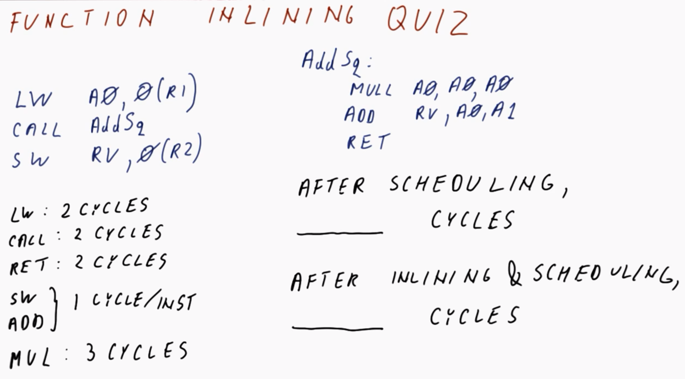
</center>

Consider the following program:

```mips
LW   A0, 0(R1) # I1 - prepare argument `A0` for function call
CALL AddSq     # I2
SW   RV, 0(R2) # I3

AddSq:
  MUL A0, A0, A0 # IA - square the argument `A0`
  ADD RV, A0, A1 # IB - add the arguments and return this value
  RET            # IC
```

Furthermore, consider the processor characterized as follows:
* Instructions `LW`, `CALL`, and `RET` each require `2` cycles
* Instructions `SW` and `ADD` each require `1` cycle
* Instruction `MUL` requires `3` cycles

After compiler-facilitated instruction scheduling, how many cycles are required to execute this program?

Furthermore, after function call inlining and compiler-facilitated instruction scheduling, how many cycles are required to execute this program?

***Answer and Explanation***:

<center>
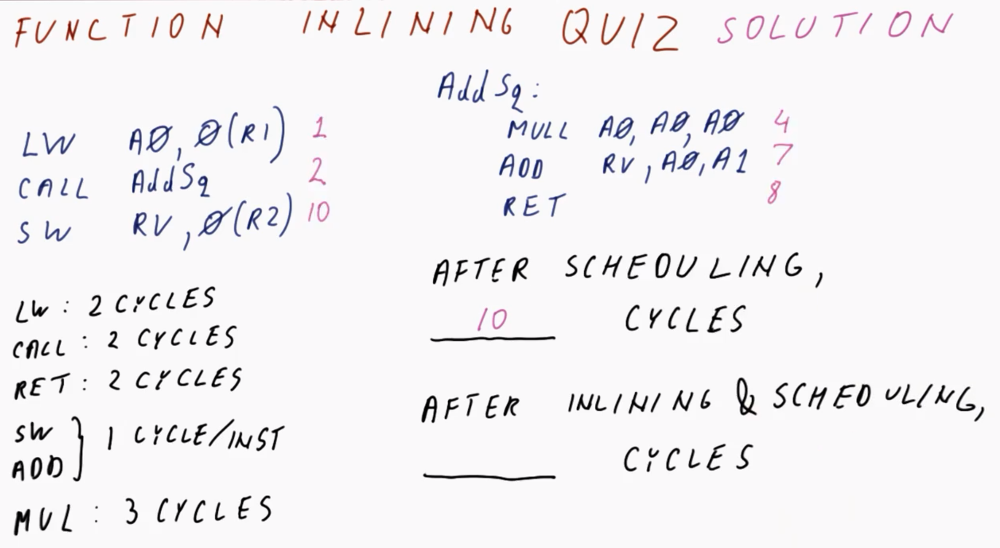
</center>

In the case of compiler-facilitated instruction scheduling (but ***without*** function call inlining), this requires `10` total cycles.
* In the main program, there is no opportunity for reordering, since there is a strict order dependence in the instructions, including the function call `CALL`. Furthermore, each of these instructions requires `2` cycles apiece.
* Similarly, the function-call body does not provide opportunities for instruction scheduling, either.

The corresponding per-cycle analysis is as follows:

| Instruction | `C1` | `C2` | `C3` | `C4` | `C5` | `C6` | `C7` | `C8` | `C9` | `C10` |
|:--:|:--:|:--:|:--:|:--:|:--:|:--:|:--:|:--:|:--:|:--:|
| `I1` | commence execution | (`stall`) | | | | | | | | | |
| `I2` | | commence execution | (`stall`) | | | | | | | |
| `IA` | | | | commence execution | (`stall`) |  (`stall`) | | | | |
| `IB` | | | | | | | commence execution | (`stall`) | | |
| `IC` | | | | | | | | commence execution |  (`stall`) | | |
| `I3` | | | | | | | | | | commence execution |

<center>
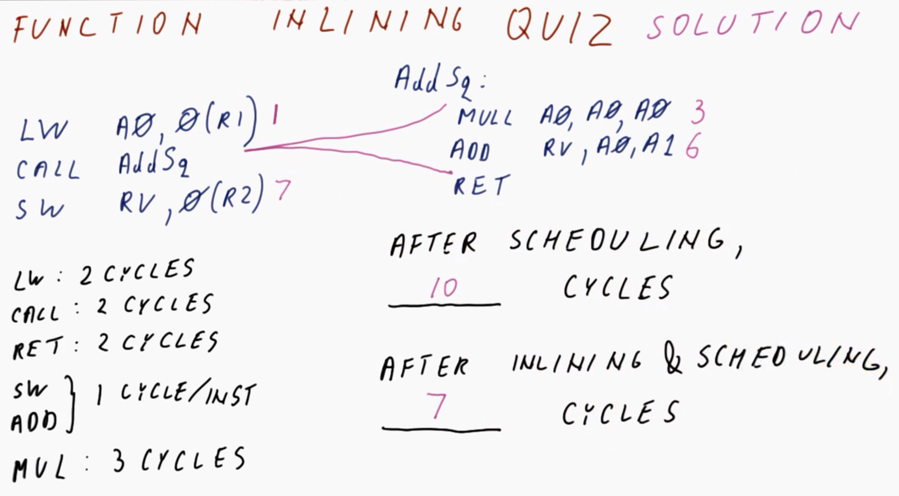
</center>

In the case of compiler-facilitated instruction scheduling (but ***without*** function call inlining), this requires only `7` total cycles.

With inlining, the corresponding update to the instructions is as follows:

```mips
LW  R3, 0(R1)  # I1′
MUL R3, R3, R3 # I2′
ADD R5, R3, R4 # I3′
SW  R5, 0(R2)  # I4′
```

The corresponding general-purpose register substitutions are as follows:

| pre-inlining argument or return register | post-inlining general-purpose register |
|:--:|:--:|
| `A0` | `R3` |
| `A1` | `R4` |
| `RV` | `R5` |

With this inlining, as before, there is still no opportunity for reordering, due to dependency via common/mutual operand `R3`.

The corresponding per-cycle analysis is as follows:

| Instruction | `C1` | `C2` | `C3` | `C4` | `C5` | `C6` | `C7` |
|:--:|:--:|:--:|:--:|:--:|:--:|:--:|:--:|
| `I1′` | commence execution | (`stall`) | | | | | |
| `I2′` | | | commence execution | (`stall`) | (`stall`) | | |
| `I3′` | | | | | | commence execution | |
| `I4′` | | | | | | | commence execution |

Therefore, in this particular example, the net reduction in cycles is strictly due to the elimination of the function-call overhead (i.e., instructions `CALL` and `RET`).

# Very Long Instruction Word (VLIW)

## 3. Superscalar vs. VLIW Quiz and Answers

<center>
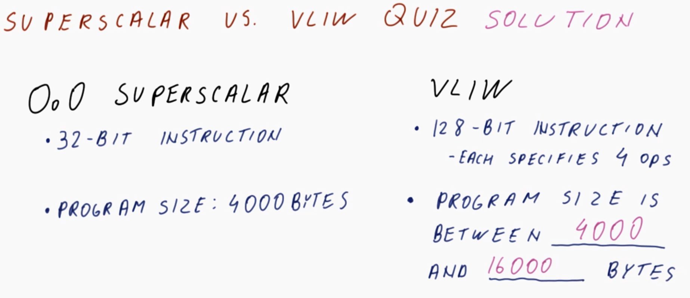
</center>

Consider an out-of-order superscalar processor characterized by `32`-bit instructions running a program of size `4000` bytes.

Similarly, consider a VLIW processor characterized by `128`-bit instructions (with each VLIW instruction specifying `4` operations, comparable to each `1`/single operation on the other processor). What is the corresponding program size for this VLIW processor? 

***Answer and Explanation***:

In the ideal case, the VLIW processor can correspondingly perform the same `4000` byte program.

However, in the worst case (e.g., all instructions have dependencies), each equivalent instruction will still require a full VLIW instruction (i.e., only utilizing *one* of its *four* total possible operations per cycle), and therefore this will increase the required program size to `4000 × 4 = 16000` bytes.

Therefore, in practice, the corresponding program size will be somewhere in the range of these two (i.e., `4000` to `16000` bytes).

## 5. VLIW Backward Compatibility Quiz and Answers

Having seen some aspects of VLIW, let's further discuss the matter of **backward compatibility** in the form of a quiz.

<center>
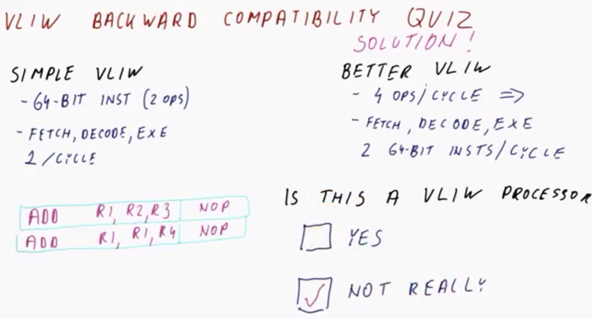
</center>

Consider a simple VLIW processor, specified as follows:
* `64`-bit instructions comprising `2` operations
* Stages (e.g., fetch, decode, execute, etc.) perform `1` of these instructions per cycle (i.e., `2` corresponding operations per cycle)

Now, consider a newly proposed "better" VLIW processor, specified as follows:
* `64`-bit instructions comprising `4` operations
* Stages (e.g., fetch, decode, execute, etc.) perform `2` of these instructions per cycle to maintain corresponding backwards compatibility (i.e., equivalently `4` corresponding operations per `2` cycles)

So, then, is this new processor still a VLIW processor?

***Answer and Explanation***:

The new processor is ***not*** truly a VLIW processor.

In a real/valid VLIW processor, the compiler determines which  operations can be performed in parallel, thereby placing them in the *same* instruction to minimize overall execution time (while still guaranteeing that each cycle performs independent operations).
* For programs run on the old processor, the compiler only guarantees that the two operations in the ***same*** instruction occur in parallel. Otherwise, if a dependency occurs (e.g., via operand `R1` in the figure shown above), then the compiler still places the operations  into ***separate*** VLIW instructions with corresponding no-ops (`NOP`) in each respective instruction to ensure necessarily independent execution (i.e., degeneration to `1` effective instruction per cycle).
* Correspondingly, for programs run on the new processor, if *two* such 64-bit instructions occur in this same program, it still cannot perform them simultaneously (i.e., despite the "enhanced" `2` VLIW instructions per cycle capability) without violating program correctness, and therefore the same degeneration to `1` effective instruction per cycle occurs.

## 8. VLIW Target Market Quiz and Answers

<center>

</center>

Among the following, which type of application is VLIW best suited for? (Rank from `1`/best to `3`/worst.)
* Add many numbers together
  * `1` - This comprises a small, predictable loop with well-controlled dependencies, and so on. 
* Determine the best path in a maze
  * `3` - This involves a lot of decision making, along with corresponding if conversions, etc., and therefore VLIW will be relatively inefficient due many of the instructions being "predicated out"
* Count elements of a linked list
  * `2` - This will likely involve many load instructions (with corresponding hits and misses), with corresponding impact on compiler scheduling (i.e., due to cache misses, etc.), however, otherwise there is still some semblance of "normalcy" otherwise in this program 

***N.B.*** As discussed previously (cf. Section 4), VLIW is optimized for programs where the compiler can effectively analyze the instructions for consequent reordering (i.e., "normal" code).